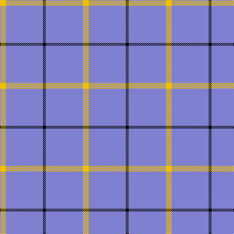

In pattern [YBKBY](/patterns/ybkby/).

This was sourced from weddslist.  It is a [5 stripes tartan](/stripes/stripes5/).

Original link http://www.weddslist.com/cgi-bin/tartans/pg.pl?source=sts

## Thread count
Y/12 B76 K6 B76 Y/12

## Palette
Each colour and its ΔE from the base-6 reference it is a variant of.

| Colour | Shade | Base | ΔE (OKLab) |
|---|---|---|---|
| B | <code style="background-color:#8080D0;">#8080D0</code> `#8080D0` | B <code style="background-color:#2C4084;">#2C4084</code> | 0.24 |
| K | <code style="background-color:#000000;">#000000</code> `#000000` | K <code style="background-color:#000000;">#000000</code> | 0.00 |
| Y | <code style="background-color:#F0C000;">#F0C000</code> `#F0C000` | Y <code style="background-color:#E8C000;">#E8C000</code> | 0.01 |

# Sample pattern

## Nearest tartans

The nearest existing variants by ΔTartan distance.

1. [Loevenstein Castle #2](/setts/s4/y80b4y16b12-b00008c-yb0b0b0/) — ΔT 1.82
1. [Poulain League (Corporate)](/setts/s3/y12b76k6-b2888c4-k101010-ye8c000/) — ΔT 1.96
1. [MacLaine of Lochbuie](/setts/s4/b64r6b8y6-b2c4084-rdc0000-ye8c000/) — ΔT 2.01
1. [MacLaine of Lochbuie](/setts/s4/b64r6b8y6-b304080-rc00000-yf0c000/) — ΔT 2.05
1. [Lochnagar](/setts/s6/w4b4g28g16g4w4-b800080-g808080-we0e0e0/) — ΔT 2.24
1. [Sephardim (Corporate)](/setts/s5/w100b14w14ba14w36-b2c2c80-ba2888c4-we0e0e0/) — ΔT 2.28
1. [Dominion (Fashion)](/setts/s7/y12r2y34b6y6b16y2-b2c2c80-rc80000-y6c9cb4/) — ΔT 2.32
1. [Westfield (Corporate?)](/setts/s4/b102y11b14w11-b003c64-we0e0e0-yeca4a4/) — ΔT 2.32
1. [Varrie](/setts/s4/b220ba20w20y20-b2888c4-ba2c2c80-we0e0e0-ye8c000/) — ΔT 2.32
1. [GulfMark](/setts/s5/b144ba12b24ba34w12-b3c4266-ba6675a0-wffffff/) — ΔT 2.45

## Neighbour map

Every grey dot is one of 15726 variants placed by the first two principal components of the ΔTartan feature space (44% of its variance). Red is this tartan; blue dots are its nearest — click one to open its page.

<svg viewBox="0 0 640 380" role="img" style="max-width:100%;height:auto;border:1px solid #e0e0e0;border-radius:4px;display:block" xmlns="http://www.w3.org/2000/svg"><image href="/nn/cloud.v1.png" width="640" height="380"/><a href="/setts/s4/y80b4y16b12-b00008c-yb0b0b0/"><circle cx="603.3" cy="216.7" r="4" fill="#3465a4"><title>Loevenstein Castle #2</title></circle></a><a href="/setts/s3/y12b76k6-b2888c4-k101010-ye8c000/"><circle cx="530.3" cy="247.3" r="4" fill="#3465a4"><title>Poulain League (Corporate)</title></circle></a><a href="/setts/s4/b64r6b8y6-b2c4084-rdc0000-ye8c000/"><circle cx="591.5" cy="238.1" r="4" fill="#3465a4"><title>MacLaine of Lochbuie</title></circle></a><a href="/setts/s4/b64r6b8y6-b304080-rc00000-yf0c000/"><circle cx="596.8" cy="239.8" r="4" fill="#3465a4"><title>MacLaine of Lochbuie</title></circle></a><a href="/setts/s6/w4b4g28g16g4w4-b800080-g808080-we0e0e0/"><circle cx="527.1" cy="251.5" r="4" fill="#3465a4"><title>Lochnagar</title></circle></a><a href="/setts/s5/w100b14w14ba14w36-b2c2c80-ba2888c4-we0e0e0/"><circle cx="516.5" cy="230.8" r="4" fill="#3465a4"><title>Sephardim (Corporate)</title></circle></a><a href="/setts/s7/y12r2y34b6y6b16y2-b2c2c80-rc80000-y6c9cb4/"><circle cx="452.5" cy="205.1" r="4" fill="#3465a4"><title>Dominion (Fashion)</title></circle></a><a href="/setts/s4/b102y11b14w11-b003c64-we0e0e0-yeca4a4/"><circle cx="541.0" cy="240.1" r="4" fill="#3465a4"><title>Westfield (Corporate?)</title></circle></a><a href="/setts/s4/b220ba20w20y20-b2888c4-ba2c2c80-we0e0e0-ye8c000/"><circle cx="510.9" cy="216.7" r="4" fill="#3465a4"><title>Varrie</title></circle></a><a href="/setts/s5/b144ba12b24ba34w12-b3c4266-ba6675a0-wffffff/"><circle cx="511.5" cy="233.0" r="4" fill="#3465a4"><title>GulfMark</title></circle></a><circle cx="542.6" cy="226.1" r="5" fill="#c00000"/></svg>

ID: /setts/s5/y12b76k6b76y12-b8080d0-k000000-yf0c000/
