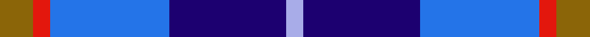

In pattern [GRBBW](/stripes/grbbw/).

This was sourced from register-of-tartans.  It is a [5 stripe tartan](/stripes/stripes5/).

Original link https://www.tartanregister.gov.uk/tartanDetails.aspx?ref=5007

## Register references

External register numbers recorded for this tartan.

- Scottish Register of Tartans: [5007](https://www.tartanregister.gov.uk/tartanDetails.aspx?ref=5007)
- Scottish Tartans Authority (ITI): 3746

## Thread count
T/16 R8 B57 DB56 LP/8

## Palette
Each colour and the base-6 reference it is a variant of.

| Colour | Shade | Base |
|---|---|---|
| B | <code style="background-color:#2474E8;">#2474E8</code> `oklch(57.8% 0.192 258.7)` <small>#2474E8</small> | B <code style="background-color:#2A418A;">#2A418A</code> |
| DB | <code style="background-color:#1C0070;">#1C0070</code> `oklch(26.3% 0.162 277.1)` <small>#1C0070</small> | B <code style="background-color:#2A418A;">#2A418A</code> |
| LP | <code style="background-color:#A8ACE8;">#A8ACE8</code> `oklch(76.3% 0.086 281.2)` <small>#A8ACE8</small> | W <code style="background-color:#F7F7F7;">#F7F7F7</code> |
| R | <code style="background-color:#E3170D;">#E3170D</code> `oklch(58.1% 0.230 29.4)` <small>#E3170D</small> | R <code style="background-color:#CC0000;">#CC0000</code> |
| T | <code style="background-color:#8B6508;">#8B6508</code> `oklch(53.2% 0.107 82.0)` <small>#8B6508</small> | G <code style="background-color:#006100;">#006100</code> |

# Sample pattern

## Nearest tartans

The nearest existing variants by ΔTartan distance, with this tartan at the top so the swatches line up against it.

ΔTartan

Tartan

Sett

—

<a href="/ttd/edit/#slug=y16r8b57db56lb8">Bryson (1988)</a> <a class="nn-out" href="/setts/s5/y16r8b57db56lb8/" title="open its dictionary page">↗</a>

0.88

<a href="/ttd/edit/#slug=w3dt2db15t15r2~x4">SABA</a> <a class="nn-out" href="/setts/s5/w3dt2db15t15r2~x4/" title="open its dictionary page">↗</a>

0.95

<a href="/ttd/edit/#slug=r2db12k5t16w2~x4">RSCDS Australia? (Corporate)</a> <a class="nn-out" href="/setts/s5/r2db12k5t16w2~x4/" title="open its dictionary page">↗</a>

1.18

<a href="/ttd/edit/#slug=lr2r1t7db7lb1~x8">Bryson (1988) (Name)</a> <a class="nn-out" href="/setts/s5/lr2r1t7db7lb1~x8/" title="open its dictionary page">↗</a>

1.41

<a href="/ttd/edit/#slug=db2b9r1db5g5lb2~x4">American Express</a> <a class="nn-out" href="/setts/s6/db2b9r1db5g5lb2~x4/" title="open its dictionary page">↗</a>

1.52

<a href="/ttd/edit/#slug=db3t24k11db20w2db5lo3~x2">Icelandair</a> <a class="nn-out" href="/setts/s7/db3t24k11db20w2db5lo3~x2/" title="open its dictionary page">↗</a>

1.53

<a href="/ttd/edit/#slug=ly2b9r2db6ly1r1~x4">Lauder Primary School</a> <a class="nn-out" href="/setts/s6/ly2b9r2db6ly1r1~x4/" title="open its dictionary page">↗</a>

1.53

<a href="/ttd/edit/#slug=r2db11r3db11t12db10w2~x2">Blue</a> <a class="nn-out" href="/setts/s7/r2db11r3db11t12db10w2~x2/" title="open its dictionary page">↗</a>

1.56

<a href="/ttd/edit/#slug=k1db6b1k6b6k1w1~x6">Mary Washington</a> <a class="nn-out" href="/setts/s7/k1db6b1k6b6k1w1~x6/" title="open its dictionary page">↗</a>

1.56

<a href="/ttd/edit/#slug=r10w5db30b20r3~x4">Lands of Liberty</a> <a class="nn-out" href="/setts/s5/r10w5db30b20r3~x4/" title="open its dictionary page">↗</a>

1.56

<a href="/ttd/edit/#slug=db3t1db6r2b6k1r1k1b6r3~x4">Ballater</a> <a class="nn-out" href="/setts/s10/db3t1db6r2b6k1r1k1b6r3~x4/" title="open its dictionary page">↗</a>

## Neighbour map

Every grey dot is one of 14299 variants placed by the first two principal components of the ΔTartan feature space (44% of its variance). Red is this tartan; blue dots are its nearest — click one to open its page.

<svg viewBox="0 0 640 380" role="img" style="max-width:100%;height:auto;border:1px solid #e0e0e0;border-radius:4px;display:block" xmlns="http://www.w3.org/2000/svg"><image href="/nn/cloud.v1.png" width="640" height="380"/><a href="/setts/s5/w3dt2db15t15r2~x4/"><circle cx="203.2" cy="218.5" r="4" fill="#3465a4"><title>SABA</title></circle></a><a href="/setts/s5/r2db12k5t16w2~x4/"><circle cx="182.3" cy="214.5" r="4" fill="#3465a4"><title>RSCDS Australia? (Corporate)</title></circle></a><a href="/setts/s5/lr2r1t7db7lb1~x8/"><circle cx="161.2" cy="211.8" r="4" fill="#3465a4"><title>Bryson (1988) (Name)</title></circle></a><a href="/setts/s6/db2b9r1db5g5lb2~x4/"><circle cx="129.3" cy="208.4" r="4" fill="#3465a4"><title>American Express</title></circle></a><a href="/setts/s7/db3t24k11db20w2db5lo3~x2/"><circle cx="206.9" cy="187.5" r="4" fill="#3465a4"><title>Icelandair</title></circle></a><a href="/setts/s6/ly2b9r2db6ly1r1~x4/"><circle cx="178.3" cy="194.6" r="4" fill="#3465a4"><title>Lauder Primary School</title></circle></a><a href="/setts/s7/r2db11r3db11t12db10w2~x2/"><circle cx="163.1" cy="237.8" r="4" fill="#3465a4"><title>Blue</title></circle></a><a href="/setts/s7/k1db6b1k6b6k1w1~x6/"><circle cx="101.5" cy="203.5" r="4" fill="#3465a4"><title>Mary Washington</title></circle></a><a href="/setts/s5/r10w5db30b20r3~x4/"><circle cx="210.6" cy="215.7" r="4" fill="#3465a4"><title>Lands of Liberty</title></circle></a><a href="/setts/s10/db3t1db6r2b6k1r1k1b6r3~x4/"><circle cx="133.6" cy="200.8" r="4" fill="#3465a4"><title>Ballater</title></circle></a><circle cx="177.2" cy="220.1" r="5" fill="#c00000"/></svg>

ID: /setts/s5/y16r8b57db56lb8/
