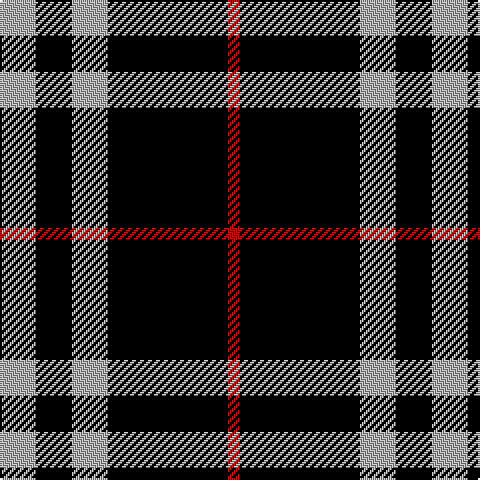

In pattern [RKYKY](/patterns/rkyky/).

This was sourced from register-of-tartans.  It is a [5 stripes tartan](/stripes/stripes5/).

Original link https://www.tartanregister.gov.uk/tartanDetails.aspx?ref=5039

## Attestations

This cloth appears in 2 source records; the oldest owns this page.

- 01/01/1986 — Burberry Black (register-of-tartans, [record](https://www.tartanregister.gov.uk/tartanDetails.aspx?ref=5039))
- 1986 — Burberry, Black (Original) (Fashion) (tartans-authority, [record](http://www.tartansauthority.com/tartan-ferret/display/3768/))

## Thread count
N/18 K18 N18 K60 R/6

## Palette
Each colour and its ΔE from the base-6 reference it is a variant of.

| Colour | Shade | Base | ΔE (OKLab) |
|---|---|---|---|
| K | <code style="background-color:#000000;">#000000</code> `#000000` | K <code style="background-color:#000000;">#000000</code> | 0.00 |
| N | <code style="background-color:#B0B0B0;">#B0B0B0</code> `#B0B0B0` | Y <code style="background-color:#F2BF00;">#F2BF00</code> | 0.18 |
| R | <code style="background-color:#C80000;">#C80000</code> `#C80000` | R <code style="background-color:#CC0000;">#CC0000</code> | 0.01 |

# Sample pattern

## Nearest tartans

The nearest existing variants by ΔTartan distance.

1. [Lords, of Skye](/setts/s4/k92r14k16w40-k000000-r806050-we0e0e0/) — ΔT 0.82
1. [Glencoe](/setts/s5/k74w18k6g18w6-g008000-k000000-we0e0e0/) — ΔT 1.15
1. [Moffat](/setts/s7/k78g6k6g6k28g56r6-g808080-k000000-rc00000/) — ΔT 1.24
1. [Glen Coe Trade Tartan Tartan Number: 1243. Earliest known date: Modern Many new designs have been given district names to promote their Scottish connections. However, these names should not be confused with the District tartans which have earned their title through 'use and wont' and not a little history. See products available Copyright © Blair Urquhart, Comrie, 2015](/setts/s5/k74w18k6g18w6-g003820-k101010-we0e0e0/) — ΔT 1.28
1. [Lords of Skye](/setts/s4/k92g14k16w40-g503c14-k101010-we0e0e0/) — ΔT 1.29
1. [Lords of Skye Trade Tartan Tartan Number: 1218. Earliest known date: 1983 Nothing See products available Copyright © Blair Urquhart, Comrie, 2015](/setts/s4/k92g14k16w40-g604000-k101010-we0e0e0/) — ΔT 1.31
1. [New Zealand (2000)](/setts/s6/k84w8k20w36k52g8-g007800-k000000-wc8c8c8/) — ΔT 1.36
1. [Black 1990 (Name)](/setts/s6/k34r12k4w12k34y4-k101010-r880000-we0e0e0-ybc8c00/) — ΔT 1.39
1. [Punky Princess (Fashion)](/setts/s7/k28r4k8w6k24r16k2-k101010-re87878-wc0c0c0/) — ΔT 1.42
1. [Lords of Skye (Fashion?)](/setts/s4/k92g14k16w40-g604000-k101010-wfcfcfc/) — ΔT 1.43

## Neighbour map

Every grey dot is one of 15726 variants placed by the first two principal components of the ΔTartan feature space (44% of its variance). Red is this tartan; blue dots are its nearest — click one to open its page.

<svg viewBox="0 0 640 380" role="img" style="max-width:100%;height:auto;border:1px solid #e0e0e0;border-radius:4px;display:block" xmlns="http://www.w3.org/2000/svg"><image href="/nn/cloud.v1.png" width="640" height="380"/><a href="/setts/s4/k92r14k16w40-k000000-r806050-we0e0e0/"><circle cx="337.8" cy="258.4" r="4" fill="#3465a4"><title>Lords, of Skye</title></circle></a><a href="/setts/s5/k74w18k6g18w6-g008000-k000000-we0e0e0/"><circle cx="361.8" cy="208.6" r="4" fill="#3465a4"><title>Glencoe</title></circle></a><a href="/setts/s7/k78g6k6g6k28g56r6-g808080-k000000-rc00000/"><circle cx="355.7" cy="196.4" r="4" fill="#3465a4"><title>Moffat</title></circle></a><a href="/setts/s5/k74w18k6g18w6-g003820-k101010-we0e0e0/"><circle cx="372.2" cy="208.0" r="4" fill="#3465a4"><title>Glen Coe Trade Tartan Tartan Number: 1243. Earliest known date: Modern Many new designs have been given district names to promote their Scottish connections. However, these names should not be confused with the District tartans which have earned their title through 'use and wont' and not a little history. See products available Copyright © Blair Urquhart, Comrie, 2015</title></circle></a><a href="/setts/s4/k92g14k16w40-g503c14-k101010-we0e0e0/"><circle cx="342.0" cy="255.8" r="4" fill="#3465a4"><title>Lords of Skye</title></circle></a><a href="/setts/s4/k92g14k16w40-g604000-k101010-we0e0e0/"><circle cx="341.9" cy="255.5" r="4" fill="#3465a4"><title>Lords of Skye Trade Tartan Tartan Number: 1218. Earliest known date: 1983 Nothing See products available Copyright © Blair Urquhart, Comrie, 2015</title></circle></a><a href="/setts/s6/k84w8k20w36k52g8-g007800-k000000-wc8c8c8/"><circle cx="415.8" cy="235.2" r="4" fill="#3465a4"><title>New Zealand (2000)</title></circle></a><a href="/setts/s6/k34r12k4w12k34y4-k101010-r880000-we0e0e0-ybc8c00/"><circle cx="372.3" cy="223.6" r="4" fill="#3465a4"><title>Black 1990 (Name)</title></circle></a><a href="/setts/s7/k28r4k8w6k24r16k2-k101010-re87878-wc0c0c0/"><circle cx="399.3" cy="212.1" r="4" fill="#3465a4"><title>Punky Princess (Fashion)</title></circle></a><a href="/setts/s4/k92g14k16w40-g604000-k101010-wfcfcfc/"><circle cx="336.6" cy="252.5" r="4" fill="#3465a4"><title>Lords of Skye (Fashion?)</title></circle></a><circle cx="348.5" cy="235.8" r="5" fill="#c00000"/></svg>

ID: /setts/s5/y18k18y18k60r6-k000000-rc80000-yb0b0b0/
