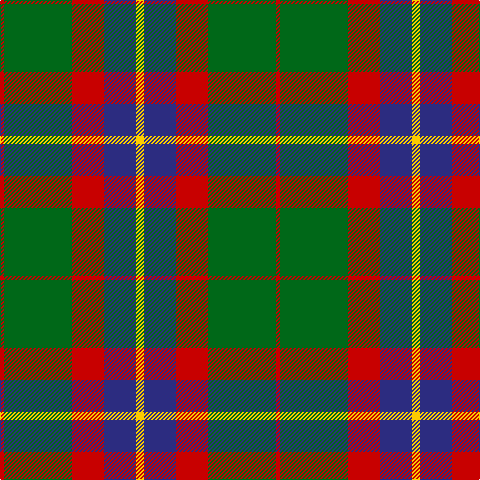

In pattern [RGRBY](/patterns/rgrby/).

This was sourced from tartans-authority.  It is a [5 stripes tartan](/stripes/stripes5/).

Original link http://www.tartansauthority.com/tartan-ferret/display/11235/

## Thread count
R/4 G68 R32 DB32 Y/8

## Palette
Each colour and its ΔE from the base-6 reference it is a variant of.

| Colour | Shade | Base | ΔE (OKLab) |
|---|---|---|---|
| DB | <code style="background-color:#2C2C80;">#2C2C80</code> `#2C2C80` | B <code style="background-color:#2A418A;">#2A418A</code> | 0.06 |
| G | <code style="background-color:#006818;">#006818</code> `#006818` | G <code style="background-color:#006100;">#006100</code> | 0.02 |
| R | <code style="background-color:#C80000;">#C80000</code> `#C80000` | R <code style="background-color:#CC0000;">#CC0000</code> | 0.01 |
| Y | <code style="background-color:#FCCC00;">#FCCC00</code> `#FCCC00` | Y <code style="background-color:#F2BF00;">#F2BF00</code> | 0.04 |

# Sample pattern

## Nearest tartans

The nearest existing variants by ΔTartan distance.

1. [McCook/Cook (Name)](/setts/s7/g12b6g6r15k1r1k2x4~b2888c4-g006818-k101010-rc80000/) — ΔT 0.99
1. [Thomson Camel (Jedburgh Mill)](/setts/s6/r4k2w10k10g28k3x2~g8c7038-k101010-rc80000-wc0c0c0/) — ΔT 1.04
1. [Christmas (Fashion)](/setts/s5/y2g17ga4r15g1x2~g003820-ga006818-rc80000-yfccc00/) — ΔT 1.07
1. [Christmas](/setts/s5/y2g17ga4r15g1x2~g0e3923-ga207449-rbb001a-ye3b235/) — ΔT 1.13
1. [MacKintosh, Geddes](/setts/s7/b1r5g18r4b9r10w1x4~b304080-g008000-rc00000-we0e0e0/) — ΔT 1.14
1. [MacTavish Hunting Clan Tartan Tartan Number: 232. Earliest known date: pre 2003 See Lord Thomson See products available Copyright © Blair Urquhart, Comrie, 2015](/setts/s6/b3g26ga4b13k13b2x2~b5c8ca8-g604000-ga006818-k101010/) — ΔT 1.14
1. [Ikelman #2 (Personal)](/setts/s5/b11k4r4y4b1x4~b5c5c5c-k101010-r880000-yd09800/) — ΔT 1.19
1. [Logan #3](/setts/s7/b9y4b1y4g15r4b1x4~b440044-g00801c-rc8002c-ye08070/) — ΔT 1.22
1. [Cook (Name)](/setts/s7/g12ga6g6r15k1r1k2x2~g003820-ga048888-k101010-rc80000/) — ΔT 1.23
1. [Thomson (Personal)](/setts/s6/b4g28ga6b12k12b3x2~b5c8ca8-g604000-ga289c18-k101010/) — ΔT 1.24

## Neighbour map

Every grey dot is one of 15726 variants placed by the first two principal components of the ΔTartan feature space (44% of its variance). Red is this tartan; blue dots are its nearest — click one to open its page.

<svg viewBox="0 0 640 380" role="img" style="max-width:100%;height:auto;border:1px solid #e0e0e0;border-radius:4px;display:block" xmlns="http://www.w3.org/2000/svg"><image href="/nn/cloud.v1.png" width="640" height="380"/><a href="/setts/s7/g12b6g6r15k1r1k2x4~b2888c4-g006818-k101010-rc80000/"><circle cx="247.8" cy="188.1" r="4" fill="#3465a4"><title>McCook/Cook (Name)</title></circle></a><a href="/setts/s6/r4k2w10k10g28k3x2~g8c7038-k101010-rc80000-wc0c0c0/"><circle cx="259.6" cy="179.5" r="4" fill="#3465a4"><title>Thomson Camel (Jedburgh Mill)</title></circle></a><a href="/setts/s5/y2g17ga4r15g1x2~g003820-ga006818-rc80000-yfccc00/"><circle cx="286.6" cy="194.5" r="4" fill="#3465a4"><title>Christmas (Fashion)</title></circle></a><a href="/setts/s5/y2g17ga4r15g1x2~g0e3923-ga207449-rbb001a-ye3b235/"><circle cx="300.9" cy="200.2" r="4" fill="#3465a4"><title>Christmas</title></circle></a><a href="/setts/s7/b1r5g18r4b9r10w1x4~b304080-g008000-rc00000-we0e0e0/"><circle cx="247.8" cy="181.6" r="4" fill="#3465a4"><title>MacKintosh, Geddes</title></circle></a><a href="/setts/s6/b3g26ga4b13k13b2x2~b5c8ca8-g604000-ga006818-k101010/"><circle cx="249.6" cy="211.4" r="4" fill="#3465a4"><title>MacTavish Hunting Clan Tartan Tartan Number: 232. Earliest known date: pre 2003 See Lord Thomson See products available Copyright © Blair Urquhart, Comrie, 2015</title></circle></a><a href="/setts/s5/b11k4r4y4b1x4~b5c5c5c-k101010-r880000-yd09800/"><circle cx="265.3" cy="230.9" r="4" fill="#3465a4"><title>Ikelman #2 (Personal)</title></circle></a><a href="/setts/s7/b9y4b1y4g15r4b1x4~b440044-g00801c-rc8002c-ye08070/"><circle cx="209.1" cy="177.1" r="4" fill="#3465a4"><title>Logan #3</title></circle></a><a href="/setts/s7/g12ga6g6r15k1r1k2x2~g003820-ga048888-k101010-rc80000/"><circle cx="251.6" cy="190.4" r="4" fill="#3465a4"><title>Cook (Name)</title></circle></a><a href="/setts/s6/b4g28ga6b12k12b3x2~b5c8ca8-g604000-ga289c18-k101010/"><circle cx="225.5" cy="223.3" r="4" fill="#3465a4"><title>Thomson (Personal)</title></circle></a><circle cx="263.9" cy="202.0" r="5" fill="#c00000"/></svg>

ID: /setts/s5/y2b8r8g17r1x4~b2c2c80-g006818-rc80000-yfccc00/
