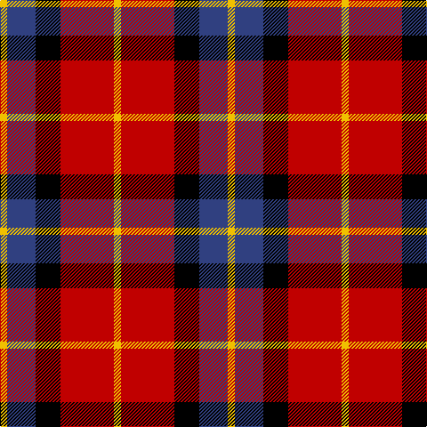

In pattern [YBKRY](/patterns/ybkry/).

This was sourced from weddslist.  It is a [5 stripes tartan](/stripes/stripes5/).

Original link http://www.weddslist.com/cgi-bin/tartans/pg.pl?source=sts

## Thread count
Y/8 B32 K28 R60 Y/8

## Palette
Each colour and its ΔE from the base-6 reference it is a variant of.

| Colour | Shade | Base | ΔE (OKLab) |
|---|---|---|---|
| B | <code style="background-color:#304080;">#304080</code> `#304080` | B <code style="background-color:#2A418A;">#2A418A</code> | 0.02 |
| K | <code style="background-color:#000000;">#000000</code> `#000000` | K <code style="background-color:#000000;">#000000</code> | 0.00 |
| R | <code style="background-color:#C00000;">#C00000</code> `#C00000` | R <code style="background-color:#CC0000;">#CC0000</code> | 0.03 |
| Y | <code style="background-color:#F0C000;">#F0C000</code> `#F0C000` | Y <code style="background-color:#F2BF00;">#F2BF00</code> | 0.00 |

# Sample pattern

## Nearest tartans

The nearest existing variants by ΔTartan distance.

1. [Aberdeen University Corporate Tartan Tartan Number: 2152. Earliest known date: 1993 Aberdeen Unversity tartan was designed by the Weaver Incorporation of Aberdeen and Harry Lindley, to commemorate the Quincentennial of the University. The colours of the armourial bearings of the University were used as the starting point of the design, which was approved by the Principal in August 1992. See products available Copyright © Blair Urquhart, Comrie, 2015](/setts/s5/y2r15k7b8y2~b2c2c80-k101010-rc80000-ye8c000~x4/) — ΔT 0.53
1. [Wcwm 759-2](/setts/s6/w5r34k22r4ra24r4~k000000-r8c0000-ra8c8c8c-wc8c8c8~x2/) — ΔT 0.65
1. [Aberdeen University (1992)](/setts/s5/y4r27k12b15y4~b2c2c80-k101010-rc8002c-ye8c000~x2/) — ΔT 0.68
1. [SAL Cubiska Stenen](/setts/s5/r15g3w2k10w5~g007800-k000000-rc80000-wf8f8f8~x2/) — ΔT 0.76
1. [Graham of Menteith, (Red)](/setts/s6/r26b3r4k16ba16k4~b5480b0-ba304080-k000000-rc00000~x2/) — ΔT 0.97
1. [Bonhill Primary School](/setts/s4/r4k25ra25w4~k101010-rc80000-rab84c00-wffffff~x2/) — ΔT 1.06
1. [Connel (Clan)](/setts/s4/w1r8k8y1~k101010-rc80000-wfcfcfc-ye8c000~x4/) — ΔT 1.10
1. [Connel Clan Tartan Tartan Number: 1854. Earliest known date: c. 1890 Whether the Wallace, which is known to date from at least 1842, and the Connel tartan are related is uncertain, although the close similarity leads one to suspect that the later 'Connel' is based on the Wallace. The Connels and MacConnels are both claimed as septs of Clan Donald. (P.E. MacDonald) See products available Copyright © Blair Urquhart, Comrie, 2015](/setts/s4/w1r8k8y1~k101010-rc80000-we0e0e0-ye8c000~x2/) — ΔT 1.11
1. [Wcwm 759-3](/setts/s6/w5r34k24r4ra24r4~k000000-r8c8c8c-ra8c0000-wc8c8c8~x2/) — ΔT 1.14
1. [Baillie of Polkemett](/setts/s5/w3b12k12r20g2~b304080-g008000-k000000-rc00000-we0e0e0~x2/) — ΔT 1.14

## Neighbour map

Every grey dot is one of 15726 variants placed by the first two principal components of the ΔTartan feature space (44% of its variance). Red is this tartan; blue dots are its nearest — click one to open its page.

<svg viewBox="0 0 640 380" role="img" style="max-width:100%;height:auto;border:1px solid #e0e0e0;border-radius:4px;display:block" xmlns="http://www.w3.org/2000/svg"><image href="/nn/cloud.v1.png" width="640" height="380"/><a href="/setts/s5/y2r15k7b8y2~b2c2c80-k101010-rc80000-ye8c000~x4/"><circle cx="196.6" cy="221.4" r="4" fill="#3465a4"><title>Aberdeen University Corporate Tartan Tartan Number: 2152. Earliest known date: 1993 Aberdeen Unversity tartan was designed by the Weaver Incorporation of Aberdeen and Harry Lindley, to commemorate the Quincentennial of the University. The colours of the armourial bearings of the University were used as the starting point of the design, which was approved by the Principal in August 1992. See products available Copyright © Blair Urquhart, Comrie, 2015</title></circle></a><a href="/setts/s6/w5r34k22r4ra24r4~k000000-r8c0000-ra8c8c8c-wc8c8c8~x2/"><circle cx="204.9" cy="206.8" r="4" fill="#3465a4"><title>Wcwm 759-2</title></circle></a><a href="/setts/s5/y4r27k12b15y4~b2c2c80-k101010-rc8002c-ye8c000~x2/"><circle cx="186.9" cy="226.1" r="4" fill="#3465a4"><title>Aberdeen University (1992)</title></circle></a><a href="/setts/s5/r15g3w2k10w5~g007800-k000000-rc80000-wf8f8f8~x2/"><circle cx="164.7" cy="212.5" r="4" fill="#3465a4"><title>SAL Cubiska Stenen</title></circle></a><a href="/setts/s6/r26b3r4k16ba16k4~b5480b0-ba304080-k000000-rc00000~x2/"><circle cx="204.1" cy="211.1" r="4" fill="#3465a4"><title>Graham of Menteith, (Red)</title></circle></a><a href="/setts/s4/r4k25ra25w4~k101010-rc80000-rab84c00-wffffff~x2/"><circle cx="213.3" cy="240.1" r="4" fill="#3465a4"><title>Bonhill Primary School</title></circle></a><a href="/setts/s4/w1r8k8y1~k101010-rc80000-wfcfcfc-ye8c000~x4/"><circle cx="238.7" cy="224.0" r="4" fill="#3465a4"><title>Connel (Clan)</title></circle></a><a href="/setts/s4/w1r8k8y1~k101010-rc80000-we0e0e0-ye8c000~x2/"><circle cx="241.6" cy="225.3" r="4" fill="#3465a4"><title>Connel Clan Tartan Tartan Number: 1854. Earliest known date: c. 1890 Whether the Wallace, which is known to date from at least 1842, and the Connel tartan are related is uncertain, although the close similarity leads one to suspect that the later 'Connel' is based on the Wallace. The Connels and MacConnels are both claimed as septs of Clan Donald. (P.E. MacDonald) See products available Copyright © Blair Urquhart, Comrie, 2015</title></circle></a><a href="/setts/s6/w5r34k24r4ra24r4~k000000-r8c8c8c-ra8c0000-wc8c8c8~x2/"><circle cx="188.8" cy="206.0" r="4" fill="#3465a4"><title>Wcwm 759-3</title></circle></a><a href="/setts/s5/w3b12k12r20g2~b304080-g008000-k000000-rc00000-we0e0e0~x2/"><circle cx="158.8" cy="198.3" r="4" fill="#3465a4"><title>Baillie of Polkemett</title></circle></a><circle cx="184.6" cy="218.7" r="5" fill="#c00000"/></svg>

ID: /setts/s5/y2r15k7b8y2~b304080-k000000-rc00000-yf0c000~x4/
