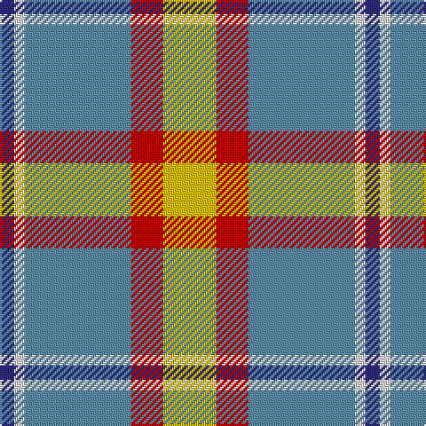

In pattern [BWBRY](/patterns/bwbry/).

This was sourced from tartans-authority.  It is a [5 stripes tartan](/stripes/stripes5/).

Original link http://www.tartansauthority.com/tartan-ferret/display/6970/

## Thread count
DB/8 LN6 B60 R18 Y/30

## Palette
Each colour and its ΔE from the base-6 reference it is a variant of.

| Colour | Shade | Base | ΔE (OKLab) |
|---|---|---|---|
| B | <code style="background-color:#5C8CA8;">#5C8CA8</code> `#5C8CA8` | B <code style="background-color:#2C4084;">#2C4084</code> | 0.23 |
| DB | <code style="background-color:#2C2C80;">#2C2C80</code> `#2C2C80` | B <code style="background-color:#2C4084;">#2C4084</code> | 0.05 |
| LN | <code style="background-color:#E0E0E0;">#E0E0E0</code> `#E0E0E0` | W <code style="background-color:#F4F4F0;">#F4F4F0</code> | 0.06 |
| R | <code style="background-color:#C80000;">#C80000</code> `#C80000` | R <code style="background-color:#C80000;">#C80000</code> | 0.00 |
| Y | <code style="background-color:#E8C000;">#E8C000</code> `#E8C000` | Y <code style="background-color:#E8C000;">#E8C000</code> | 0.00 |

# Sample pattern

## Nearest tartans

The nearest existing variants by ΔTartan distance.

1. [Bagpipe Shop (Switzerland)](/setts/s5/b100w30y30g10r10-b646464-g4ca412-rff0000-wf8f4d0-ya4a8a8/) — ΔT 0.75
1. [Bagpipe Shop (Corporate)](/setts/s5/b100w30wa30g10r10-b5c5c5c-g289c18-rc80000-we0e0e0-wac0c0c0/) — ΔT 0.81
1. [Tombow 140th Anniversary, The](/setts/s7/g8y14r18y18b40w4b4-b1870a4-g006400-rfa4b00-wffffff-ye0a126/) — ΔT 1.02
1. [Trinity Bicycles (Corporate)](/setts/s5/g8w22g28wa60r8-g704400-rc80000-wb4c0c8-wac8c8bc/) — ΔT 1.14
1. [Burberry Counterfeit](/setts/s5/r18w18k18y60ra6-k101010-r98481c-rac80000-wf8f4d0-ya08858/) — ΔT 1.24
1. [Afternoon Tea / Milk Tea](/setts/s6/w15y98b72r25b8ya15-b4c3428-re87878-we0e0e0-ya08858-ya48a4c0/) — ΔT 1.25
1. [Roseberry (Name)](/setts/s6/w8b30g5w3ba8r5-b5c8ca8-ba2c2c80-g289c18-rc80000-we0e0e0/) — ΔT 1.25
1. [Sterling, Rob (Florida) (Persona Name Tartan Tartan Number: 10653. Earliest known date: 10/07/2012 Designed by Rob Sterling, St. Petersburg, Florida, for use by his family and associates. See products available Copyright © Blair Urquhart, Comrie, 2015](/setts/s5/g22y20b22ba66w6-b433a5a-ba5f749c-g649848-wf9f5ef-ye0a126/) — ΔT 1.26
1. [MacKintosh Dress (Dance)](/setts/s6/g6r18ga36b16w66r6-b780078-g289c18-ga285800-rc80000-we0e0e0/) — ΔT 1.33
1. [Celtic Norse Heritage Society](/setts/s5/r60k6b18g18y6-b2c2c80-g006818-k101010-r888888-yfccc00/) — ΔT 1.36

## Neighbour map

Every grey dot is one of 15726 variants placed by the first two principal components of the ΔTartan feature space (44% of its variance). Red is this tartan; blue dots are its nearest — click one to open its page.

<svg viewBox="0 0 640 380" role="img" style="max-width:100%;height:auto;border:1px solid #e0e0e0;border-radius:4px;display:block" xmlns="http://www.w3.org/2000/svg"><image href="/nn/cloud.v1.png" width="640" height="380"/><a href="/setts/s5/b100w30y30g10r10-b646464-g4ca412-rff0000-wf8f4d0-ya4a8a8/"><circle cx="276.7" cy="187.7" r="4" fill="#3465a4"><title>Bagpipe Shop (Switzerland)</title></circle></a><a href="/setts/s5/b100w30wa30g10r10-b5c5c5c-g289c18-rc80000-we0e0e0-wac0c0c0/"><circle cx="273.5" cy="187.4" r="4" fill="#3465a4"><title>Bagpipe Shop (Corporate)</title></circle></a><a href="/setts/s7/g8y14r18y18b40w4b4-b1870a4-g006400-rfa4b00-wffffff-ye0a126/"><circle cx="180.4" cy="181.3" r="4" fill="#3465a4"><title>Tombow 140th Anniversary, The</title></circle></a><a href="/setts/s5/g8w22g28wa60r8-g704400-rc80000-wb4c0c8-wac8c8bc/"><circle cx="234.5" cy="221.1" r="4" fill="#3465a4"><title>Trinity Bicycles (Corporate)</title></circle></a><a href="/setts/s5/r18w18k18y60ra6-k101010-r98481c-rac80000-wf8f4d0-ya08858/"><circle cx="212.0" cy="187.7" r="4" fill="#3465a4"><title>Burberry Counterfeit</title></circle></a><a href="/setts/s6/w15y98b72r25b8ya15-b4c3428-re87878-we0e0e0-ya08858-ya48a4c0/"><circle cx="225.8" cy="179.9" r="4" fill="#3465a4"><title>Afternoon Tea / Milk Tea</title></circle></a><a href="/setts/s6/w8b30g5w3ba8r5-b5c8ca8-ba2c2c80-g289c18-rc80000-we0e0e0/"><circle cx="233.2" cy="179.0" r="4" fill="#3465a4"><title>Roseberry (Name)</title></circle></a><a href="/setts/s5/g22y20b22ba66w6-b433a5a-ba5f749c-g649848-wf9f5ef-ye0a126/"><circle cx="240.4" cy="211.5" r="4" fill="#3465a4"><title>Sterling, Rob (Florida) (Persona Name Tartan Tartan Number: 10653. Earliest known date: 10/07/2012 Designed by Rob Sterling, St. Petersburg, Florida, for use by his family and associates. See products available Copyright © Blair Urquhart, Comrie, 2015</title></circle></a><a href="/setts/s6/g6r18ga36b16w66r6-b780078-g289c18-ga285800-rc80000-we0e0e0/"><circle cx="174.7" cy="160.3" r="4" fill="#3465a4"><title>MacKintosh Dress (Dance)</title></circle></a><a href="/setts/s5/r60k6b18g18y6-b2c2c80-g006818-k101010-r888888-yfccc00/"><circle cx="279.6" cy="196.9" r="4" fill="#3465a4"><title>Celtic Norse Heritage Society</title></circle></a><circle cx="229.5" cy="192.7" r="5" fill="#c00000"/></svg>

ID: /setts/s5/y30r18b60w6ba8-b5c8ca8-ba2c2c80-rc80000-we0e0e0-ye8c000/
