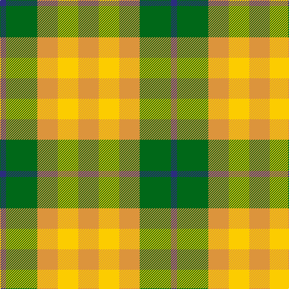

In pattern [BGYYY](/patterns/bgyyy/).

This was sourced from tartans-authority.  It is a [5 stripes tartan](/stripes/stripes5/).

Original link http://www.tartansauthority.com/tartan-ferret/display/10933/

## Thread count
DB/10 G52 O34 Y34 O/34

## Palette
Each colour and its ΔE from the base-6 reference it is a variant of.

| Colour | Shade | Base | ΔE (OKLab) |
|---|---|---|---|
| DB | <code style="background-color:#2C2C80;">#2C2C80</code> `#2C2C80` | B <code style="background-color:#2C4084;">#2C4084</code> | 0.05 |
| G | <code style="background-color:#006818;">#006818</code> `#006818` | G <code style="background-color:#006400;">#006400</code> | 0.02 |
| O | <code style="background-color:#DC943C;">#DC943C</code> `#DC943C` | Y <code style="background-color:#E8C000;">#E8C000</code> | 0.12 |
| Y | <code style="background-color:#FCCC00;">#FCCC00</code> `#FCCC00` | Y <code style="background-color:#E8C000;">#E8C000</code> | 0.04 |

# Sample pattern

## Nearest tartans

The nearest existing variants by ΔTartan distance.

1. [Wilson's, No 203](/setts/s4/b8r16g20y4-b5480b0-g008000-rc00000-yf0c000/) — ΔT 1.30
1. [Unidentified, Silk Plaid](/setts/s5/b70r80g150y60ga30-b304080-g008000-ga908000-rf07040-yffe000/) — ΔT 1.42
1. [Wild Mustard Dreams](/setts/s5/y34ya34r34g52b10-b0000ff-g408060-rb84c00-yd87c00-yaffe600/) — ΔT 1.55
1. [MacKinnon, dress](/setts/s4/g36r28w28ra4-g008000-r703000-rac00000-we0e0e0/) — ΔT 1.55
1. [Wilson's No.203](/setts/s4/b8r16g20y4-b2888c4-g006818-rc80000-ye8c000/) — ΔT 1.56
1. [Spirit of Riverside (Corporate)](/setts/s4/r40w26y48k6-k101010-r888888-we0e0e0-ye8c000/) — ΔT 1.60
1. [Unidentified Silk Plaid](/setts/s5/b70r80g150y60ya30-b2c4084-g005020-rec7440-yfadc00-yac89600/) — ΔT 1.79
1. [Omani Regiment 2nd Pipe Sqn.](/setts/s6/g46r46w18r46g46w18-g289c18-rc80000-wf8f8f8/) — ΔT 1.80
1. [Tulsa](/setts/s6/r28k6r28g26b16g26-b304080-g008000-k000000-rc00000/) — ΔT 1.87
1. [Quaboos, Pipers Plaid](/setts/s4/w18g46r46w18-g008000-rc00000-we0e0e0/) — ΔT 1.88

## Neighbour map

Every grey dot is one of 15726 variants placed by the first two principal components of the ΔTartan feature space (44% of its variance). Red is this tartan; blue dots are its nearest — click one to open its page.

<svg viewBox="0 0 640 380" role="img" style="max-width:100%;height:auto;border:1px solid #e0e0e0;border-radius:4px;display:block" xmlns="http://www.w3.org/2000/svg"><image href="/nn/cloud.v1.png" width="640" height="380"/><a href="/setts/s4/b8r16g20y4-b5480b0-g008000-rc00000-yf0c000/"><circle cx="181.4" cy="278.1" r="4" fill="#3465a4"><title>Wilson's, No 203</title></circle></a><a href="/setts/s5/b70r80g150y60ga30-b304080-g008000-ga908000-rf07040-yffe000/"><circle cx="97.1" cy="246.2" r="4" fill="#3465a4"><title>Unidentified, Silk Plaid</title></circle></a><a href="/setts/s5/y34ya34r34g52b10-b0000ff-g408060-rb84c00-yd87c00-yaffe600/"><circle cx="66.4" cy="254.0" r="4" fill="#3465a4"><title>Wild Mustard Dreams</title></circle></a><a href="/setts/s4/g36r28w28ra4-g008000-r703000-rac00000-we0e0e0/"><circle cx="149.2" cy="248.2" r="4" fill="#3465a4"><title>MacKinnon, dress</title></circle></a><a href="/setts/s4/b8r16g20y4-b2888c4-g006818-rc80000-ye8c000/"><circle cx="177.8" cy="277.0" r="4" fill="#3465a4"><title>Wilson's No.203</title></circle></a><a href="/setts/s4/r40w26y48k6-k101010-r888888-we0e0e0-ye8c000/"><circle cx="183.7" cy="250.4" r="4" fill="#3465a4"><title>Spirit of Riverside (Corporate)</title></circle></a><a href="/setts/s5/b70r80g150y60ya30-b2c4084-g005020-rec7440-yfadc00-yac89600/"><circle cx="91.0" cy="243.1" r="4" fill="#3465a4"><title>Unidentified Silk Plaid</title></circle></a><a href="/setts/s6/g46r46w18r46g46w18-g289c18-rc80000-wf8f8f8/"><circle cx="140.1" cy="306.2" r="4" fill="#3465a4"><title>Omani Regiment 2nd Pipe Sqn.</title></circle></a><a href="/setts/s6/r28k6r28g26b16g26-b304080-g008000-k000000-rc00000/"><circle cx="166.2" cy="282.3" r="4" fill="#3465a4"><title>Tulsa</title></circle></a><a href="/setts/s4/w18g46r46w18-g008000-rc00000-we0e0e0/"><circle cx="123.8" cy="311.1" r="4" fill="#3465a4"><title>Quaboos, Pipers Plaid</title></circle></a><circle cx="146.9" cy="274.1" r="5" fill="#c00000"/></svg>

ID: /setts/s5/y34ya34y34g52b10-b2c2c80-g006818-ydc943c-yafccc00/
