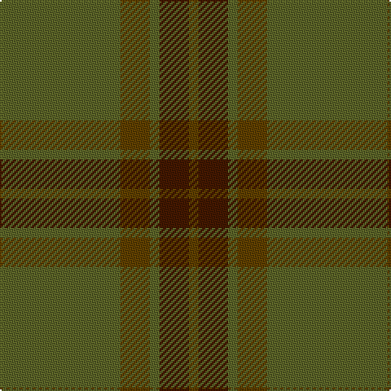

**Bands:** [GGGBG](/stripes/gggbg/) · **Stripes:** [Y DY Y DO DY](/stripes/stripes5/) Y DY Y DO DY

This was sourced from house-of-tartan.  It is a [5 band tartan](/bands/bands5/).

Original link http://www.house-of-tartan.scotland.net/house/TartanViewjs.asp?colr=Def&tnam=915

## Thread count
G/74 T18 G6 DR18 T/6

## Palette
Each colour and its ΔE from the base-6 reference it is a variant of.

| Colour | Shade | Base | ΔE (OKLab) |
|---|---|---|---|
| DR | <code style="background-color:#441800;">#441800</code> `#441800` | B <code style="background-color:#2A418A;">#2A418A</code> | 0.23 |
| G | <code style="background-color:#5C6428;">#5C6428</code> `#5C6428` | G <code style="background-color:#006100;">#006100</code> | 0.10 |
| T | <code style="background-color:#604000;">#604000</code> `#604000` | G <code style="background-color:#006100;">#006100</code> | 0.14 |

# Sample pattern

## Nearest tartans

The nearest existing variants by ΔTartan distance.

1. [Glen Boig](/setts/s5/g13dy3g1do3dy1~x6/) — ΔT 1.30
1. [McGuigan, Julia (St Monans, Fife) (Personal)](/setts/s4/y9y52dy15ly4~x2/) — ΔT 1.33
1. [Sanix Muted](/setts/s4/dg3dy30dg40r3~x2/) — ΔT 1.56
1. [Highland Greenford (Personal)](/setts/s4/y50dy25ly2dp6~x2/) — ΔT 1.79
1. [Gayre Bodyguard](/setts/s8/dg18r6dg75db6dg13dy35dg12db6/) — ΔT 1.79
1. [Cairns, David (Personal)](/setts/s5/n11o1n4o8r1~x8/) — ΔT 1.97
1. [Celtic 2009 (Sports)](/setts/s5/g40dg15g4dg4g4~x2/) — ΔT 2.07
1. [Cairns, David (Personal)](/setts/s5/do11n1do4n8r1~x8/) — ΔT 2.07
1. [Ulster (Peat) (District](/setts/s10/y28k2y28k2y2k2dy29k2r2k2~x2/) — ΔT 2.23
1. [Tricor (Corporate)](/setts/s7/y23o4dy6g6y4lb1y4~x4/) — ΔT 2.27

## Neighbour map

Every grey dot is one of 14299 variants placed by the first two principal components of the ΔTartan feature space (44% of its variance). Red is this tartan; blue dots are its nearest — click one to open its page.

<svg viewBox="0 0 640 380" role="img" style="max-width:100%;height:auto;border:1px solid #e0e0e0;border-radius:4px;display:block" xmlns="http://www.w3.org/2000/svg"><image href="/nn/cloud.v1.png" width="640" height="380"/><a href="/setts/s5/g13dy3g1do3dy1~x6/"><circle cx="568.5" cy="307.0" r="4" fill="#3465a4"><title>Glen Boig</title></circle></a><a href="/setts/s4/y9y52dy15ly4~x2/"><circle cx="537.8" cy="304.1" r="4" fill="#3465a4"><title>McGuigan, Julia (St Monans, Fife) (Personal)</title></circle></a><a href="/setts/s4/dg3dy30dg40r3~x2/"><circle cx="536.7" cy="335.3" r="4" fill="#3465a4"><title>Sanix Muted</title></circle></a><a href="/setts/s4/y50dy25ly2dp6~x2/"><circle cx="505.7" cy="261.9" r="4" fill="#3465a4"><title>Highland Greenford (Personal)</title></circle></a><a href="/setts/s8/dg18r6dg75db6dg13dy35dg12db6/"><circle cx="541.2" cy="270.1" r="4" fill="#3465a4"><title>Gayre Bodyguard</title></circle></a><a href="/setts/s5/n11o1n4o8r1~x8/"><circle cx="504.7" cy="311.4" r="4" fill="#3465a4"><title>Cairns, David (Personal)</title></circle></a><a href="/setts/s5/g40dg15g4dg4g4~x2/"><circle cx="487.9" cy="307.2" r="4" fill="#3465a4"><title>Celtic 2009 (Sports)</title></circle></a><a href="/setts/s5/do11n1do4n8r1~x8/"><circle cx="545.1" cy="340.1" r="4" fill="#3465a4"><title>Cairns, David (Personal)</title></circle></a><a href="/setts/s10/y28k2y28k2y2k2dy29k2r2k2~x2/"><circle cx="480.9" cy="219.9" r="4" fill="#3465a4"><title>Ulster (Peat) (District</title></circle></a><a href="/setts/s7/y23o4dy6g6y4lb1y4~x4/"><circle cx="506.5" cy="221.6" r="4" fill="#3465a4"><title>Tricor (Corporate)</title></circle></a><circle cx="554.6" cy="298.1" r="5" fill="#c00000"/></svg>

ID: /setts/s5/y37dy9y3do9dy3~x2/
