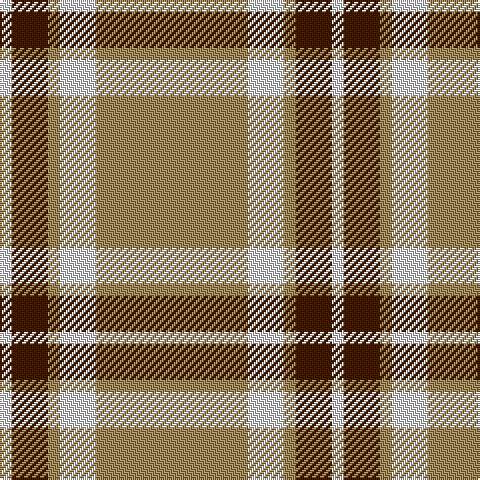

In pattern [WBYWY](/patterns/wbywy/).

This was sourced from house-of-tartan.  It is a [5 stripes tartan](/stripes/stripes5/).

Original link http://www.house-of-tartan.scotland.net/house/TartanViewjs.asp?colr=Def&tnam=1751

## Thread count
LN/6 DR18 LT6 LN18 LT/76

## Palette
Each colour and its ΔE from the base-6 reference it is a variant of.

| Colour | Shade | Base | ΔE (OKLab) |
|---|---|---|---|
| DR | <code style="background-color:#441800;">#441800</code> `#441800` | B <code style="background-color:#2A418A;">#2A418A</code> | 0.23 |
| LN | <code style="background-color:#E0E0E0;">#E0E0E0</code> `#E0E0E0` | W <code style="background-color:#F7F7F7;">#F7F7F7</code> | 0.07 |
| LT | <code style="background-color:#A08858;">#A08858</code> `#A08858` | Y <code style="background-color:#F2BF00;">#F2BF00</code> | 0.21 |

# Sample pattern

## Nearest tartans

The nearest existing variants by ΔTartan distance.

1. [Loch Tummel](/setts/s5/r38w9r3b9w3~b401000-r906030-we0e0e0~x2/) — ΔT 0.83
1. [Ceredigion (Personal)](/setts/s5/y5b1y1b12r1~b5c5c5c-rb44440-yc0c4a0~x8/) — ΔT 1.24
1. [Carlisle, Ancient](/setts/s5/b11y2r1y2r1~b5480b0-rc00000-yf0c000~x4/) — ΔT 1.30
1. [Machair](/setts/s6/y72b16w9b4w5b16~b003c64-we0e0e0-ya08858~x2/) — ΔT 1.40
1. [Lister (Misty Mountain)](/setts/s7/g8y29g8ya3g8y8ya3~g5d321f-yccbaaf-yae0a126~x2/) — ΔT 1.53
1. [Coca Cola (Corporate)](/setts/s5/w15g15w15g80r6~g604000-rc80000-wd4e8f4/) — ΔT 1.57
1. [Menzies, Brown & White](/setts/s8/r31w5r2w5r4w3r2w7~r806050-we0e0e0~x2/) — ΔT 1.64
1. [Coca Cola](/setts/s5/w7g7w7g40r3~g604000-rc80000-wd4e8f4~x2/) — ΔT 1.65
1. [Deer Park (Loton) (Personal)](/setts/s7/y60r7w10g16y15w3y15~g003820-rc03824-wf8f8f8-y8ca064~x2/) — ΔT 1.76
1. [Carlisle Family Tartan Tartan Number: 674. Earliest known date: 1987 Derived from the Coat of Arms. See products available Copyright © Blair Urquhart, Comrie, 2015](/setts/s7/b11y5k1y2r1y2b11~b5c8ca8-k101010-rc80000-ye8c000~x12/) — ΔT 1.77

## Neighbour map

Every grey dot is one of 15726 variants placed by the first two principal components of the ΔTartan feature space (44% of its variance). Red is this tartan; blue dots are its nearest — click one to open its page.

<svg viewBox="0 0 640 380" role="img" style="max-width:100%;height:auto;border:1px solid #e0e0e0;border-radius:4px;display:block" xmlns="http://www.w3.org/2000/svg"><image href="/nn/cloud.v1.png" width="640" height="380"/><a href="/setts/s5/r38w9r3b9w3~b401000-r906030-we0e0e0~x2/"><circle cx="407.7" cy="203.9" r="4" fill="#3465a4"><title>Loch Tummel</title></circle></a><a href="/setts/s5/y5b1y1b12r1~b5c5c5c-rb44440-yc0c4a0~x8/"><circle cx="432.6" cy="220.6" r="4" fill="#3465a4"><title>Ceredigion (Personal)</title></circle></a><a href="/setts/s5/b11y2r1y2r1~b5480b0-rc00000-yf0c000~x4/"><circle cx="407.0" cy="211.2" r="4" fill="#3465a4"><title>Carlisle, Ancient</title></circle></a><a href="/setts/s6/y72b16w9b4w5b16~b003c64-we0e0e0-ya08858~x2/"><circle cx="380.5" cy="181.3" r="4" fill="#3465a4"><title>Machair</title></circle></a><a href="/setts/s7/g8y29g8ya3g8y8ya3~g5d321f-yccbaaf-yae0a126~x2/"><circle cx="311.4" cy="204.9" r="4" fill="#3465a4"><title>Lister (Misty Mountain)</title></circle></a><a href="/setts/s5/w15g15w15g80r6~g604000-rc80000-wd4e8f4/"><circle cx="444.7" cy="205.8" r="4" fill="#3465a4"><title>Coca Cola (Corporate)</title></circle></a><a href="/setts/s8/r31w5r2w5r4w3r2w7~r806050-we0e0e0~x2/"><circle cx="452.0" cy="183.0" r="4" fill="#3465a4"><title>Menzies, Brown &amp; White</title></circle></a><a href="/setts/s5/w7g7w7g40r3~g604000-rc80000-wd4e8f4~x2/"><circle cx="454.9" cy="204.6" r="4" fill="#3465a4"><title>Coca Cola</title></circle></a><a href="/setts/s7/y60r7w10g16y15w3y15~g003820-rc03824-wf8f8f8-y8ca064~x2/"><circle cx="428.8" cy="171.5" r="4" fill="#3465a4"><title>Deer Park (Loton) (Personal)</title></circle></a><a href="/setts/s7/b11y5k1y2r1y2b11~b5c8ca8-k101010-rc80000-ye8c000~x12/"><circle cx="385.0" cy="202.1" r="4" fill="#3465a4"><title>Carlisle Family Tartan Tartan Number: 674. Earliest known date: 1987 Derived from the Coat of Arms. See products available Copyright © Blair Urquhart, Comrie, 2015</title></circle></a><circle cx="408.7" cy="204.9" r="5" fill="#c00000"/></svg>

ID: /setts/s5/y38w9y3b9w3~b441800-we0e0e0-ya08858~x2/
