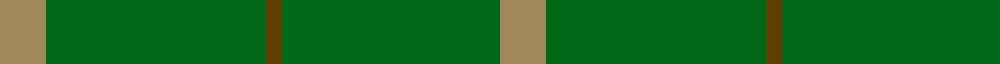
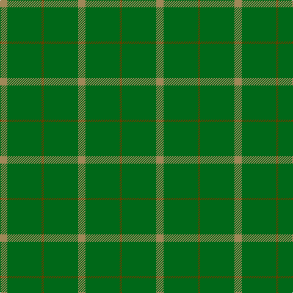

In pattern [YGGGY](/patterns/ygggy/).

This was sourced from house-of-tartan.  It is a [5 stripes tartan](/stripes/stripes5/).

Original link http://www.house-of-tartan.scotland.net/house/TartanViewjs.asp?colr=Def&tnam=1734

## Thread count
LT/12 G56 T4 G56 LT/12

## Palette
Each colour and its ΔE from the base-6 reference it is a variant of.

| Colour | Shade | Base | ΔE (OKLab) |
|---|---|---|---|
| G | <code style="background-color:#006818;">#006818</code> `#006818` | G <code style="background-color:#006100;">#006100</code> | 0.02 |
| LT | <code style="background-color:#A08858;">#A08858</code> `#A08858` | Y <code style="background-color:#F2BF00;">#F2BF00</code> | 0.21 |
| T | <code style="background-color:#604000;">#604000</code> `#604000` | G <code style="background-color:#006100;">#006100</code> | 0.14 |

# Sample pattern

## Nearest tartans

The nearest existing variants by ΔTartan distance.

1. [Pearson](/setts/s5/r3g14ra1g14r3x4~g008000-r906030-ra806050/) — ΔT 1.53
1. [Bannockbane Hunting Trade Tartan Tartan Number: 909. Earliest known date: c.1984 Nothing See products available Copyright © Blair Urquhart, Comrie, 2015](/setts/s8/g2ga2g15ga1w1g15ga2g2x2~g006818-ga604000-we0e0e0/) — ΔT 1.59
1. [Bannockbane, hunting](/setts/s8/g2r2g15r1w1g15r2g2x2~g008000-r806050-we0e0e0/) — ΔT 1.78
1. [Campbell Simpson](/setts/s4/g22k3g25k4x2~g005020-k101010/) — ΔT 2.25
1. [Glenlivet Corporate Tartan Tartan Number: 193. Earliest known date: 1989 Designed for Glenlivet Distilleries Ltd, Strathspey. See products available Copyright © Blair Urquhart, Comrie, 2015](/setts/s8/g18r6g75b6g13ga35g12b6~b2c2c80-g006818-ga604000-rc80000/) — ΔT 2.41
1. [Glenlivet](/setts/s8/g18r6g75b6g13ra35g12b6~b304080-g008000-rc00000-ra806050/) — ΔT 2.45
1. [O'Neill, Red](/setts/s6/g46r20g9r20g46y5x2~g006818-rb84c00-y48a4c0/) — ΔT 2.47
1. [Glen Boig](/setts/s5/g37r9g3b9r3x2~b401000-g006020-r806050/) — ΔT 2.54
1. [O'Neill, Red (Corporate?)](/setts/s4/g9r20g46y5x2~g006818-rb84c00-y48a4c0/) — ΔT 2.55
1. [Colonial Marine (Corporate)](/setts/s4/g56ga13y13y5x2~g006818-ga604000-ybc8c00/) — ΔT 2.64

## Neighbour map

Every grey dot is one of 15726 variants placed by the first two principal components of the ΔTartan feature space (44% of its variance). Red is this tartan; blue dots are its nearest — click one to open its page.

<svg viewBox="0 0 640 380" role="img" style="max-width:100%;height:auto;border:1px solid #e0e0e0;border-radius:4px;display:block" xmlns="http://www.w3.org/2000/svg"><image href="/nn/cloud.v1.png" width="640" height="380"/><a href="/setts/s5/r3g14ra1g14r3x4~g008000-r906030-ra806050/"><circle cx="626.0" cy="304.6" r="4" fill="#3465a4"><title>Pearson</title></circle></a><a href="/setts/s8/g2ga2g15ga1w1g15ga2g2x2~g006818-ga604000-we0e0e0/"><circle cx="626.0" cy="250.6" r="4" fill="#3465a4"><title>Bannockbane Hunting Trade Tartan Tartan Number: 909. Earliest known date: c.1984 Nothing See products available Copyright © Blair Urquhart, Comrie, 2015</title></circle></a><a href="/setts/s8/g2r2g15r1w1g15r2g2x2~g008000-r806050-we0e0e0/"><circle cx="626.0" cy="242.8" r="4" fill="#3465a4"><title>Bannockbane, hunting</title></circle></a><a href="/setts/s4/g22k3g25k4x2~g005020-k101010/"><circle cx="626.0" cy="356.3" r="4" fill="#3465a4"><title>Campbell Simpson</title></circle></a><a href="/setts/s8/g18r6g75b6g13ga35g12b6~b2c2c80-g006818-ga604000-rc80000/"><circle cx="497.5" cy="233.4" r="4" fill="#3465a4"><title>Glenlivet Corporate Tartan Tartan Number: 193. Earliest known date: 1989 Designed for Glenlivet Distilleries Ltd, Strathspey. See products available Copyright © Blair Urquhart, Comrie, 2015</title></circle></a><a href="/setts/s8/g18r6g75b6g13ra35g12b6~b304080-g008000-rc00000-ra806050/"><circle cx="471.5" cy="220.9" r="4" fill="#3465a4"><title>Glenlivet</title></circle></a><a href="/setts/s6/g46r20g9r20g46y5x2~g006818-rb84c00-y48a4c0/"><circle cx="454.9" cy="282.6" r="4" fill="#3465a4"><title>O'Neill, Red</title></circle></a><a href="/setts/s5/g37r9g3b9r3x2~b401000-g006020-r806050/"><circle cx="491.8" cy="263.1" r="4" fill="#3465a4"><title>Glen Boig</title></circle></a><a href="/setts/s4/g9r20g46y5x2~g006818-rb84c00-y48a4c0/"><circle cx="462.9" cy="285.8" r="4" fill="#3465a4"><title>O'Neill, Red (Corporate?)</title></circle></a><a href="/setts/s4/g56ga13y13y5x2~g006818-ga604000-ybc8c00/"><circle cx="458.5" cy="274.8" r="4" fill="#3465a4"><title>Colonial Marine (Corporate)</title></circle></a><circle cx="608.9" cy="290.6" r="5" fill="#c00000"/></svg>

ID: /setts/s5/y3g14ga1g14y3x4~g006818-ga604000-ya08858/
