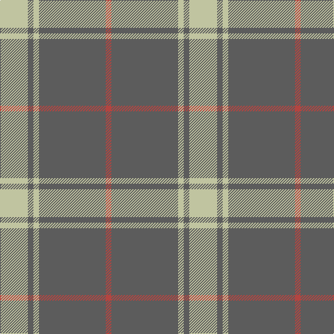

In pattern [RBYBY](/patterns/rbyby/).

This was sourced from tartans-authority.  It is a [5 stripes tartan](/stripes/stripes5/).

Original link http://www.tartansauthority.com/tartan-ferret/display/7078/

## Thread count
Na/40 N8 Na8 N96 R/8

## Palette
Each colour and its ΔE from the base-6 reference it is a variant of.

| Colour | Shade | Base | ΔE (OKLab) |
|---|---|---|---|
| N | <code style="background-color:#5C5C5C;">#5C5C5C</code> `#5C5C5C` | B <code style="background-color:#2C4084;">#2C4084</code> | 0.14 |
| Na | <code style="background-color:#C0C4A0;">#C0C4A0</code> `#C0C4A0` | Y <code style="background-color:#E8C000;">#E8C000</code> | 0.12 |
| R | <code style="background-color:#B44440;">#B44440</code> `#B44440` | R <code style="background-color:#C80000;">#C80000</code> | 0.07 |

# Sample pattern

ID: /setts/s5/y40b8y8b96r8-b5c5c5c-rb44440-yc0c4a0/
0/
