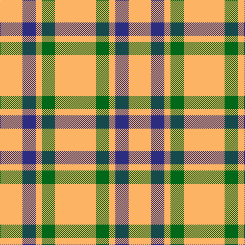

In pattern [YBYGY](/patterns/ybygy/).

This was sourced from tartans-authority.  It is a [5 stripes tartan](/stripes/stripes5/).

Original link http://www.tartansauthority.com/tartan-ferret/display/8908/

## Thread count
LG/44 DB26 LG12 G26 LG/80

## Palette
Each colour and its ΔE from the base-6 reference it is a variant of.

| Colour | Shade | Base | ΔE (OKLab) |
|---|---|---|---|
| DB | <code style="background-color:#2C2C80;">#2C2C80</code> `#2C2C80` | B <code style="background-color:#2A418A;">#2A418A</code> | 0.06 |
| G | <code style="background-color:#006818;">#006818</code> `#006818` | G <code style="background-color:#006100;">#006100</code> | 0.02 |
| LG | <code style="background-color:#FCB464;">#FCB464</code> `#FCB464` | Y <code style="background-color:#F2BF00;">#F2BF00</code> | 0.07 |

# Sample pattern

## Nearest tartans

The nearest existing variants by ΔTartan distance.

1. [Silvicola](/setts/s4/y20k15y20w3~k101010-we0e0e0-ye8c000~x2/) — ΔT 1.61
1. [Quenouille (2011)](/setts/s3/y49r16k11~k1c1714-rca2625-yf8e38c~x2/) — ΔT 1.73
1. [Sands-Pingot (Name?)](/setts/s5/y6r1y4r4b2~b2c2c80-rc80000-yfccc00~x5/) — ΔT 1.96
1. [Sands-Pingot Family, Alabama (Personal)](/setts/s5/y6r1y4r4b2~b0000cd-rff0000-yffe600~x5/) — ΔT 1.99
1. [Clayton Dress (Dance)](/setts/s6/w8r14w8r14w35k4~k000000-r880000-wfcfcfc~x2/) — ΔT 2.03
1. [Clayton Dress (Dance)](/setts/s8/r14w35k4w35r14w8r14w8~k000000-r880000-wfcfcfc~x2/) — ΔT 2.03
1. [Buchanan VS](/setts/s6/w2r4w2r4w9k1~k000000-rff0000-wd0d0d0/) — ΔT 2.07
1. [Tokharion](/setts/s6/b1y5b1y5b2w1~b2c2c80-we0e0e0-ya08858~x4/) — ΔT 2.14
1. [Masai Shuka 04 (Artefact)](/setts/s3/y20b10k3~b2c2c80-k000000-ye8c000~x2/) — ΔT 2.16
1. [Tennessee Volunteer](/setts/s8/w12y12w12k5y45k5wa5y10~k101010-wf8f8f8-wa98c8e8-yd87c00~x2/) — ΔT 2.18

## Neighbour map

Every grey dot is one of 15726 variants placed by the first two principal components of the ΔTartan feature space (44% of its variance). Red is this tartan; blue dots are its nearest — click one to open its page.

<svg viewBox="0 0 640 380" role="img" style="max-width:100%;height:auto;border:1px solid #e0e0e0;border-radius:4px;display:block" xmlns="http://www.w3.org/2000/svg"><image href="/nn/cloud.v1.png" width="640" height="380"/><a href="/setts/s4/y20k15y20w3~k101010-we0e0e0-ye8c000~x2/"><circle cx="321.9" cy="276.2" r="4" fill="#3465a4"><title>Silvicola</title></circle></a><a href="/setts/s3/y49r16k11~k1c1714-rca2625-yf8e38c~x2/"><circle cx="301.2" cy="272.0" r="4" fill="#3465a4"><title>Quenouille (2011)</title></circle></a><a href="/setts/s5/y6r1y4r4b2~b2c2c80-rc80000-yfccc00~x5/"><circle cx="271.1" cy="257.8" r="4" fill="#3465a4"><title>Sands-Pingot (Name?)</title></circle></a><a href="/setts/s5/y6r1y4r4b2~b0000cd-rff0000-yffe600~x5/"><circle cx="257.5" cy="252.0" r="4" fill="#3465a4"><title>Sands-Pingot Family, Alabama (Personal)</title></circle></a><a href="/setts/s6/w8r14w8r14w35k4~k000000-r880000-wfcfcfc~x2/"><circle cx="302.9" cy="208.5" r="4" fill="#3465a4"><title>Clayton Dress (Dance)</title></circle></a><a href="/setts/s8/r14w35k4w35r14w8r14w8~k000000-r880000-wfcfcfc~x2/"><circle cx="317.2" cy="202.2" r="4" fill="#3465a4"><title>Clayton Dress (Dance)</title></circle></a><a href="/setts/s6/w2r4w2r4w9k1~k000000-rff0000-wd0d0d0/"><circle cx="322.3" cy="214.0" r="4" fill="#3465a4"><title>Buchanan VS</title></circle></a><a href="/setts/s6/b1y5b1y5b2w1~b2c2c80-we0e0e0-ya08858~x4/"><circle cx="359.5" cy="263.4" r="4" fill="#3465a4"><title>Tokharion</title></circle></a><a href="/setts/s3/y20b10k3~b2c2c80-k000000-ye8c000~x2/"><circle cx="286.8" cy="269.3" r="4" fill="#3465a4"><title>Masai Shuka 04 (Artefact)</title></circle></a><a href="/setts/s8/w12y12w12k5y45k5wa5y10~k101010-wf8f8f8-wa98c8e8-yd87c00~x2/"><circle cx="321.2" cy="171.8" r="4" fill="#3465a4"><title>Tennessee Volunteer</title></circle></a><circle cx="374.7" cy="253.7" r="5" fill="#c00000"/></svg>

ID: /setts/s5/y40g13y6b13y22~b2c2c80-g006818-yfcb464~x2/
