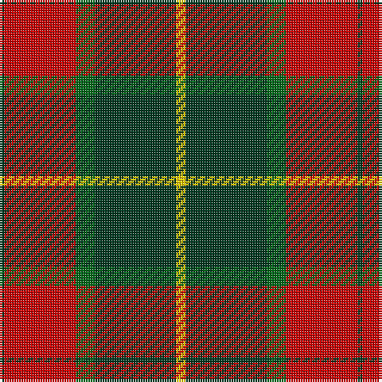

In pattern [GRGGY](/patterns/grggy/).

This was sourced from tartans-authority.  It is a [5 stripes tartan](/stripes/stripes5/).

Original link http://www.tartansauthority.com/tartan-ferret/display/10554/

## Thread count
DG/2 R30 G8 DG34 Y/4

## Palette
Each colour and its ΔE from the base-6 reference it is a variant of.

| Colour | Shade | Base | ΔE (OKLab) |
|---|---|---|---|
| DG | <code style="background-color:#003820;">#003820</code> `#003820` | G <code style="background-color:#006400;">#006400</code> | 0.16 |
| G | <code style="background-color:#006818;">#006818</code> `#006818` | G <code style="background-color:#006400;">#006400</code> | 0.02 |
| R | <code style="background-color:#C80000;">#C80000</code> `#C80000` | R <code style="background-color:#C80000;">#C80000</code> | 0.00 |
| Y | <code style="background-color:#FCCC00;">#FCCC00</code> `#FCCC00` | Y <code style="background-color:#E8C000;">#E8C000</code> | 0.04 |

# Sample pattern

## Nearest tartans

The nearest existing variants by ΔTartan distance.

1. [Christmas](/setts/s5/y4g34ga8r30g2-g0e3923-ga207449-rbb001a-ye3b235/) — ΔT 0.55
1. [Unidentified #15](/setts/s6/k12r4g34r32k2b4-b3c82af-g005020-k101010-rdc0000/) — ΔT 0.73
1. [Plummer Family Personal Tartan Tartan Number: 2778. Earliest known date: 2001 From a D C Dalgliesh swatch in 2001 via Phil Smith June 2004. See products available Copyright © Blair Urquhart, Comrie, 2015](/setts/s6/r60k16g60b8r6b4-b1860a8-g005028-k101010-rc80000/) — ΔT 0.86
1. [Finnlaggan](/setts/s6/g14w2g36b12r36g4-b304080-g003000-rc00000-we0e0e0/) — ΔT 0.93
1. [Prince of Orange #2](/setts/s5/b12y50g32k4b6-b2c2c80-g604000-k101010-yd87c00/) — ΔT 0.94
1. [Cetoloni (Personal)](/setts/s6/b4r48g24y4g24b4-b2c2c80-g006818-rc80000-ye8c000/) — ΔT 0.97
1. [Loch Ness Trade Tartan Tartan Number: 1219. Earliest known date: pre 2003 Nothing See products available Copyright © Blair Urquhart, Comrie, 2015](/setts/s6/r20w4k20w20g70k10-g604000-k101010-rc80000-we0e0e0/) — ΔT 0.99
1. [Celtic Combat](/setts/s6/k4r40k16g36r6w4-g005010-k101010-rc04c04-we0e0e0/) — ΔT 1.00
1. [Logan - 1819 (with yellow)](/setts/s7/b32r12y4r12g56r12y4-b440044-g285800-rc80000-ye8c000/) — ΔT 1.03
1. [Cook (Name)](/setts/s7/g24ga12g12r30k2r2k4-g003820-ga048888-k101010-rc80000/) — ΔT 1.03

## Neighbour map

Every grey dot is one of 15726 variants placed by the first two principal components of the ΔTartan feature space (44% of its variance). Red is this tartan; blue dots are its nearest — click one to open its page.

<svg viewBox="0 0 640 380" role="img" style="max-width:100%;height:auto;border:1px solid #e0e0e0;border-radius:4px;display:block" xmlns="http://www.w3.org/2000/svg"><image href="/nn/cloud.v1.png" width="640" height="380"/><a href="/setts/s5/y4g34ga8r30g2-g0e3923-ga207449-rbb001a-ye3b235/"><circle cx="300.9" cy="198.7" r="4" fill="#3465a4"><title>Christmas</title></circle></a><a href="/setts/s6/k12r4g34r32k2b4-b3c82af-g005020-k101010-rdc0000/"><circle cx="257.1" cy="178.1" r="4" fill="#3465a4"><title>Unidentified #15</title></circle></a><a href="/setts/s6/r60k16g60b8r6b4-b1860a8-g005028-k101010-rc80000/"><circle cx="278.9" cy="186.1" r="4" fill="#3465a4"><title>Plummer Family Personal Tartan Tartan Number: 2778. Earliest known date: 2001 From a D C Dalgliesh swatch in 2001 via Phil Smith June 2004. See products available Copyright © Blair Urquhart, Comrie, 2015</title></circle></a><a href="/setts/s6/g14w2g36b12r36g4-b304080-g003000-rc00000-we0e0e0/"><circle cx="314.8" cy="196.2" r="4" fill="#3465a4"><title>Finnlaggan</title></circle></a><a href="/setts/s5/b12y50g32k4b6-b2c2c80-g604000-k101010-yd87c00/"><circle cx="277.0" cy="200.5" r="4" fill="#3465a4"><title>Prince of Orange #2</title></circle></a><a href="/setts/s6/b4r48g24y4g24b4-b2c2c80-g006818-rc80000-ye8c000/"><circle cx="287.6" cy="197.2" r="4" fill="#3465a4"><title>Cetoloni (Personal)</title></circle></a><a href="/setts/s6/r20w4k20w20g70k10-g604000-k101010-rc80000-we0e0e0/"><circle cx="254.5" cy="170.2" r="4" fill="#3465a4"><title>Loch Ness Trade Tartan Tartan Number: 1219. Earliest known date: pre 2003 Nothing See products available Copyright © Blair Urquhart, Comrie, 2015</title></circle></a><a href="/setts/s6/k4r40k16g36r6w4-g005010-k101010-rc04c04-we0e0e0/"><circle cx="236.1" cy="203.9" r="4" fill="#3465a4"><title>Celtic Combat</title></circle></a><a href="/setts/s7/b32r12y4r12g56r12y4-b440044-g285800-rc80000-ye8c000/"><circle cx="246.7" cy="179.3" r="4" fill="#3465a4"><title>Logan - 1819 (with yellow)</title></circle></a><a href="/setts/s7/g24ga12g12r30k2r2k4-g003820-ga048888-k101010-rc80000/"><circle cx="251.2" cy="189.4" r="4" fill="#3465a4"><title>Cook (Name)</title></circle></a><circle cx="286.8" cy="192.5" r="5" fill="#c00000"/></svg>

ID: /setts/s5/y4g34ga8r30g2-g003820-ga006818-rc80000-yfccc00/
