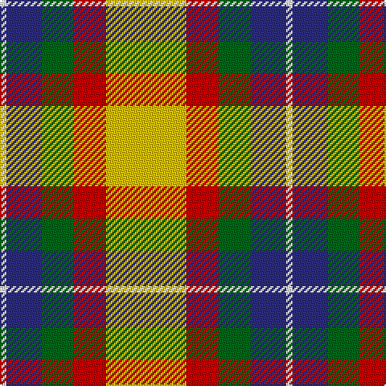

In pattern [WBGRY](/patterns/wbgry/).

This was sourced from register-of-tartans.  It is a [5 stripes tartan](/stripes/stripes5/).

Original link https://www.tartanregister.gov.uk/tartanDetails.aspx?ref=5410

## Attestations

This cloth appears in 2 source records; the oldest owns this page.

- 01/03/2007 — Samye (register-of-tartans, [record](https://www.tartanregister.gov.uk/tartanDetails.aspx?ref=5410))
- March 2007 — Samye (Corporate) (tartans-authority, [record](http://www.tartansauthority.com/tartan-ferret/display/7128/))

## Thread count
W/4 DB22 G20 R20 Y/50

## Palette
Each colour and its ΔE from the base-6 reference it is a variant of.

| Colour | Shade | Base | ΔE (OKLab) |
|---|---|---|---|
| DB | <code style="background-color:#2C2C80;">#2C2C80</code> `#2C2C80` | B <code style="background-color:#2C4084;">#2C4084</code> | 0.05 |
| G | <code style="background-color:#006818;">#006818</code> `#006818` | G <code style="background-color:#006400;">#006400</code> | 0.02 |
| R | <code style="background-color:#C80000;">#C80000</code> `#C80000` | R <code style="background-color:#C80000;">#C80000</code> | 0.00 |
| W | <code style="background-color:#F8F8F8;">#F8F8F8</code> `#F8F8F8` | W <code style="background-color:#F4F4F0;">#F4F4F0</code> | 0.01 |
| Y | <code style="background-color:#E8C000;">#E8C000</code> `#E8C000` | Y <code style="background-color:#E8C000;">#E8C000</code> | 0.00 |

# Sample pattern

## Nearest tartans

The nearest existing variants by ΔTartan distance.

1. [Samye #2](/setts/s5/y56r22g22b22w4-b2c4084-g309c18-rdc0000-we0e0e0-ye8c000/) — ΔT 0.70
1. [Scottish American Athletic Assoc](/setts/s5/y64k42r32ya12b8-b344054-k101010-r901c1c-ye8c000-yab8b8b8/) — ΔT 1.06
1. [Burberry Counterfeit](/setts/s5/r18w18k18y60ra6-k101010-r98481c-rac80000-wf8f4d0-ya08858/) — ΔT 1.09
1. [MacLean, dress](/setts/s6/r4w48g24r32b12y4-b5480b0-g008000-rc00000-we0e0e0-yf0c000/) — ΔT 1.15
1. [MacLean Dress (Lumsden)](/setts/s6/r4w48g24r32wa12y4-g006818-ra40000-wf8ece0-waa8ace8-yd09800/) — ΔT 1.18
1. [Ball Hunting](/setts/s6/y52g32k20w12wa8r4-g009468-k101010-rc80000-w98c8e8-waf8f8f8-ydc943c/) — ΔT 1.25
1. [Abbink, Ingmar (Personal)](/setts/s5/r78b44k22y44g10-b5c8ca8-g288028-k101010-ra00000-yfccc00/) — ΔT 1.31
1. [Entre Rios Province (Provisional](/setts/s6/g72w8g16k58r48wa14-g44a054-k101010-rc80000-wa8ace8-wae0e0e0/) — ΔT 1.34
1. [MacLachlan, dress](/setts/s7/r68w6g8ga46w48k6g8-g006030-ga008000-k000000-rd03030-we0e0e0/) — ΔT 1.35
1. [MacLachlan Dress](/setts/s7/r72w6y8g48w48k6y12-g006818-k101010-r880000-wf8f8f8-yd09800/) — ΔT 1.37

## Neighbour map

Every grey dot is one of 15726 variants placed by the first two principal components of the ΔTartan feature space (44% of its variance). Red is this tartan; blue dots are its nearest — click one to open its page.

<svg viewBox="0 0 640 380" role="img" style="max-width:100%;height:auto;border:1px solid #e0e0e0;border-radius:4px;display:block" xmlns="http://www.w3.org/2000/svg"><image href="/nn/cloud.v1.png" width="640" height="380"/><a href="/setts/s5/y56r22g22b22w4-b2c4084-g309c18-rdc0000-we0e0e0-ye8c000/"><circle cx="183.0" cy="182.0" r="4" fill="#3465a4"><title>Samye #2</title></circle></a><a href="/setts/s5/y64k42r32ya12b8-b344054-k101010-r901c1c-ye8c000-yab8b8b8/"><circle cx="130.1" cy="199.8" r="4" fill="#3465a4"><title>Scottish American Athletic Assoc</title></circle></a><a href="/setts/s5/r18w18k18y60ra6-k101010-r98481c-rac80000-wf8f4d0-ya08858/"><circle cx="212.0" cy="187.7" r="4" fill="#3465a4"><title>Burberry Counterfeit</title></circle></a><a href="/setts/s6/r4w48g24r32b12y4-b5480b0-g008000-rc00000-we0e0e0-yf0c000/"><circle cx="157.4" cy="166.5" r="4" fill="#3465a4"><title>MacLean, dress</title></circle></a><a href="/setts/s6/r4w48g24r32wa12y4-g006818-ra40000-wf8ece0-waa8ace8-yd09800/"><circle cx="148.1" cy="161.5" r="4" fill="#3465a4"><title>MacLean Dress (Lumsden)</title></circle></a><a href="/setts/s6/y52g32k20w12wa8r4-g009468-k101010-rc80000-w98c8e8-waf8f8f8-ydc943c/"><circle cx="138.9" cy="153.6" r="4" fill="#3465a4"><title>Ball Hunting</title></circle></a><a href="/setts/s5/r78b44k22y44g10-b5c8ca8-g288028-k101010-ra00000-yfccc00/"><circle cx="130.7" cy="210.3" r="4" fill="#3465a4"><title>Abbink, Ingmar (Personal)</title></circle></a><a href="/setts/s6/g72w8g16k58r48wa14-g44a054-k101010-rc80000-wa8ace8-wae0e0e0/"><circle cx="142.7" cy="194.7" r="4" fill="#3465a4"><title>Entre Rios Province (Provisional</title></circle></a><a href="/setts/s7/r68w6g8ga46w48k6g8-g006030-ga008000-k000000-rd03030-we0e0e0/"><circle cx="146.7" cy="152.6" r="4" fill="#3465a4"><title>MacLachlan, dress</title></circle></a><a href="/setts/s7/r72w6y8g48w48k6y12-g006818-k101010-r880000-wf8f8f8-yd09800/"><circle cx="138.2" cy="148.7" r="4" fill="#3465a4"><title>MacLachlan Dress</title></circle></a><circle cx="159.1" cy="185.9" r="5" fill="#c00000"/></svg>

ID: /setts/s5/y50r20g20b22w4-b2c2c80-g006818-rc80000-wf8f8f8-ye8c000/
