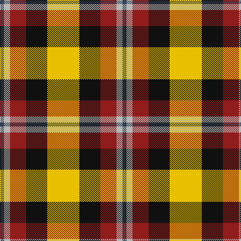

In pattern [BYRKY](/patterns/byrky/).

This was sourced from register-of-tartans.  It is a [5 stripes tartan](/stripes/stripes5/).

Original link https://www.tartanregister.gov.uk/tartanDetails.aspx?ref=3708

## Thread count
Na/8 N12 DRa32 K42 Y/64

## Palette
Each colour and its ΔE from the base-6 reference it is a variant of.

| Colour | Shade | Base | ΔE (OKLab) |
|---|---|---|---|
| B | <code style="background-color:#38409C;">#38409C</code> `#38409C` | B <code style="background-color:#2C4084;">#2C4084</code> | 0.04 |
| DB | <code style="background-color:#003C64;">#003C64</code> `#003C64` | B <code style="background-color:#2C4084;">#2C4084</code> | 0.07 |
| DR | <code style="background-color:#780028;">#780028</code> `#780028` | R <code style="background-color:#C80000;">#C80000</code> | 0.18 |
| DRa | <code style="background-color:#901C1C;">#901C1C</code> `#901C1C` | R <code style="background-color:#C80000;">#C80000</code> | 0.11 |
| K | <code style="background-color:#101010;">#101010</code> `#101010` | K <code style="background-color:#000000;">#000000</code> | 0.17 |
| N | <code style="background-color:#B8B8B8;">#B8B8B8</code> `#B8B8B8` | Y <code style="background-color:#E8C000;">#E8C000</code> | 0.17 |
| Na | <code style="background-color:#344054;">#344054</code> `#344054` | B <code style="background-color:#2C4084;">#2C4084</code> | 0.08 |
| R | <code style="background-color:#C8002C;">#C8002C</code> `#C8002C` | R <code style="background-color:#C80000;">#C80000</code> | 0.03 |
| Y | <code style="background-color:#E8C000;">#E8C000</code> `#E8C000` | Y <code style="background-color:#E8C000;">#E8C000</code> | 0.00 |

# Sample pattern

ID: /setts/s5/y64k42r32ya12b8-b344054-k101010-r901c1c-ye8c000-yab8b8b8/
0);">#E8C000</code> `#E8C000` | Y <code style="background-color:#E8C000;">#E8C000</code> | 0.00 |

# Sample pattern

ID: /setts/s5/y64k42r32ya12b8-b344054-k101010-r901c1c-ye8c000-yab8b8b8/
