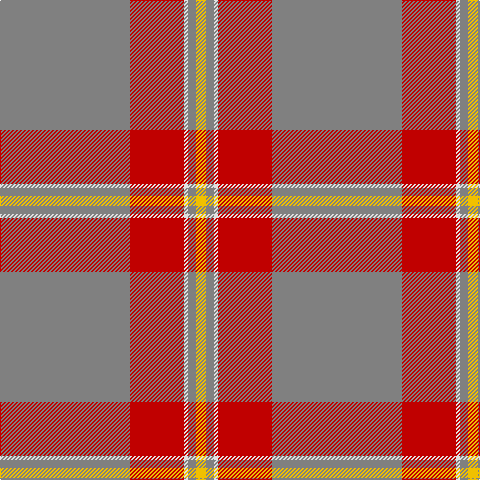

This page is one **sett** — a single exact thread-count. It belongs to the [tartan](/tartans/y65r27w2y4ly5/)
(the same proportion at any scale), whose colour order is pattern [GRWGY](/stripes/grwgy/).

Sourced from weddslist.  It is a [5 stripe tartan](/stripes/stripes5/).

Original link http://www.weddslist.com/cgi-bin/tartans/pg.pl?source=sts

## Thread count
N/130 R54 LN4 N8 Y/10

## Palette

Palette: <strong>Tartan Register</strong> <small style="color:#888">(2 of 4 colours)</small>
<table><thead><tr><th>Colour</th><th>Threads</th><th>Shade</th><th>Base</th><th>OKLCh</th></tr></thead><tbody><tr><td>N/</td><td style="text-align:right;font-variant-numeric:tabular-nums">130</td><td><code style="background-color:#808080;">#808080</code> <small style="color:#888">#808080</small></td><td>G <code style="background-color:#006100;">#006100</code></td><td><small style="color:#888">oklch(60.0% 0.000 89.9)</small></td></tr><tr><td>R</td><td style="text-align:right;font-variant-numeric:tabular-nums">54</td><td><code style="background-color:#C00000;">#C00000</code> <small style="color:#888">#C00000</small></td><td>R <code style="background-color:#CC0000;">#CC0000</code></td><td><small style="color:#888">oklch(50.7% 0.208 29.2)</small></td></tr><tr><td>LN</td><td style="text-align:right;font-variant-numeric:tabular-nums">4</td><td><code style="background-color:#E0E0E0;">#E0E0E0</code> <small style="color:#888">#E0E0E0</small></td><td>W <code style="background-color:#F7F7F7;">#F7F7F7</code></td><td><small style="color:#888">oklch(90.7% 0.000 89.9)</small></td></tr><tr><td>N</td><td style="text-align:right;font-variant-numeric:tabular-nums">8</td><td><code style="background-color:#808080;">#808080</code> <small style="color:#888">#808080</small></td><td>G <code style="background-color:#006100;">#006100</code></td><td><small style="color:#888">oklch(60.0% 0.000 89.9)</small></td></tr><tr><td>Y/</td><td style="text-align:right;font-variant-numeric:tabular-nums">10</td><td><code style="background-color:#F0C000;">#F0C000</code> <small style="color:#888">#F0C000</small></td><td>Y <code style="background-color:#F2BF00;">#F2BF00</code></td><td><small style="color:#888">oklch(82.7% 0.169 90.5)</small></td></tr></tbody></table>

# Sample pattern

## Nearest tartans

The nearest existing variants by ΔTartan distance, with this tartan at the top so the swatches line up against it.

ΔTartan

Tartan

Sett

—

<a href="/ttd/edit/#slug=y65r27w2y4ly5~x2">Perry, Arisaid</a> <a class="nn-out" href="/setts/s5/y65r27w2y4ly5~x2/" title="open its dictionary page">↗</a>

1.69

<a href="/ttd/edit/#slug=r1dy7o25dy7r1~x2">Unnamed Brown (Teddy Bear)</a> <a class="nn-out" href="/setts/s5/r1dy7o25dy7r1~x2/" title="open its dictionary page">↗</a>

1.70

<a href="/ttd/edit/#slug=r9y2r45y20lo3~x2">Hunt (Personal)</a> <a class="nn-out" href="/setts/s5/r9y2r45y20lo3~x2/" title="open its dictionary page">↗</a>

1.75

<a href="/ttd/edit/#slug=o60dg13o9o8ly4~x2">Ballantyne Personal Tartan Tartan Number: 7563. Earliest known date: 2007 Andrew Ballantyne said, l finally decided to purchase a tartan of my own design. The first kilt was made for my father and he was very pleased with it. The fabric was designed online at House of Tartan and woven by Edgars, Perth. See products available Copyright © Blair Urquhart, Comrie, 2015</a> <a class="nn-out" href="/setts/s5/o60dg13o9o8ly4~x2/" title="open its dictionary page">↗</a>

1.85

<a href="/ttd/edit/#slug=y40r8y4w2y4ly5~x2">Reid (1939)</a> <a class="nn-out" href="/setts/s6/y40r8y4w2y4ly5~x2/" title="open its dictionary page">↗</a>

1.90

<a href="/ttd/edit/#slug=lb65r27w2lb4ly5~x2">Perry Arisaid (Personal)</a> <a class="nn-out" href="/setts/s5/lb65r27w2lb4ly5~x2/" title="open its dictionary page">↗</a>

1.92

<a href="/ttd/edit/#slug=y60g13y9r8ly4~x2">Ballantyne (Personal)</a> <a class="nn-out" href="/setts/s5/y60g13y9r8ly4~x2/" title="open its dictionary page">↗</a>

1.92

<a href="/ttd/edit/#slug=db13k3db20o70db20o30w3~x2">Unidentified 21</a> <a class="nn-out" href="/setts/s7/db13k3db20o70db20o30w3~x2/" title="open its dictionary page">↗</a>

1.94

<a href="/ttd/edit/#slug=db2n2lb1n18lb2r2~x4">St. Giles Cathedral (Corporate)</a> <a class="nn-out" href="/setts/s6/db2n2lb1n18lb2r2~x4/" title="open its dictionary page">↗</a>

1.95

<a href="/ttd/edit/#slug=n65k2n4lr2n10r24~x2">Norsemen (Corporate)</a> <a class="nn-out" href="/setts/s6/n65k2n4lr2n10r24~x2/" title="open its dictionary page">↗</a>

1.95

<a href="/ttd/edit/#slug=o5g1o32r1o8r9o2g2g3r3g1~x2">Portosalvo (Corporate)</a> <a class="nn-out" href="/setts/s11/o5g1o32r1o8r9o2g2g3r3g1~x2/" title="open its dictionary page">↗</a>

## Neighbour map

Every grey dot is one of 14299 variants placed by the first two principal components of the ΔTartan feature space (44% of its variance). Red is this tartan; blue dots are its nearest — click one to open its page.

<svg viewBox="0 0 640 380" role="img" style="max-width:100%;height:auto;border:1px solid #e0e0e0;border-radius:4px;display:block" xmlns="http://www.w3.org/2000/svg"><image href="/nn/cloud.v1.png" width="640" height="380"/><a href="/setts/s5/r1dy7o25dy7r1~x2/"><circle cx="475.2" cy="200.4" r="4" fill="#3465a4"><title>Unnamed Brown (Teddy Bear)</title></circle></a><a href="/setts/s5/r9y2r45y20lo3~x2/"><circle cx="516.5" cy="209.0" r="4" fill="#3465a4"><title>Hunt (Personal)</title></circle></a><a href="/setts/s5/o60dg13o9o8ly4~x2/"><circle cx="506.7" cy="212.5" r="4" fill="#3465a4"><title>Ballantyne Personal Tartan Tartan Number: 7563. Earliest known date: 2007 Andrew Ballantyne said, l finally decided to purchase a tartan of my own design. The first kilt was made for my father and he was very pleased with it. The fabric was designed online at House of Tartan and woven by Edgars, Perth. See products available Copyright © Blair Urquhart, Comrie, 2015</title></circle></a><a href="/setts/s6/y40r8y4w2y4ly5~x2/"><circle cx="565.8" cy="187.6" r="4" fill="#3465a4"><title>Reid (1939)</title></circle></a><a href="/setts/s5/lb65r27w2lb4ly5~x2/"><circle cx="460.8" cy="143.2" r="4" fill="#3465a4"><title>Perry Arisaid (Personal)</title></circle></a><a href="/setts/s5/y60g13y9r8ly4~x2/"><circle cx="527.5" cy="225.8" r="4" fill="#3465a4"><title>Ballantyne (Personal)</title></circle></a><a href="/setts/s7/db13k3db20o70db20o30w3~x2/"><circle cx="460.8" cy="203.0" r="4" fill="#3465a4"><title>Unidentified 21</title></circle></a><a href="/setts/s6/db2n2lb1n18lb2r2~x4/"><circle cx="521.7" cy="185.3" r="4" fill="#3465a4"><title>St. Giles Cathedral (Corporate)</title></circle></a><a href="/setts/s6/n65k2n4lr2n10r24~x2/"><circle cx="579.5" cy="186.5" r="4" fill="#3465a4"><title>Norsemen (Corporate)</title></circle></a><a href="/setts/s11/o5g1o32r1o8r9o2g2g3r3g1~x2/"><circle cx="539.1" cy="141.6" r="4" fill="#3465a4"><title>Portosalvo (Corporate)</title></circle></a><circle cx="508.1" cy="174.4" r="5" fill="#c00000"/></svg>

ID: /setts/s5/y65r27w2y4ly5~x2/
