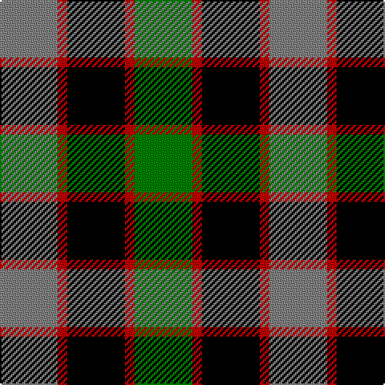

This page is one **sett** — a single exact thread-count. It belongs to the [tartan](/tartans/y6r1k6r1g6/)
(the same proportion at any scale), whose colour order is pattern [GRKRG](/stripes/grkrg/).

Sourced from weddslist.  It is a [5 stripe tartan](/stripes/stripes5/).

Original link http://www.weddslist.com/cgi-bin/tartans/pg.pl?source=sts

## Also known as

This cloth is also recorded under:

- Timespan,

## Thread count
N/36 R6 K36 R6 G/36

## Palette

Palette: <strong>Tartan Register</strong> <small style="color:#888">(2 of 4 colours)</small>
<table><thead><tr><th>Colour</th><th>Threads</th><th>Shade</th><th>Base</th><th>OKLCh</th></tr></thead><tbody><tr><td>N/</td><td style="text-align:right;font-variant-numeric:tabular-nums">36</td><td><code style="background-color:#808080;">#808080</code> <small style="color:#888">#808080</small></td><td>G <code style="background-color:#006100;">#006100</code></td><td><small style="color:#888">oklch(60.0% 0.000 89.9)</small></td></tr><tr><td>R</td><td style="text-align:right;font-variant-numeric:tabular-nums">6</td><td><code style="background-color:#C00000;">#C00000</code> <small style="color:#888">#C00000</small></td><td>R <code style="background-color:#CC0000;">#CC0000</code></td><td><small style="color:#888">oklch(50.7% 0.208 29.2)</small></td></tr><tr><td>K</td><td style="text-align:right;font-variant-numeric:tabular-nums">36</td><td><code style="background-color:#000000;">#000000</code> <small style="color:#888">#000000</small></td><td>K <code style="background-color:#000000;">#000000</code></td><td><small style="color:#888">oklch(0.0% 0.000 0.0)</small></td></tr><tr><td>R</td><td style="text-align:right;font-variant-numeric:tabular-nums">6</td><td><code style="background-color:#C00000;">#C00000</code> <small style="color:#888">#C00000</small></td><td>R <code style="background-color:#CC0000;">#CC0000</code></td><td><small style="color:#888">oklch(50.7% 0.208 29.2)</small></td></tr><tr><td>G/</td><td style="text-align:right;font-variant-numeric:tabular-nums">36</td><td><code style="background-color:#008000;">#008000</code> <small style="color:#888">#008000</small></td><td>G <code style="background-color:#006100;">#006100</code></td><td><small style="color:#888">oklch(52.0% 0.177 142.5)</small></td></tr></tbody></table>

# Sample pattern

## Nearest tartans

The nearest existing variants by ΔTartan distance, with this tartan at the top so the swatches line up against it.

ΔTartan

Tartan

Sett

—

<a href="/ttd/edit/#slug=y6r1k6r1g6~x6">Timespan, (MacKay)</a> <a class="nn-out" href="/setts/s5/y6r1k6r1g6~x6/" title="open its dictionary page">↗</a>

1.07

<a href="/ttd/edit/#slug=o6r1k6r1g6~x6">Timespan</a> <a class="nn-out" href="/setts/s5/o6r1k6r1g6~x6/" title="open its dictionary page">↗</a>

1.15

<a href="/ttd/edit/#slug=t3g12k14t11r3t3~x2">Wellington, or Waterloo</a> <a class="nn-out" href="/setts/s6/t3g12k14t11r3t3~x2/" title="open its dictionary page">↗</a>

1.15

<a href="/ttd/edit/#slug=k2g10t2k9p8g2~x2">Lennie</a> <a class="nn-out" href="/setts/s6/k2g10t2k9p8g2~x2/" title="open its dictionary page">↗</a>

1.18

<a href="/ttd/edit/#slug=k3g14k14g2db14r3~x2">Morrison</a> <a class="nn-out" href="/setts/s6/k3g14k14g2db14r3~x2/" title="open its dictionary page">↗</a>

1.19

<a href="/ttd/edit/#slug=r4g11k11g2db11y3~x4">Casely</a> <a class="nn-out" href="/setts/s6/r4g11k11g2db11y3~x4/" title="open its dictionary page">↗</a>

1.19

<a href="/ttd/edit/#slug=k4g16k14ly3db16r4~x2">Birse</a> <a class="nn-out" href="/setts/s6/k4g16k14ly3db16r4~x2/" title="open its dictionary page">↗</a>

1.20

<a href="/ttd/edit/#slug=t3g6k6t4r1t1~x2">Wellington, or Waterloo</a> <a class="nn-out" href="/setts/s6/t3g6k6t4r1t1~x2/" title="open its dictionary page">↗</a>

1.22

<a href="/ttd/edit/#slug=k4g14k14g2w14b3~x2">MacKay, Dress (Corporate)</a> <a class="nn-out" href="/setts/s6/k4g14k14g2w14b3~x2/" title="open its dictionary page">↗</a>

1.22

<a href="/ttd/edit/#slug=k4o9k13g6o3g9w4~x2">Ramsay, Red</a> <a class="nn-out" href="/setts/s7/k4o9k13g6o3g9w4~x2/" title="open its dictionary page">↗</a>

1.22

<a href="/ttd/edit/#slug=w4db4g22k20db20w3">Unnamed, No 26</a> <a class="nn-out" href="/setts/s6/w4db4g22k20db20w3/" title="open its dictionary page">↗</a>

## Neighbour map

Every grey dot is one of 14299 variants placed by the first two principal components of the ΔTartan feature space (44% of its variance). Red is this tartan; blue dots are its nearest — click one to open its page.

<svg viewBox="0 0 640 380" role="img" style="max-width:100%;height:auto;border:1px solid #e0e0e0;border-radius:4px;display:block" xmlns="http://www.w3.org/2000/svg"><image href="/nn/cloud.v1.png" width="640" height="380"/><a href="/setts/s5/o6r1k6r1g6~x6/"><circle cx="129.5" cy="256.2" r="4" fill="#3465a4"><title>Timespan</title></circle></a><a href="/setts/s6/t3g12k14t11r3t3~x2/"><circle cx="115.7" cy="248.1" r="4" fill="#3465a4"><title>Wellington, or Waterloo</title></circle></a><a href="/setts/s6/k2g10t2k9p8g2~x2/"><circle cx="127.0" cy="244.2" r="4" fill="#3465a4"><title>Lennie</title></circle></a><a href="/setts/s6/k3g14k14g2db14r3~x2/"><circle cx="137.1" cy="235.4" r="4" fill="#3465a4"><title>Morrison</title></circle></a><a href="/setts/s6/r4g11k11g2db11y3~x4/"><circle cx="73.5" cy="236.1" r="4" fill="#3465a4"><title>Casely</title></circle></a><a href="/setts/s6/k4g16k14ly3db16r4~x2/"><circle cx="77.6" cy="229.3" r="4" fill="#3465a4"><title>Birse</title></circle></a><a href="/setts/s6/t3g6k6t4r1t1~x2/"><circle cx="128.6" cy="243.8" r="4" fill="#3465a4"><title>Wellington, or Waterloo</title></circle></a><a href="/setts/s6/k4g14k14g2w14b3~x2/"><circle cx="120.4" cy="222.5" r="4" fill="#3465a4"><title>MacKay, Dress (Corporate)</title></circle></a><a href="/setts/s7/k4o9k13g6o3g9w4~x2/"><circle cx="84.1" cy="252.7" r="4" fill="#3465a4"><title>Ramsay, Red</title></circle></a><a href="/setts/s6/w4db4g22k20db20w3/"><circle cx="118.2" cy="224.4" r="4" fill="#3465a4"><title>Unnamed, No 26</title></circle></a><circle cx="101.8" cy="245.0" r="5" fill="#c00000"/></svg>

ID: /setts/s5/y6r1k6r1g6~x6/
