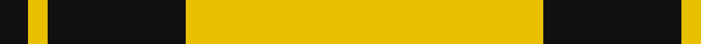

In pattern [KYKKY](/patterns/kykky/).

This was sourced from tartans-authority.  It is a [5 stripes tartan](/stripes/stripes5/).

Original link http://www.tartansauthority.com/tartan-ferret/display/1213/

## Thread count
K/12 Y8 Ka6 Ka52 Y/150

## Palette
Each colour and its ΔE from the base-6 reference it is a variant of.

| Colour | Shade | Base | ΔE (OKLab) |
|---|---|---|---|
| K | <code style="background-color:#101010;">#101010</code> `#101010` | K <code style="background-color:#000000;">#000000</code> | 0.17 |
| Ka | <code style="background-color:#101010;">#101010</code> `#101010` | K <code style="background-color:#000000;">#000000</code> | 0.17 |
| Y | <code style="background-color:#E8C000;">#E8C000</code> `#E8C000` | Y <code style="background-color:#F2BF00;">#F2BF00</code> | 0.02 |

# Sample pattern

## Nearest tartans

The nearest existing variants by ΔTartan distance.

1. [Monoch Airline](/setts/s6/y4k6y1k1y16k2x2~k101010-yd09800/) — ΔT 1.52
1. [Kernow Spirit (Corporate)](/setts/s7/k14w4k8y45w3k1y2x2~k101010-we0e0e0-ye8c000/) — ΔT 1.53
1. [Morris (Welsh Name)](/setts/s8/b6b3y3b2y3b4y48b4~b202060-ye8c000/) — ΔT 1.55
1. [Baileville (Personal)](/setts/s7/y1k4y1k4y11r1y1x4~k101010-r901c38-ye8c000/) — ΔT 1.76
1. [Wilbers](/setts/s8/y5k9y2k7ya35r4ya35k4x2~k101010-rc80000-ye8c000-yab49440/) — ΔT 1.85
1. [Port Moresby City Pipes & Drums](/setts/s5/g2w3k12y36r2x2~g006818-k101010-rc80000-we0e0e0-ye8c000/) — ΔT 1.92
1. [Baillieville](/setts/s7/y1k4y1k4y11r1y1x4~k000000-r802040-yf0c000/) — ΔT 1.95
1. [Yellow Pencil](/setts/s8/g48y9g6y9g12y4g2y16x2~g5b3a15-yf5b92f/) — ΔT 1.97
1. [Coca Cola (Corporate)](/setts/s5/w15g15w15g80r6~g604000-rc80000-wd4e8f4/) — ΔT 2.04
1. [Bro-Dreger](/setts/s7/w3k5y3r3y32k2y3x2~k101010-r880000-we0e0e0-yb0840c/) — ΔT 2.05

## Neighbour map

Every grey dot is one of 15726 variants placed by the first two principal components of the ΔTartan feature space (44% of its variance). Red is this tartan; blue dots are its nearest — click one to open its page.

<svg viewBox="0 0 640 380" role="img" style="max-width:100%;height:auto;border:1px solid #e0e0e0;border-radius:4px;display:block" xmlns="http://www.w3.org/2000/svg"><image href="/nn/cloud.v1.png" width="640" height="380"/><a href="/setts/s6/y4k6y1k1y16k2x2~k101010-yd09800/"><circle cx="446.3" cy="200.3" r="4" fill="#3465a4"><title>Monoch Airline</title></circle></a><a href="/setts/s7/k14w4k8y45w3k1y2x2~k101010-we0e0e0-ye8c000/"><circle cx="392.1" cy="113.3" r="4" fill="#3465a4"><title>Kernow Spirit (Corporate)</title></circle></a><a href="/setts/s8/b6b3y3b2y3b4y48b4~b202060-ye8c000/"><circle cx="473.0" cy="122.4" r="4" fill="#3465a4"><title>Morris (Welsh Name)</title></circle></a><a href="/setts/s7/y1k4y1k4y11r1y1x4~k101010-r901c38-ye8c000/"><circle cx="334.6" cy="182.6" r="4" fill="#3465a4"><title>Baileville (Personal)</title></circle></a><a href="/setts/s8/y5k9y2k7ya35r4ya35k4x2~k101010-rc80000-ye8c000-yab49440/"><circle cx="399.4" cy="156.2" r="4" fill="#3465a4"><title>Wilbers</title></circle></a><a href="/setts/s5/g2w3k12y36r2x2~g006818-k101010-rc80000-we0e0e0-ye8c000/"><circle cx="347.8" cy="135.9" r="4" fill="#3465a4"><title>Port Moresby City Pipes &amp; Drums</title></circle></a><a href="/setts/s7/y1k4y1k4y11r1y1x4~k000000-r802040-yf0c000/"><circle cx="329.7" cy="182.6" r="4" fill="#3465a4"><title>Baillieville</title></circle></a><a href="/setts/s8/g48y9g6y9g12y4g2y16x2~g5b3a15-yf5b92f/"><circle cx="438.0" cy="177.4" r="4" fill="#3465a4"><title>Yellow Pencil</title></circle></a><a href="/setts/s5/w15g15w15g80r6~g604000-rc80000-wd4e8f4/"><circle cx="444.7" cy="205.8" r="4" fill="#3465a4"><title>Coca Cola (Corporate)</title></circle></a><a href="/setts/s7/w3k5y3r3y32k2y3x2~k101010-r880000-we0e0e0-yb0840c/"><circle cx="469.3" cy="150.5" r="4" fill="#3465a4"><title>Bro-Dreger</title></circle></a><circle cx="428.6" cy="159.3" r="5" fill="#c00000"/></svg>

ID: /setts/s5/y75k26k3y4k6x2~k101010-ye8c000/
