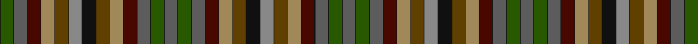

In pattern [BKGKBKBKYKGKRKKKGKYKBKBKGKBKGKBKBKYKGKKKRKGKYKBKBKGK](/patterns/bkgkbkbkykgkrkkkgkykbkbkgkbkgkbkbkykgkkkrkgkykbkbkgk/).

This was sourced from tartans-authority.  It is a [52 stripes tartan](/stripes/stripes52/).

Original link http://www.tartansauthority.com/tartan-ferret/display/2037/

## Thread count
K/2 G36 K2 N36 K2 DR36 K2 LT36 K2 T36 K2 Na36 K2 Ka36 K2 T36 K2 LT36 K2 DR36 K2 N36 K2 G36 K2 Nb36 K2 G36 K2 N36 K2 DR36 K2 LT36 K2 T36 K2 Ka36 K2 Na36 K2 T36 K2 LT36 K2 DR36 K2 N36 K2 G36 K2 Nb/36

## Palette
Each colour and its ΔE from the base-6 reference it is a variant of.

| Colour | Shade | Base | ΔE (OKLab) |
|---|---|---|---|
| DR | <code style="background-color:#480800;">#480800</code> `#480800` | B <code style="background-color:#2A418A;">#2A418A</code> | 0.24 |
| G | <code style="background-color:#285800;">#285800</code> `#285800` | G <code style="background-color:#006100;">#006100</code> | 0.03 |
| K | <code style="background-color:#101010;">#101010</code> `#101010` | K <code style="background-color:#000000;">#000000</code> | 0.17 |
| Ka | <code style="background-color:#101010;">#101010</code> `#101010` | K <code style="background-color:#000000;">#000000</code> | 0.17 |
| LT | <code style="background-color:#A08858;">#A08858</code> `#A08858` | Y <code style="background-color:#F2BF00;">#F2BF00</code> | 0.21 |
| N | <code style="background-color:#5C5C5C;">#5C5C5C</code> `#5C5C5C` | B <code style="background-color:#2A418A;">#2A418A</code> | 0.15 |
| Na | <code style="background-color:#888888;">#888888</code> `#888888` | R <code style="background-color:#CC0000;">#CC0000</code> | 0.24 |
| Nb | <code style="background-color:#5C5C5C;">#5C5C5C</code> `#5C5C5C` | B <code style="background-color:#2A418A;">#2A418A</code> | 0.15 |
| T | <code style="background-color:#604000;">#604000</code> `#604000` | G <code style="background-color:#006100;">#006100</code> | 0.14 |

## Nearest tartans

The nearest existing variants by ΔTartan distance.

1. [MacKay of Strathnaver Clan Tartan Tartan Number: 2037. Earliest known date: 1952 Designed circa 1952 for Wm Andersons of Edinburgh and Lord Reay. The tartan features the seasons of the year. See products available Copyright © Blair Urquhart, Comrie, 2015](/setts/s27/g36r2k36r2b36r2ra36r2ba36r2ga36r2y36r2ya36r2ga36r2ba36r2ra36r2b36r2k36r2g36-b5c5c5c-ba480800-g006818-ga604000-k101010-rc80000-ra888888-ya08858-yab4b498/) — ΔT 1.70
1. [MacKay of Strathnaver](/setts/s27/g36r2k36r2b36r2ra36r2ba36r2ga36r2y36r2ya36r2ga36r2ba36r2ra36r2b36r2k36r2g36-b5c5c5c-ba480800-g285800-ga604000-k101010-rc80000-ra888888-ya08858-yac4bc68/) — ΔT 1.71
1. [MacKay of Strathnaver](/setts/s27/g36r2k36r2b36r2ga36r2ra36r2rb36r2rc36r2y36r2rb36r2ra36r2ga36r2b36r2k36r2g36-b505050-g008000-ga808080-k000000-rc00000-ra703000-rb806050-rc906030-yb0b0b0/) — ΔT 2.05
1. [Hunter Portrait/Artefact Tartan Tartan Number: 5873. Earliest known date: 1775 Presented to the Tartans Authority in Canada in 2003 by a Jean Hunter from Huntsville Ontario who had been given it by her Father the Rev. George W. Hunter - a minister in Aberdeen. The piece is a shawl 6ft 6inches long by 19inches wide and is what is known as a hard, superfine tartan using typical Wilson of Bannockburn colours. The sett is selvedge to selvedge full repeat and the weave is 52epi. The sett is complex with 8 colours and 67 colour changes. Embroidered into the end of the shawl is "Donnald 1775" See products available Copyright © Blair Urquhart, Comrie, 2015](/setts/s66/r60ra8g12y8ra8r32ya4ra8ya4y8b36g12yb6ya4y8ya4yb6g12b36y8ya4ra8r24g4r24ra6ya4ga20ya4ga4yb8ga4ya4g16ya8g16ya4ga4yb8ga4ya4ga20ya4ra8r24g4r24ra8ya4ga20y8ya8y8ga20ya4g12ya4b24ya4b24ya4g12ya4ra8r24ya4-b2020-hf11859fdfa34547d/) — ΔT 2.63
1. [Unnamed C18th - Prince Charles Edward](/setts/s28/r16w4g100w4b34ga30y10w3ga16ba12w4b16bb64r26w4r26bb64b16w4ba12ga16w3y10ga30b34w4g100w4-b2c2c80-ba780078-bb441800-g604000-ga006818-rc80000-we0e0e0-ye8c000/) — ΔT 2.65
1. [United Distillers, (Warp)](/setts/s19/b24ba2g24r4g24ga24ba2b24ba4bb24ra2ga24ra24y4ra24ga24ra2bb24ba4-b304080-ba8080d0-bb600030-g008000-ga003000-rc00000-ra806050-yf0c000/) — ΔT 2.79
1. [Hunter (1775)](/setts/s66/r60ra8g12y8ra8r32w4ra8w4y8b36g12ya6w4y8w4ya6g12b36y8w4ra8r24g4r24ra6w4ga20w4ga4ya8ga4w4g16w8g16w4ga4ya8ga4w4ga20w4ra8r24g4r24ra8w4ga20y8w8y8ga20w4g12w4b24w4b24w4g12w4ra8r24w4-b202060-g789484-ga006818--h942b42b842750023/) — ΔT 2.94
1. [Unidentified Cotton sample](/setts/s36/b8g12ga14gb2g12ga14gb2g12ga14gb2g12ga14gb2g12ga14gb2g12b8k16r2k2w2k2b16ra12k2ra8w2ra8k2ra12b16k2w2k2r2-b2c4084-g309c18-ga002814-gb503c14-k101010-rfa4b00-rac82828-we0e0e0/) — ΔT 2.96
1. [Unidentified Cant #01 (Cumming)](/setts/s30/g36y6b28ba12w6k4w6ba12k4r8ra6rb8k4rb8ra6r4k4ba12w6k4w6ba12b28y6g36r24w6r24w6r24-b2c2c80-ba2888c4-g285800-k101010-rc80000-ra9c68a4-rbe87878-we0e0e0-ye8c000/) — ΔT 3.05
1. [Waggrall Family Tartan Tartan Number: 1691. Earliest known date: 1819 Incomplete see Sindex. Update required if possible. See products available Copyright © Blair Urquhart, Comrie, 2015](/setts/s36/r8w2ra22r4w4b22ba8w4ba8b22w4g8y8w2b10w2y8g8w4ga20g8w4g8ga20w4ba4b12w2b12ba4w4r4ra22w2r8w2-b780078-ba5c8ca8-g289c18-ga006818-rd05054-rac80000-we0e0e0-ye8c000/) — ΔT 3.16

## Neighbour map

Every grey dot is one of 15726 variants placed by the first two principal components of the ΔTartan feature space (44% of its variance). Red is this tartan; blue dots are its nearest — click one to open its page.

<svg viewBox="0 0 640 380" role="img" style="max-width:100%;height:auto;border:1px solid #e0e0e0;border-radius:4px;display:block" xmlns="http://www.w3.org/2000/svg"><image href="/nn/cloud.v1.png" width="640" height="380"/><a href="/setts/s27/g36r2k36r2b36r2ra36r2ba36r2ga36r2y36r2ya36r2ga36r2ba36r2ra36r2b36r2k36r2g36-b5c5c5c-ba480800-g006818-ga604000-k101010-rc80000-ra888888-ya08858-yab4b498/"><circle cx="14.0" cy="44.4" r="4" fill="#3465a4"><title>MacKay of Strathnaver Clan Tartan Tartan Number: 2037. Earliest known date: 1952 Designed circa 1952 for Wm Andersons of Edinburgh and Lord Reay. The tartan features the seasons of the year. See products available Copyright © Blair Urquhart, Comrie, 2015</title></circle></a><a href="/setts/s27/g36r2k36r2b36r2ra36r2ba36r2ga36r2y36r2ya36r2ga36r2ba36r2ra36r2b36r2k36r2g36-b5c5c5c-ba480800-g285800-ga604000-k101010-rc80000-ra888888-ya08858-yac4bc68/"><circle cx="14.0" cy="43.9" r="4" fill="#3465a4"><title>MacKay of Strathnaver</title></circle></a><a href="/setts/s27/g36r2k36r2b36r2ga36r2ra36r2rb36r2rc36r2y36r2rb36r2ra36r2ga36r2b36r2k36r2g36-b505050-g008000-ga808080-k000000-rc00000-ra703000-rb806050-rc906030-yb0b0b0/"><circle cx="14.0" cy="37.5" r="4" fill="#3465a4"><title>MacKay of Strathnaver</title></circle></a><a href="/setts/s66/r60ra8g12y8ra8r32ya4ra8ya4y8b36g12yb6ya4y8ya4yb6g12b36y8ya4ra8r24g4r24ra6ya4ga20ya4ga4yb8ga4ya4g16ya8g16ya4ga4yb8ga4ya4ga20ya4ra8r24g4r24ra8ya4ga20y8ya8y8ga20ya4g12ya4b24ya4b24ya4g12ya4ra8r24ya4-b2020-hf11859fdfa34547d/"><circle cx="21.4" cy="14.0" r="4" fill="#3465a4"><title>Hunter Portrait/Artefact Tartan Tartan Number: 5873. Earliest known date: 1775 Presented to the Tartans Authority in Canada in 2003 by a Jean Hunter from Huntsville Ontario who had been given it by her Father the Rev. George W. Hunter - a minister in Aberdeen. The piece is a shawl 6ft 6inches long by 19inches wide and is what is known as a hard, superfine tartan using typical Wilson of Bannockburn colours. The sett is selvedge to selvedge full repeat and the weave is 52epi. The sett is complex with 8 colours and 67 colour changes. Embroidered into the end of the shawl is &quot;Donnald 1775&quot; See products available Copyright © Blair Urquhart, Comrie, 2015</title></circle></a><a href="/setts/s28/r16w4g100w4b34ga30y10w3ga16ba12w4b16bb64r26w4r26bb64b16w4ba12ga16w3y10ga30b34w4g100w4-b2c2c80-ba780078-bb441800-g604000-ga006818-rc80000-we0e0e0-ye8c000/"><circle cx="106.9" cy="18.1" r="4" fill="#3465a4"><title>Unnamed C18th - Prince Charles Edward</title></circle></a><a href="/setts/s19/b24ba2g24r4g24ga24ba2b24ba4bb24ra2ga24ra24y4ra24ga24ra2bb24ba4-b304080-ba8080d0-bb600030-g008000-ga003000-rc00000-ra806050-yf0c000/"><circle cx="36.6" cy="115.7" r="4" fill="#3465a4"><title>United Distillers, (Warp)</title></circle></a><a href="/setts/s66/r60ra8g12y8ra8r32w4ra8w4y8b36g12ya6w4y8w4ya6g12b36y8w4ra8r24g4r24ra6w4ga20w4ga4ya8ga4w4g16w8g16w4ga4ya8ga4w4ga20w4ra8r24g4r24ra8w4ga20y8w8y8ga20w4g12w4b24w4b24w4g12w4ra8r24w4-b202060-g789484-ga006818--h942b42b842750023/"><circle cx="14.0" cy="14.0" r="4" fill="#3465a4"><title>Hunter (1775)</title></circle></a><a href="/setts/s36/b8g12ga14gb2g12ga14gb2g12ga14gb2g12ga14gb2g12ga14gb2g12b8k16r2k2w2k2b16ra12k2ra8w2ra8k2ra12b16k2w2k2r2-b2c4084-g309c18-ga002814-gb503c14-k101010-rfa4b00-rac82828-we0e0e0/"><circle cx="14.0" cy="85.6" r="4" fill="#3465a4"><title>Unidentified Cotton sample</title></circle></a><a href="/setts/s30/g36y6b28ba12w6k4w6ba12k4r8ra6rb8k4rb8ra6r4k4ba12w6k4w6ba12b28y6g36r24w6r24w6r24-b2c2c80-ba2888c4-g285800-k101010-rc80000-ra9c68a4-rbe87878-we0e0e0-ye8c000/"><circle cx="14.0" cy="48.0" r="4" fill="#3465a4"><title>Unidentified Cant #01 (Cumming)</title></circle></a><a href="/setts/s36/r8w2ra22r4w4b22ba8w4ba8b22w4g8y8w2b10w2y8g8w4ga20g8w4g8ga20w4ba4b12w2b12ba4w4r4ra22w2r8w2-b780078-ba5c8ca8-g289c18-ga006818-rd05054-rac80000-we0e0e0-ye8c000/"><circle cx="14.0" cy="48.8" r="4" fill="#3465a4"><title>Waggrall Family Tartan Tartan Number: 1691. Earliest known date: 1819 Incomplete see Sindex. Update required if possible. See products available Copyright © Blair Urquhart, Comrie, 2015</title></circle></a><circle cx="14.0" cy="29.3" r="5" fill="#c00000"/></svg>

ID: /setts/s52/b36k2g36k2b36k2ba36k2y36k2ga36k2r36k2k36k2ga36k2y36k2ba36k2b36k2g36k2b36k2g36k2b36k2ba36k2y36k2ga36k2k36k2r36k2ga36k2y36k2ba36k2b36k2g36k2-b5c5c5c-ba480800-g285800-ga604000-k101010-r888888-ya08858/
