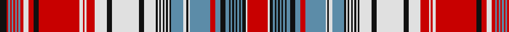

In pattern [KRBRBRBRBRWRKRWRWRWKWKWKWKWKWKWKBWKWBRBKBKBKBKBKBKWR](/patterns/krbrbrbrbrwrkrwrwrwkwkwkwkwkwkwkbwkwbrbkbkbkbkbkbkwr/).

This was sourced from register-of-tartans.  It is a [52 stripes tartan](/stripes/stripes52/).

Original link https://www.tartanregister.gov.uk/tartanDetails.aspx?ref=3087

## Thread count
K/8 R2 B2 R2 B2 R2 B2 R2 B2 R4 LN6 R6 K6 R48 LN4 R2 LN2 R10 LN14 K6 LN32 K6 LN14 K2 LN2 K2 LN2 K2 LN2 K2 LN2 K2 B14 LN4 K2 LN2 B24 R6 B6 K6 B4 K2 B2 K2 B2 K2 B2 K2 B2 K4 LN2 R/24

## Palette
Each colour and its ΔE from the base-6 reference it is a variant of.

| Colour | Shade | Base | ΔE (OKLab) |
|---|---|---|---|
| B | <code style="background-color:#5C8CA8;">#5C8CA8</code> `#5C8CA8` | B <code style="background-color:#2A418A;">#2A418A</code> | 0.23 |
| K | <code style="background-color:#101010;">#101010</code> `#101010` | K <code style="background-color:#000000;">#000000</code> | 0.17 |
| LN | <code style="background-color:#E0E0E0;">#E0E0E0</code> `#E0E0E0` | W <code style="background-color:#F7F7F7;">#F7F7F7</code> | 0.07 |
| R | <code style="background-color:#C80000;">#C80000</code> `#C80000` | R <code style="background-color:#CC0000;">#CC0000</code> | 0.01 |

## Nearest tartans

The nearest existing variants by ΔTartan distance.

1. [Coulin](/setts/s35/y16k1b1k1b1k1b1k1b1k1b1k1b1k1b1k1b1k1b1k1b1k1b1k1b1y8k1b1k1b1r9k1b1k1b1~b6080e0-k000000-r70000c-yf09430~x4/) — ΔT 1.52
1. [MacDonald Dress #2](/setts/s33/b18r7b2r2b7r2b2r7b18r2k18w8b7w40b2r8b2w40b7w8r2k18g18r7g2r2g6r2g2r7g18k18r2~b2c4084-g005020-k101010-rdc0000-we0e0e0~x2/) — ΔT 1.93
1. [Unidentified, Plaid arisaid](/setts/s36/r6w16r6b1r6w16r6b9w140r55k2w4k2r16w20r16b6r2b27k4y4k6y4k4b27r2b6r16w20r16k2w4k2r55b1r6~b304080-k000000-rc00000-we0e0e0-yf0c000~x2/) — ΔT 1.95
1. [Not Specified #4](/setts/s64/r35w2r2w2r2w2r2w2r2w2r14w38k4r4w4r4k4w4k4r4w4r4k4w16k36r19w2r4w4r3w4r2w13r2w4r3w4r4w2r19k36w16k4r4w4r4k4w4k4r4w4r4k4w38r14w2r2w2r2w2r2w2r2w2~k101010-r888888-we0e0e0~x2/) — ΔT 1.95
1. [MacDonald Dress Clan Tartan Tartan Number: 1998. Earliest known date: c.1815 In 1815, members of the Highland Society of London resolved to request of each of the Highland chiefs, a sample of their clan tartan. The swatches were to be signed and sealed in the chief's own hand. This sett is one of those delivered to the Society between 1815 and 1822. See products available Copyright © Blair Urquhart, Comrie, 2015](/setts/s33/b18r7b2r2b7r2b2r7b18r2k18w8b7w40b2r8b2w40b7w8r2k18g18r7g2r2g6r2g2r7g18k18r2~b2c2c80-g006818-k101010-rc80000-we0e0e0~x2/) — ΔT 1.97
1. [Dunbar Plaid (Artefact)](/setts/s84/w6k1w1k1w1k5w2k5w4k4r1k1r1k1r1k1r1k1r1k1r1k1r1k1r1k1r1k1r1k1r1k1r1k1r1k1r1k1r1k1r1k1r1k1r1k1r1k1r1k1r1k1r1k1r1k1r1k1r1k1r1k1r1k1r1k1r1k1r1k1r1k1r1k1r1k1r1k1r1k1r1k4w24k4~k101010-rc80000-wfcfcfc/) — ΔT 1.99
1. [Unidentified Plaid arisaid](/setts/s36/r6w16r6b1r6w16r6b9w140r55k2w4k2r16w20r16b6r2b27k4y4k6y4k4b27r2b6r16w20r16k2w4k2r55b1r6~b2c4084-k101010-rdc0000-we0e0e0-ye8c000~x2/) — ΔT 2.05
1. [Unidentified Cant #08](/setts/s26/w38b6w5k6w3k2w3k2wa24r24k2r8w2r8k2r24wa24k2w3k2w3k6w5b6w38r4~b2c2c80-k101010-rc80000-we0e0e0-wae8ccb8/) — ΔT 2.07
1. [MacDonald, dress](/setts/s33/b18r7b2r2b7r2b2r7b18r2k18w8b7w40b2r8b2w40b7w8r2k18g18r7g2r2g6r2g2r7g18k18r2~b304080-g008000-k000000-rc00000-we0e0e0~x2/) — ΔT 2.07
1. [Anderson](/setts/s26/r16g2w24g2r6k6r6g2w66y2k12y2w12y2k4y4k4y4k7r2k7r6g20r6g20r12~g006818-k101010-rc80000-wfcfcfc-yfccc00/) — ΔT 2.14

## Neighbour map

Every grey dot is one of 15726 variants placed by the first two principal components of the ΔTartan feature space (44% of its variance). Red is this tartan; blue dots are its nearest — click one to open its page.

<svg viewBox="0 0 640 380" role="img" style="max-width:100%;height:auto;border:1px solid #e0e0e0;border-radius:4px;display:block" xmlns="http://www.w3.org/2000/svg"><image href="/nn/cloud.v1.png" width="640" height="380"/><a href="/setts/s35/y16k1b1k1b1k1b1k1b1k1b1k1b1k1b1k1b1k1b1k1b1k1b1k1b1y8k1b1k1b1r9k1b1k1b1~b6080e0-k000000-r70000c-yf09430~x4/"><circle cx="176.3" cy="46.6" r="4" fill="#3465a4"><title>Coulin</title></circle></a><a href="/setts/s33/b18r7b2r2b7r2b2r7b18r2k18w8b7w40b2r8b2w40b7w8r2k18g18r7g2r2g6r2g2r7g18k18r2~b2c4084-g005020-k101010-rdc0000-we0e0e0~x2/"><circle cx="96.6" cy="54.2" r="4" fill="#3465a4"><title>MacDonald Dress #2</title></circle></a><a href="/setts/s36/r6w16r6b1r6w16r6b9w140r55k2w4k2r16w20r16b6r2b27k4y4k6y4k4b27r2b6r16w20r16k2w4k2r55b1r6~b304080-k000000-rc00000-we0e0e0-yf0c000~x2/"><circle cx="249.1" cy="14.0" r="4" fill="#3465a4"><title>Unidentified, Plaid arisaid</title></circle></a><a href="/setts/s64/r35w2r2w2r2w2r2w2r2w2r14w38k4r4w4r4k4w4k4r4w4r4k4w16k36r19w2r4w4r3w4r2w13r2w4r3w4r4w2r19k36w16k4r4w4r4k4w4k4r4w4r4k4w38r14w2r2w2r2w2r2w2r2w2~k101010-r888888-we0e0e0~x2/"><circle cx="209.9" cy="45.3" r="4" fill="#3465a4"><title>Not Specified #4</title></circle></a><a href="/setts/s33/b18r7b2r2b7r2b2r7b18r2k18w8b7w40b2r8b2w40b7w8r2k18g18r7g2r2g6r2g2r7g18k18r2~b2c2c80-g006818-k101010-rc80000-we0e0e0~x2/"><circle cx="95.7" cy="54.4" r="4" fill="#3465a4"><title>MacDonald Dress Clan Tartan Tartan Number: 1998. Earliest known date: c.1815 In 1815, members of the Highland Society of London resolved to request of each of the Highland chiefs, a sample of their clan tartan. The swatches were to be signed and sealed in the chief's own hand. This sett is one of those delivered to the Society between 1815 and 1822. See products available Copyright © Blair Urquhart, Comrie, 2015</title></circle></a><a href="/setts/s84/w6k1w1k1w1k5w2k5w4k4r1k1r1k1r1k1r1k1r1k1r1k1r1k1r1k1r1k1r1k1r1k1r1k1r1k1r1k1r1k1r1k1r1k1r1k1r1k1r1k1r1k1r1k1r1k1r1k1r1k1r1k1r1k1r1k1r1k1r1k1r1k1r1k1r1k1r1k1r1k1r1k4w24k4~k101010-rc80000-wfcfcfc/"><circle cx="241.9" cy="14.0" r="4" fill="#3465a4"><title>Dunbar Plaid (Artefact)</title></circle></a><a href="/setts/s36/r6w16r6b1r6w16r6b9w140r55k2w4k2r16w20r16b6r2b27k4y4k6y4k4b27r2b6r16w20r16k2w4k2r55b1r6~b2c4084-k101010-rdc0000-we0e0e0-ye8c000~x2/"><circle cx="254.5" cy="14.0" r="4" fill="#3465a4"><title>Unidentified Plaid arisaid</title></circle></a><a href="/setts/s26/w38b6w5k6w3k2w3k2wa24r24k2r8w2r8k2r24wa24k2w3k2w3k6w5b6w38r4~b2c2c80-k101010-rc80000-we0e0e0-wae8ccb8/"><circle cx="164.1" cy="52.1" r="4" fill="#3465a4"><title>Unidentified Cant #08</title></circle></a><a href="/setts/s33/b18r7b2r2b7r2b2r7b18r2k18w8b7w40b2r8b2w40b7w8r2k18g18r7g2r2g6r2g2r7g18k18r2~b304080-g008000-k000000-rc00000-we0e0e0~x2/"><circle cx="88.9" cy="53.3" r="4" fill="#3465a4"><title>MacDonald, dress</title></circle></a><a href="/setts/s26/r16g2w24g2r6k6r6g2w66y2k12y2w12y2k4y4k4y4k7r2k7r6g20r6g20r12~g006818-k101010-rc80000-wfcfcfc-yfccc00/"><circle cx="171.5" cy="22.7" r="4" fill="#3465a4"><title>Anderson</title></circle></a><circle cx="170.9" cy="20.1" r="5" fill="#c00000"/></svg>

ID: /setts/s52/r12w1k2b1k1b1k1b1k1b1k1b2k3b3r3b12w1k1w2b7k1w1k1w1k1w1k1w1k1w7k3w16k3w7r5w1r1w2r24k3r3w3r2b1r1b1r1b1r1b1r1k4~b5c8ca8-k101010-rc80000-we0e0e0~x2/
