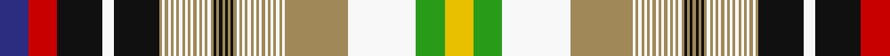

**Bands:** [BRKWKYWYWYWYWYWYWYWYWYWYKYKYKYKYWYWYWYWYWYWYWYWYWYWGY](/stripes/brkwkywywywywywywywywywykykykykywywywywywywywywywywgy/) · **Stripes:** [DB R K W K LO W LO W LO W LO W LO W LO W LO W LO W LO W LO K LO K LO K LO K LO W LO W LO W LO W LO W LO W LO W LO W LO W LO W G LY](/stripes/stripes53/) DB R K W K LO W LO W LO W LO W LO W LO W LO W LO W LO W LO K LO K LO K LO K LO W LO W LO W LO W LO W LO W LO W LO W LO W LO W G LY

This was sourced from tartans-authority.  It is a [53 band tartan](/bands/bands53/).

Original link http://www.tartansauthority.com/tartan-ferret/display/7132/

## Thread count
DB/20 R20 K32 W8 K32 LT2 W2 LT2 W2 LT2 W2 LT2 W2 LT2 W2 LT2 W2 LT2 W2 LT2 W2 LT2 W2 LT2 K2 LT2 K2 LT2 K2 LT2 K2 LT2 W2 LT2 W2 LT2 W2 LT2 W2 LT2 W2 LT2 W2 LT2 W2 LT2 W2 LT2 W2 LT44 W48 G20 Y/20

## Palette
Each colour and its ΔE from the base-6 reference it is a variant of.

| Colour | Shade | Base | ΔE (OKLab) |
|---|---|---|---|
| DB | <code style="background-color:#2C2C80;">#2C2C80</code> `#2C2C80` | B <code style="background-color:#2A418A;">#2A418A</code> | 0.06 |
| G | <code style="background-color:#289C18;">#289C18</code> `#289C18` | G <code style="background-color:#006100;">#006100</code> | 0.19 |
| K | <code style="background-color:#101010;">#101010</code> `#101010` | K <code style="background-color:#000000;">#000000</code> | 0.17 |
| LT | <code style="background-color:#A08858;">#A08858</code> `#A08858` | Y <code style="background-color:#F2BF00;">#F2BF00</code> | 0.21 |
| R | <code style="background-color:#C80000;">#C80000</code> `#C80000` | R <code style="background-color:#CC0000;">#CC0000</code> | 0.01 |
| W | <code style="background-color:#F8F8F8;">#F8F8F8</code> `#F8F8F8` | W <code style="background-color:#F7F7F7;">#F7F7F7</code> | 0.00 |
| Y | <code style="background-color:#E8C000;">#E8C000</code> `#E8C000` | Y <code style="background-color:#F2BF00;">#F2BF00</code> | 0.02 |

## Nearest tartans

The nearest existing variants by ΔTartan distance.

1. [All breeds Dairy Goats (Version 2)](/setts/s35/db10r10k16w4k16w1o1w1o1w1o1w1o1w1o1k1o1k1o1k1o1k1w1o1w1o1w1o1w1o1w1o22w24lg10ly10/) — ΔT 1.01
1. [All Breeds Dairy Goats (Corporate)](/setts/s36/db10r10k36w1lo1w1lo1w1lo1w1lo1w1lo1k1lo1k1lo1k1lo1k1lo1k1lo1w1lo1w1lo1w1lo1w1lo1w1lo26w26g10ly10~x2/) — ΔT 1.14
1. [All Breeds Dairy Goats](/setts/s36/db10r10k36o1w1o1w1o1w1o1w1o1w1o1k1o1k1o1k1o1k1o1k1w1o1w1o1w1o1w1o1w1o27w26lg10ly10/) — ΔT 1.15
1. [Whiskey & Bourbon](/setts/s32/ly8k2w3k4y3k2lb6k2y3k4lb3t44k4y4k4dy5y5dy5y6dy5y5dy5k4dy5ly5dy5ly6dy5ly5dy5k4w6/) — ΔT 1.81
1. [Coutts 80th (James Robert)](/setts/s44/db11k1db1k1db1k1db1k11dg11k1dg1k1dg1k1dg1k1w4ly4w4dg11k1dg1k1dg1k1dg1k11db11k1db1k1db1k1db1k1w4k1r4k1w22k1r4k1w4~x2/) — ΔT 1.85
1. [Am Yisrael Chair (Corporate)](/setts/s36/dp1db2k1dp1db2k1dp1db2k1dp1db2k1dp1db2k1dp1db2k1w27db27w6k3o2w1o2k3w2r9lo2ly1lo2ly1lo2ly1lo2ly1~x2/) — ΔT 1.94
1. [Hash House Harriers Trail (Corp)](/setts/s67/ly1lo1ly1lo1r4ly1lo1ly1lo1ly1lo1ly1lo1ly1lo1ly1lo1ly1lo1ly1lo1ly1lo1ly1lo1ly1lo1ly1lo1ly1lo1do28g28db4g28do28ly1lo1ly1lo1ly1lo1ly1lo1w4ly1lo1ly1lo1w4ly1lo1ly1lo1ly1lo1ly1lo1ly1lo1ly1lo1ly1lo1ly1lo1ly1-h14a4f2c28f558f15/) — ΔT 1.95
1. [Whiskey & Bourbon (Corporate)](/setts/s32/ly8k2w3k4lo3k2t6k2lo3k4t3db44k4lo4k4dy5lo5dy5lo6dy5lo5dy5k4dy5ly5dy5ly6dy5ly5dy5k4w6/) — ΔT 1.96
1. [New Brunswick or Beaverbrook District Tartan Tartan Number: 663. Earliest known date: 1959 The entry in the Lyon Court Books reads, "This tartan is assymetrical. The sett reading along the warp from the left may be divided into four equal sections of 190 threads. The first is symetrical, The second is assymetrical, The third is the same as the first, The fourth is the same as the second but in reverse" In reality the pattern is symetrical and has 380 threads in half sett as careful reading of Lord Lyons description reveals. The design was commissioned by Lord Beaverbrook and adopted by the Province. See products available Copyright © Blair Urquhart, Comrie, 2015](/setts/s44/t1ly1t1dg1g2dg2g2dg2g2dg1t1ly1t1ly1t1dg18r16ly1o2ly3t4r8dr9r3ly2r9dr5r6dg18t1ly1t1ly1t1dg1g2dg2g2dg2g2dg1t1ly1t1~x2/) — ΔT 2.06
1. [Victoria, Highland dress](/setts/s58/r5w23g5w5k7ly3k3w2k3g16r8g3r6w3r6g3r8g16k3w2k3ly3k7w5g5w23r4g1w19g4w4g1k5ly3k2g1w4g15r6g3r5g1w3g1r5g3r6g15w4g1k2ly3k5g1w4g4w19g1~x2/) — ΔT 2.07

## Neighbour map

Every grey dot is one of 14313 variants placed by the first two principal components of the ΔTartan feature space (44% of its variance). Red is this tartan; blue dots are its nearest — click one to open its page.

<svg viewBox="0 0 640 380" role="img" style="max-width:100%;height:auto;border:1px solid #e0e0e0;border-radius:4px;display:block" xmlns="http://www.w3.org/2000/svg"><image href="/nn/cloud.v1.png" width="640" height="380"/><a href="/setts/s35/db10r10k16w4k16w1o1w1o1w1o1w1o1w1o1k1o1k1o1k1o1k1w1o1w1o1w1o1w1o1w1o22w24lg10ly10/"><circle cx="70.1" cy="14.0" r="4" fill="#3465a4"><title>All breeds Dairy Goats (Version 2)</title></circle></a><a href="/setts/s36/db10r10k36w1lo1w1lo1w1lo1w1lo1w1lo1k1lo1k1lo1k1lo1k1lo1k1lo1w1lo1w1lo1w1lo1w1lo1w1lo26w26g10ly10~x2/"><circle cx="104.0" cy="14.0" r="4" fill="#3465a4"><title>All Breeds Dairy Goats (Corporate)</title></circle></a><a href="/setts/s36/db10r10k36o1w1o1w1o1w1o1w1o1w1o1k1o1k1o1k1o1k1o1k1w1o1w1o1w1o1w1o1w1o27w26lg10ly10/"><circle cx="100.7" cy="14.0" r="4" fill="#3465a4"><title>All Breeds Dairy Goats</title></circle></a><a href="/setts/s32/ly8k2w3k4y3k2lb6k2y3k4lb3t44k4y4k4dy5y5dy5y6dy5y5dy5k4dy5ly5dy5ly6dy5ly5dy5k4w6/"><circle cx="50.0" cy="16.5" r="4" fill="#3465a4"><title>Whiskey &amp; Bourbon</title></circle></a><a href="/setts/s44/db11k1db1k1db1k1db1k11dg11k1dg1k1dg1k1dg1k1w4ly4w4dg11k1dg1k1dg1k1dg1k11db11k1db1k1db1k1db1k1w4k1r4k1w22k1r4k1w4~x2/"><circle cx="76.2" cy="14.0" r="4" fill="#3465a4"><title>Coutts 80th (James Robert)</title></circle></a><a href="/setts/s36/dp1db2k1dp1db2k1dp1db2k1dp1db2k1dp1db2k1dp1db2k1w27db27w6k3o2w1o2k3w2r9lo2ly1lo2ly1lo2ly1lo2ly1~x2/"><circle cx="107.4" cy="14.0" r="4" fill="#3465a4"><title>Am Yisrael Chair (Corporate)</title></circle></a><a href="/setts/s67/ly1lo1ly1lo1r4ly1lo1ly1lo1ly1lo1ly1lo1ly1lo1ly1lo1ly1lo1ly1lo1ly1lo1ly1lo1ly1lo1ly1lo1ly1lo1do28g28db4g28do28ly1lo1ly1lo1ly1lo1ly1lo1w4ly1lo1ly1lo1w4ly1lo1ly1lo1ly1lo1ly1lo1ly1lo1ly1lo1ly1lo1ly1lo1ly1-h14a4f2c28f558f15/"><circle cx="138.6" cy="14.0" r="4" fill="#3465a4"><title>Hash House Harriers Trail (Corp)</title></circle></a><a href="/setts/s32/ly8k2w3k4lo3k2t6k2lo3k4t3db44k4lo4k4dy5lo5dy5lo6dy5lo5dy5k4dy5ly5dy5ly6dy5ly5dy5k4w6/"><circle cx="58.5" cy="20.5" r="4" fill="#3465a4"><title>Whiskey &amp; Bourbon (Corporate)</title></circle></a><a href="/setts/s44/t1ly1t1dg1g2dg2g2dg2g2dg1t1ly1t1ly1t1dg18r16ly1o2ly3t4r8dr9r3ly2r9dr5r6dg18t1ly1t1ly1t1dg1g2dg2g2dg2g2dg1t1ly1t1~x2/"><circle cx="118.4" cy="15.7" r="4" fill="#3465a4"><title>New Brunswick or Beaverbrook District Tartan Tartan Number: 663. Earliest known date: 1959 The entry in the Lyon Court Books reads, &quot;This tartan is assymetrical. The sett reading along the warp from the left may be divided into four equal sections of 190 threads. The first is symetrical, The second is assymetrical, The third is the same as the first, The fourth is the same as the second but in reverse&quot; In reality the pattern is symetrical and has 380 threads in half sett as careful reading of Lord Lyons description reveals. The design was commissioned by Lord Beaverbrook and adopted by the Province. See products available Copyright © Blair Urquhart, Comrie, 2015</title></circle></a><a href="/setts/s58/r5w23g5w5k7ly3k3w2k3g16r8g3r6w3r6g3r8g16k3w2k3ly3k7w5g5w23r4g1w19g4w4g1k5ly3k2g1w4g15r6g3r5g1w3g1r5g3r6g15w4g1k2ly3k5g1w4g4w19g1~x2/"><circle cx="86.9" cy="14.0" r="4" fill="#3465a4"><title>Victoria, Highland dress</title></circle></a><circle cx="76.8" cy="14.0" r="5" fill="#c00000"/></svg>

ID: /setts/s53/db10r10k16w4k16lo1w1lo1w1lo1w1lo1w1lo1w1lo1w1lo1w1lo1w1lo1w1lo1k1lo1k1lo1k1lo1k1lo1w1lo1w1lo1w1lo1w1lo1w1lo1w1lo1w1lo1w1lo1w1lo22w24g10ly10~x2/
