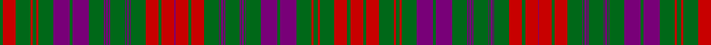

In pattern [GRGRGRGBGBGBGBGBGBGBGBGRGRBRGRGBGBGBGBGBGBGBGBGRGRGRGR](/patterns/grgrgrgbgbgbgbgbgbgbgbgrgrbrgrgbgbgbgbgbgbgbgbgrgrgrgr/).

This was sourced from register-of-tartans.  It is a [54 stripes tartan](/stripes/stripes54/).

Original link https://www.tartanregister.gov.uk/tartanDetails.aspx?ref=4985

## Attestations

This cloth appears in 2 source records; the oldest owns this page.

- 01/01/1819 — Ross (Wilsons) (register-of-tartans, [record](https://www.tartanregister.gov.uk/tartanDetails.aspx?ref=4985))
- undated — Ross (Wilsons) Clan/Family Tartan Tartan Number: 3560. Earliest known date: 1819 1819 (Key Pattern Book). Peter MacDonald says that there are over a dozen patterns of this type which obviously have a common ancestor which was probably the Lumsden of the mid 1700s. (#869). Relevant tartans are Ross, Rae, MacRae and Marchioness of Huntly's, Princes Own. See products available Copyright © Blair Urquhart, Comrie, 2015 (house-of-tartan, [record](http://www.house-of-tartan.scotland.net/house/TartanViewjs.asp?colr=Def&tnam=3560))

## Register references

External register numbers recorded for this tartan.

- Scottish Register of Tartans: [4985](https://www.tartanregister.gov.uk/tartanDetails.aspx?ref=4985)
- Scottish Tartans Authority (ITI): 3560

## Thread count
G/6 R25 G29 R4 G8 R4 G29 P32 G6 P32 G29 P2 G2 P4 G2 P2 G29 P2 G2 P4 G2 P2 G29 R25 G6 R25 P2 R25 G6 R25 G29 P2 G2 P4 G2 P2 G29 P2 G2 P4 G2 P2 G29 P32 G6 P32 G29 R4 G8 R4 G29 R25 G6 R/25

## Palette
Each colour and its ΔE from the base-6 reference it is a variant of.

| Colour | Shade | Base | ΔE (OKLab) |
|---|---|---|---|
| G | <code style="background-color:#006818;">#006818</code> `#006818` | G <code style="background-color:#006100;">#006100</code> | 0.02 |
| P | <code style="background-color:#780078;">#780078</code> `#780078` | B <code style="background-color:#2A418A;">#2A418A</code> | 0.17 |
| R | <code style="background-color:#C80000;">#C80000</code> `#C80000` | R <code style="background-color:#CC0000;">#CC0000</code> | 0.01 |

## Nearest tartans

The nearest existing variants by ΔTartan distance.

1. [Ross 1](/setts/s36/r32b3r3b8r3b3r23g20r6g20r6g20r22g5r10g5r22b24r5b24r23b3r3b8r3b3r32b3r3b8r3b3r23g20r6g20~b304080-g008000-rc00000/) — ΔT 1.39
1. [Wilson (Janet)](/setts/s42/b45w4b6g6b6g6b6g37r6g6r6g6r6g6r6g39r27g6b6r12w4r30w4r12b6g6r27g39r6g6r6g6r6g6r6g37b6g6b6g6b6w4~b2c2c80-g006818-rc80000-wfcfcfc/) — ΔT 1.41
1. [Ross (Clan)](/setts/s27/g18r2g18r18g2r4g2r18b18r2b18r18b1r1b2r1b1r18b1r1g2r1b1r18g18r2g18~b2c2c80-g006818-rc80000~x2/) — ΔT 1.54
1. [Ross Clan Tartan Tartan Number: 864. Earliest known date: 1810-15 D.C.Stewart says, "The version here given may be taken to be correct." Later versions, including Logans, are known to have omissions. The Clan Ross is descended from Fearcher MacinTagart, Earl of Ross in the 13th century. The chiefship has passed to the Rosses of Shandwick. The tartan is also worn by the MacTiers. Also worn by the Metro Toronto Police pipe band. (Strathallan 1994) See products available Copyright © Blair Urquhart, Comrie, 2015](/setts/s27/g18r2g18r18g2r4g2r18b18r2b18r18b1r1b2r1b1r18b1r1b2r1b1r18g18r2g18~b2c2c80-g006818-rc80000~x2/) — ΔT 1.55
1. [Ross #4](/setts/s27/g18r2g18r18g2r4g2r18b18r2b18r18b1r1b2r1b1r18b1r1b2r1b1r18g18r2g18~b2c4084-g005020-rdc0000~x2/) — ΔT 1.66
1. [Murray of Polmaise](/setts/s35/b3r4g1r3b3r7g3r3b9r12b1r1g1r1b1r1b6r1b1r1b1r1b1r1b6g1b1r1g1r1b1r12b9r3g3~b5c8ca8-g006818-rc80000~x4/) — ΔT 1.69
1. [Ross](/setts/s27/g18r2g18r18g2r4g2r18b18r2b18r18b1r1b2r1b1r18b1r1b2r1b1r18g18r2g18~b000052-g11450d-raa0000~x2/) — ΔT 1.70
1. [Campbell of Loudoun Plaid](/setts/s48/r4b5r10g10r14g4r3b1r1b1r3b14r18b1r1b3r1b1r3b9r3b1r1b3r1b1r3b9r3b1r1b3r1b1r18b14r3b1r1b1r3g4r14g10r10b5r4b1~b2c2c80-g285800-rc80000~x2/) — ΔT 1.71
1. [Lumsden, of Clova](/setts/s31/b9r2b9r9g1r1g2r1g1r9g1r1g2r1g1r9w1r4b11r2b11r4w1r9g2r4g2r9g9r2g9~b304080-g008000-rc00000-we0e0e0~x2/) — ΔT 1.71
1. [Unidentified Cant #07](/setts/s38/k21r3g16k6b10r42b11k3r6g4r6b10r6g4r6b3k21b3r24g24r24b3k21b3r6g4r6b10r6g4r6k3b11r42b10k6g16r3~b2c2c80-g006818-k101010-rc80000/) — ΔT 1.79

## Neighbour map

Every grey dot is one of 15726 variants placed by the first two principal components of the ΔTartan feature space (44% of its variance). Red is this tartan; blue dots are its nearest — click one to open its page.

<svg viewBox="0 0 640 380" role="img" style="max-width:100%;height:auto;border:1px solid #e0e0e0;border-radius:4px;display:block" xmlns="http://www.w3.org/2000/svg"><image href="/nn/cloud.v1.png" width="640" height="380"/><a href="/setts/s36/r32b3r3b8r3b3r23g20r6g20r6g20r22g5r10g5r22b24r5b24r23b3r3b8r3b3r32b3r3b8r3b3r23g20r6g20~b304080-g008000-rc00000/"><circle cx="290.0" cy="149.6" r="4" fill="#3465a4"><title>Ross 1</title></circle></a><a href="/setts/s42/b45w4b6g6b6g6b6g37r6g6r6g6r6g6r6g39r27g6b6r12w4r30w4r12b6g6r27g39r6g6r6g6r6g6r6g37b6g6b6g6b6w4~b2c2c80-g006818-rc80000-wfcfcfc/"><circle cx="222.9" cy="106.4" r="4" fill="#3465a4"><title>Wilson (Janet)</title></circle></a><a href="/setts/s27/g18r2g18r18g2r4g2r18b18r2b18r18b1r1b2r1b1r18b1r1g2r1b1r18g18r2g18~b2c2c80-g006818-rc80000~x2/"><circle cx="293.0" cy="129.5" r="4" fill="#3465a4"><title>Ross (Clan)</title></circle></a><a href="/setts/s27/g18r2g18r18g2r4g2r18b18r2b18r18b1r1b2r1b1r18b1r1b2r1b1r18g18r2g18~b2c2c80-g006818-rc80000~x2/"><circle cx="291.8" cy="129.3" r="4" fill="#3465a4"><title>Ross Clan Tartan Tartan Number: 864. Earliest known date: 1810-15 D.C.Stewart says, &quot;The version here given may be taken to be correct.&quot; Later versions, including Logans, are known to have omissions. The Clan Ross is descended from Fearcher MacinTagart, Earl of Ross in the 13th century. The chiefship has passed to the Rosses of Shandwick. The tartan is also worn by the MacTiers. Also worn by the Metro Toronto Police pipe band. (Strathallan 1994) See products available Copyright © Blair Urquhart, Comrie, 2015</title></circle></a><a href="/setts/s27/g18r2g18r18g2r4g2r18b18r2b18r18b1r1b2r1b1r18b1r1b2r1b1r18g18r2g18~b2c4084-g005020-rdc0000~x2/"><circle cx="290.1" cy="126.9" r="4" fill="#3465a4"><title>Ross #4</title></circle></a><a href="/setts/s35/b3r4g1r3b3r7g3r3b9r12b1r1g1r1b1r1b6r1b1r1b1r1b1r1b6g1b1r1g1r1b1r12b9r3g3~b5c8ca8-g006818-rc80000~x4/"><circle cx="324.4" cy="130.4" r="4" fill="#3465a4"><title>Murray of Polmaise</title></circle></a><a href="/setts/s27/g18r2g18r18g2r4g2r18b18r2b18r18b1r1b2r1b1r18b1r1b2r1b1r18g18r2g18~b000052-g11450d-raa0000~x2/"><circle cx="296.8" cy="136.5" r="4" fill="#3465a4"><title>Ross</title></circle></a><a href="/setts/s48/r4b5r10g10r14g4r3b1r1b1r3b14r18b1r1b3r1b1r3b9r3b1r1b3r1b1r3b9r3b1r1b3r1b1r18b14r3b1r1b1r3g4r14g10r10b5r4b1~b2c2c80-g285800-rc80000~x2/"><circle cx="337.2" cy="100.8" r="4" fill="#3465a4"><title>Campbell of Loudoun Plaid</title></circle></a><a href="/setts/s31/b9r2b9r9g1r1g2r1g1r9g1r1g2r1g1r9w1r4b11r2b11r4w1r9g2r4g2r9g9r2g9~b304080-g008000-rc00000-we0e0e0~x2/"><circle cx="245.5" cy="133.5" r="4" fill="#3465a4"><title>Lumsden, of Clova</title></circle></a><a href="/setts/s38/k21r3g16k6b10r42b11k3r6g4r6b10r6g4r6b3k21b3r24g24r24b3k21b3r6g4r6b10r6g4r6k3b11r42b10k6g16r3~b2c2c80-g006818-k101010-rc80000/"><circle cx="215.4" cy="105.5" r="4" fill="#3465a4"><title>Unidentified Cant #07</title></circle></a><circle cx="287.0" cy="112.0" r="5" fill="#c00000"/></svg>

ID: /setts/s54/r25g6r25g29r4g8r4g29b32g6b32g29b2g2b4g2b2g29b2g2b4g2b2g29r25g6r25b2r25g6r25g29b2g2b4g2b2g29b2g2b4g2b2g29b32g6b32g29r4g8r4g29r25g6~b780078-g006818-rc80000/
