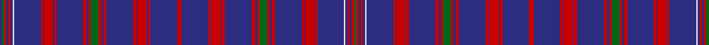

In pattern [BGRBRBWBRBRBRBRBRGRBRBRBRBRBRBRBRBRBRBRGRBRBRBRBRBWBRBRG](/patterns/bgrbrbwbrbrbrbrbrgrbrbrbrbrbrbrbrbrbrbrgrbrbrbrbrbwbrbrg/).

This was sourced from register-of-tartans.  It is a [56 stripes tartan](/stripes/stripes56/).

Original link https://www.tartanregister.gov.uk/tartanDetails.aspx?ref=1671

## Register references

External register numbers recorded for this tartan.

- Scottish Register of Tartans: [1671](https://www.tartanregister.gov.uk/tartanDetails.aspx?ref=1671)
- Scottish Tartans Authority (ITI): 1954
- Scottish Tartans World Register: 1954

## Thread count
DB/4 G4 R4 DB4 R4 DB4 LN2 DB48 R4 DB2 R16 DB2 R4 DB48 R6 DB4 R4 G14 R4 DB4 R6 DB48 R6 DB2 R16 DB2 R4 DB48 R8 DB48 R4 DB2 R16 DB2 R6 DB48 R6 DB4 R4 G14 R4 DB4 R6 DB48 R4 DB2 R16 DB2 R4 DB48 LN2 DB4 R4 DB4 R4 G/4

## Palette
Each colour and its ΔE from the base-6 reference it is a variant of.

| Colour | Shade | Base | ΔE (OKLab) |
|---|---|---|---|
| DB | <code style="background-color:#2C2C80;">#2C2C80</code> `#2C2C80` | B <code style="background-color:#2A418A;">#2A418A</code> | 0.06 |
| G | <code style="background-color:#006818;">#006818</code> `#006818` | G <code style="background-color:#006100;">#006100</code> | 0.02 |
| LN | <code style="background-color:#E0E0E0;">#E0E0E0</code> `#E0E0E0` | W <code style="background-color:#F7F7F7;">#F7F7F7</code> | 0.07 |
| R | <code style="background-color:#C80000;">#C80000</code> `#C80000` | R <code style="background-color:#CC0000;">#CC0000</code> | 0.01 |

## Nearest tartans

The nearest existing variants by ΔTartan distance.

1. [Hebridean, South Uist Specimen](/setts/s29/r4b24r2b1r8b1r3b24r3b2r2g7r2b2r3b24r2b1r8b1r2b24w1b2r2b2r2g2b2~b304080-g008000-rc00000-we0e0e0~x2/) — ΔT 1.52
1. [Washington Stockmens](/setts/s38/b4r3b4r19k2r3k2r12b4r3b4r3k1r2y1r2y1r2k1r3k1r2y1r2y1r2k1r3b4r3b4r12k2r3k2r19b4r3~b2c2c80-k101010-r888888-ye8c000~x4/) — ΔT 2.05
1. [Racing Wanless Australian Corporate Tartan Tartan Number: 3913. Earliest known date: 2002 Mrs Judi Wanless of Calamvale, Queensland, Australia.Originally woven in silk for jockeys tunic. Wanless Stables. See products available Copyright © Blair Urquhart, Comrie, 2015](/setts/s36/b25y5b12y3r1w1b12y3w1b12y3w1b12y5r1w1b12y4w2y4b12w1r1y5b12w1y3b12w1y3b12w1r1y3b12y5~b2c2c80-rc80000-we0e0e0-ye8c000~x2/) — ΔT 2.34
1. [Italian (Fashion)](/setts/s30/b24k2b24k1w1k1k12r2k2r2k12k1w1k1b24r2w2g2b24k1w1k1k12r2k2r2k12k1w1k1~b2c2c80-g289c18-k101010-r880000-wc0c0c0~x2/) — ΔT 2.50
1. [Weiss-Halliwell (Personal)](/setts/s36/b6k1ba1k2ba1k1b6k1ba22k3ba1k3ba10k1b3ba1k6ba1g3k1ba10k3ba1k3ba22k1g6k1ba1k2ba1k1g6k1ba12k1~b000048-ba646464-g003820-k101010~x2/) — ΔT 2.52
1. [Jenkins of Wales](/setts/s21/r4b37g4b4g7b5y2b4g2b3g8b3g2b4y2b5g6b4g4b37r2~b202060-g006818-rc80000-ybc8c00/) — ΔT 2.55
1. [Weiss-Halliwell (Personal)](/setts/s36/b6k1r1k2r1k1b6k1r22k3r1k3r10k1b3r1k6r1g3k1r10k3r1k3r22k1g6k1r1k2r1k1g6k1r12k1~b780078-g285800-k101010-r888888~x2/) — ΔT 2.55
1. [Clergy (Logan) (Corporate)](/setts/s32/k5w1b4w1k26w1k10b5k2b5k10w1b4w1k5w1k5w1b4w1k10b5k2b5k10w1k26w1b4w1k5w1~b5c5c5c-k101010-wc0c0c0~x2/) — ΔT 2.56
1. [Suffolk County Police](/setts/s20/b74b6k12y3k3w3b16b8k3b4w3b4k3b8b16w3k3y3k12b6~b2c2c80-k101010-we0e0e0-ye8c000~x2/) — ΔT 2.56
1. [MacRae (MacCrae)](/setts/s31/b25g6b25g26b5g7b5g26w3g7b29g6b29g7w3g26b2g2b4g2b2g26b2g2b4g2b2g26b25g6b25~b5a008c-g005020-we0e0e0~x2/) — ΔT 2.65

## Neighbour map

Every grey dot is one of 15726 variants placed by the first two principal components of the ΔTartan feature space (44% of its variance). Red is this tartan; blue dots are its nearest — click one to open its page.

<svg viewBox="0 0 640 380" role="img" style="max-width:100%;height:auto;border:1px solid #e0e0e0;border-radius:4px;display:block" xmlns="http://www.w3.org/2000/svg"><image href="/nn/cloud.v1.png" width="640" height="380"/><a href="/setts/s29/r4b24r2b1r8b1r3b24r3b2r2g7r2b2r3b24r2b1r8b1r2b24w1b2r2b2r2g2b2~b304080-g008000-rc00000-we0e0e0~x2/"><circle cx="449.6" cy="98.1" r="4" fill="#3465a4"><title>Hebridean, South Uist Specimen</title></circle></a><a href="/setts/s38/b4r3b4r19k2r3k2r12b4r3b4r3k1r2y1r2y1r2k1r3k1r2y1r2y1r2k1r3b4r3b4r12k2r3k2r19b4r3~b2c2c80-k101010-r888888-ye8c000~x4/"><circle cx="402.1" cy="97.0" r="4" fill="#3465a4"><title>Washington Stockmens</title></circle></a><a href="/setts/s36/b25y5b12y3r1w1b12y3w1b12y3w1b12y5r1w1b12y4w2y4b12w1r1y5b12w1y3b12w1y3b12w1r1y3b12y5~b2c2c80-rc80000-we0e0e0-ye8c000~x2/"><circle cx="377.8" cy="89.0" r="4" fill="#3465a4"><title>Racing Wanless Australian Corporate Tartan Tartan Number: 3913. Earliest known date: 2002 Mrs Judi Wanless of Calamvale, Queensland, Australia.Originally woven in silk for jockeys tunic. Wanless Stables. See products available Copyright © Blair Urquhart, Comrie, 2015</title></circle></a><a href="/setts/s30/b24k2b24k1w1k1k12r2k2r2k12k1w1k1b24r2w2g2b24k1w1k1k12r2k2r2k12k1w1k1~b2c2c80-g289c18-k101010-r880000-wc0c0c0~x2/"><circle cx="351.9" cy="86.6" r="4" fill="#3465a4"><title>Italian (Fashion)</title></circle></a><a href="/setts/s36/b6k1ba1k2ba1k1b6k1ba22k3ba1k3ba10k1b3ba1k6ba1g3k1ba10k3ba1k3ba22k1g6k1ba1k2ba1k1g6k1ba12k1~b000048-ba646464-g003820-k101010~x2/"><circle cx="352.8" cy="96.4" r="4" fill="#3465a4"><title>Weiss-Halliwell (Personal)</title></circle></a><a href="/setts/s21/r4b37g4b4g7b5y2b4g2b3g8b3g2b4y2b5g6b4g4b37r2~b202060-g006818-rc80000-ybc8c00/"><circle cx="468.8" cy="131.8" r="4" fill="#3465a4"><title>Jenkins of Wales</title></circle></a><a href="/setts/s36/b6k1r1k2r1k1b6k1r22k3r1k3r10k1b3r1k6r1g3k1r10k3r1k3r22k1g6k1r1k2r1k1g6k1r12k1~b780078-g285800-k101010-r888888~x2/"><circle cx="318.9" cy="75.2" r="4" fill="#3465a4"><title>Weiss-Halliwell (Personal)</title></circle></a><a href="/setts/s32/k5w1b4w1k26w1k10b5k2b5k10w1b4w1k5w1k5w1b4w1k10b5k2b5k10w1k26w1b4w1k5w1~b5c5c5c-k101010-wc0c0c0~x2/"><circle cx="447.8" cy="115.8" r="4" fill="#3465a4"><title>Clergy (Logan) (Corporate)</title></circle></a><a href="/setts/s20/b74b6k12y3k3w3b16b8k3b4w3b4k3b8b16w3k3y3k12b6~b2c2c80-k101010-we0e0e0-ye8c000~x2/"><circle cx="480.0" cy="103.9" r="4" fill="#3465a4"><title>Suffolk County Police</title></circle></a><a href="/setts/s31/b25g6b25g26b5g7b5g26w3g7b29g6b29g7w3g26b2g2b4g2b2g26b2g2b4g2b2g26b25g6b25~b5a008c-g005020-we0e0e0~x2/"><circle cx="338.1" cy="156.8" r="4" fill="#3465a4"><title>MacRae (MacCrae)</title></circle></a><circle cx="429.0" cy="66.1" r="5" fill="#c00000"/></svg>

ID: /setts/s56/b2g2r2b2r2b2w1b24r2b1r8b1r2b24r3b2r2g7r2b2r3b24r3b1r8b1r2b24r4b24r2b1r8b1r3b24r3b2r2g7r2b2r3b24r2b1r8b1r2b24w1b2r2b2r2g2~b2c2c80-g006818-rc80000-we0e0e0~x2/
