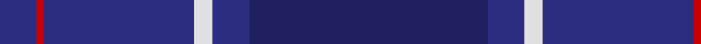

In pattern [BBWBRB](/patterns/bbwbrb/).

This was sourced from house-of-tartan.  It is a [6 stripes tartan](/stripes/stripes6/).

Original link http://www.house-of-tartan.scotland.net/house/TartanViewjs.asp?colr=Def&tnam=81

## Thread count
DB/16 R3 DB66 LN8 DB16 DBa/104

## Palette
Each colour and its ΔE from the base-6 reference it is a variant of.

| Colour | Shade | Base | ΔE (OKLab) |
|---|---|---|---|
| DB | <code style="background-color:#2C2C80;">#2C2C80</code> `#2C2C80` | B <code style="background-color:#2A418A;">#2A418A</code> | 0.06 |
| DBa | <code style="background-color:#202060;">#202060</code> `#202060` | B <code style="background-color:#2A418A;">#2A418A</code> | 0.11 |
| LN | <code style="background-color:#E0E0E0;">#E0E0E0</code> `#E0E0E0` | W <code style="background-color:#F7F7F7;">#F7F7F7</code> | 0.07 |
| R | <code style="background-color:#C80000;">#C80000</code> `#C80000` | R <code style="background-color:#CC0000;">#CC0000</code> | 0.01 |

# Sample pattern

## Nearest tartans

The nearest existing variants by ΔTartan distance.

1. [US Navy Edzell](/setts/s6/b104ba16w8ba66r3ba16~b003c64-ba2c2c80-rc80000-we0e0e0/) — ΔT 0.67
1. [S.C.O.T.S. U.S.A. Tartan Tartan Number: 82. Earliest known date: 1988 S = Scarlet. Based on the Earl of St Andrews tartan. S.C.O.T.S. is a U.S. nationwide network of travel agents promoting tourism in Scotland. See products available Copyright © Blair Urquhart, Comrie, 2015](/setts/s6/b55ba18w3ba2r2ba6~b2c2c80-ba202060-rc8002c-we0e0e0~x2/) — ΔT 1.57
1. [ODL (Corporate)](/setts/s8/k4r1b3ba28b36k3r2ra1~b2c2c80-ba1c1c50-k101010-rc80000-ra888888~x2/) — ΔT 1.75
1. [MacKerrell of Hillhouse Htg Family Tartan Tartan Number: 1758. Earliest known date: 1975 A MacKerral tartan was recorded by the Scottish Tartans Society in 1975. The Lyon Court Books contain the note "Wefted in scarlet", referring to an unusual feature, that of replacing the yellow warp stripe with red in the weft. The name, MacKerrell or MacKerral, was recorded in Ayrshire in the 12th century. See products available Copyright © Blair Urquhart, Comrie, 2015](/setts/s6/b28ba49y3ba49b28w4~b2c2c80-ba202060-we0e0e0-ye8c000~x2/) — ΔT 1.92
1. [U.S. Navy/Edzell (Military)](/setts/s6/b45ba7w3ba27r1ba7~b14283c-ba2c2c80-rc80000-we0e0e0~x2/) — ΔT 1.92
1. [Ewell Castle School](/setts/s6/b4w1b18ba18r1ba4~b003c64-ba142836-rff0000-wffffff~x4/) — ΔT 2.01
1. [Scottish Canals Corporate Tartan Tartan Number: 3916. Earliest known date: 2001 Designed by Claire Donaldson of House of Edgar for BWB. Initially called Highland Canals, later changed (April 2002) to Caledonian Canal and then in January 2003 to Scottish Canals. See products available Copyright © Blair Urquhart, Comrie, 2015](/setts/s12/g2b1ba29b2g9b26y2b26g9b2ba29b1~b202060-ba2c2c80-g006818-ye8c000~x2/) — ΔT 2.05
1. [Spirit of Wales (Fashion)](/setts/s10/b4ba2b22k2b1bb2b1k2bb24w2~b14283c-ba780078-bb202060-k101010-we0e0e0~x2/) — ΔT 2.08
1. [Rutherford, John (Personal)](/setts/s7/b64r3k3r3ba61g5ba6~b202060-ba440044-g003c14-k101010-rff0000~x2/) — ΔT 2.13
1. [Dauphinee, Andrew Hunter (Personal)](/setts/s9/r3b32ba2b3ba4b2ba16w1ba1~b3c4359-ba172d60-ra00000-wf8f4d0~x2/) — ΔT 2.17

## Neighbour map

Every grey dot is one of 15726 variants placed by the first two principal components of the ΔTartan feature space (44% of its variance). Red is this tartan; blue dots are its nearest — click one to open its page.

<svg viewBox="0 0 640 380" role="img" style="max-width:100%;height:auto;border:1px solid #e0e0e0;border-radius:4px;display:block" xmlns="http://www.w3.org/2000/svg"><image href="/nn/cloud.v1.png" width="640" height="380"/><a href="/setts/s6/b104ba16w8ba66r3ba16~b003c64-ba2c2c80-rc80000-we0e0e0/"><circle cx="456.7" cy="213.4" r="4" fill="#3465a4"><title>US Navy Edzell</title></circle></a><a href="/setts/s6/b55ba18w3ba2r2ba6~b2c2c80-ba202060-rc8002c-we0e0e0~x2/"><circle cx="529.8" cy="203.3" r="4" fill="#3465a4"><title>S.C.O.T.S. U.S.A. Tartan Tartan Number: 82. Earliest known date: 1988 S = Scarlet. Based on the Earl of St Andrews tartan. S.C.O.T.S. is a U.S. nationwide network of travel agents promoting tourism in Scotland. See products available Copyright © Blair Urquhart, Comrie, 2015</title></circle></a><a href="/setts/s8/k4r1b3ba28b36k3r2ra1~b2c2c80-ba1c1c50-k101010-rc80000-ra888888~x2/"><circle cx="451.1" cy="167.1" r="4" fill="#3465a4"><title>ODL (Corporate)</title></circle></a><a href="/setts/s6/b28ba49y3ba49b28w4~b2c2c80-ba202060-we0e0e0-ye8c000~x2/"><circle cx="454.4" cy="269.2" r="4" fill="#3465a4"><title>MacKerrell of Hillhouse Htg Family Tartan Tartan Number: 1758. Earliest known date: 1975 A MacKerral tartan was recorded by the Scottish Tartans Society in 1975. The Lyon Court Books contain the note &quot;Wefted in scarlet&quot;, referring to an unusual feature, that of replacing the yellow warp stripe with red in the weft. The name, MacKerrell or MacKerral, was recorded in Ayrshire in the 12th century. See products available Copyright © Blair Urquhart, Comrie, 2015</title></circle></a><a href="/setts/s6/b45ba7w3ba27r1ba7~b14283c-ba2c2c80-rc80000-we0e0e0~x2/"><circle cx="448.3" cy="189.8" r="4" fill="#3465a4"><title>U.S. Navy/Edzell (Military)</title></circle></a><a href="/setts/s6/b4w1b18ba18r1ba4~b003c64-ba142836-rff0000-wffffff~x4/"><circle cx="412.8" cy="237.3" r="4" fill="#3465a4"><title>Ewell Castle School</title></circle></a><a href="/setts/s12/g2b1ba29b2g9b26y2b26g9b2ba29b1~b202060-ba2c2c80-g006818-ye8c000~x2/"><circle cx="374.2" cy="182.7" r="4" fill="#3465a4"><title>Scottish Canals Corporate Tartan Tartan Number: 3916. Earliest known date: 2001 Designed by Claire Donaldson of House of Edgar for BWB. Initially called Highland Canals, later changed (April 2002) to Caledonian Canal and then in January 2003 to Scottish Canals. See products available Copyright © Blair Urquhart, Comrie, 2015</title></circle></a><a href="/setts/s10/b4ba2b22k2b1bb2b1k2bb24w2~b14283c-ba780078-bb202060-k101010-we0e0e0~x2/"><circle cx="395.9" cy="166.0" r="4" fill="#3465a4"><title>Spirit of Wales (Fashion)</title></circle></a><a href="/setts/s7/b64r3k3r3ba61g5ba6~b202060-ba440044-g003c14-k101010-rff0000~x2/"><circle cx="429.9" cy="189.1" r="4" fill="#3465a4"><title>Rutherford, John (Personal)</title></circle></a><a href="/setts/s9/r3b32ba2b3ba4b2ba16w1ba1~b3c4359-ba172d60-ra00000-wf8f4d0~x2/"><circle cx="528.6" cy="187.6" r="4" fill="#3465a4"><title>Dauphinee, Andrew Hunter (Personal)</title></circle></a><circle cx="458.6" cy="212.6" r="5" fill="#c00000"/></svg>

ID: /setts/s6/b104ba16w8ba66r3ba16~b202060-ba2c2c80-rc80000-we0e0e0/
