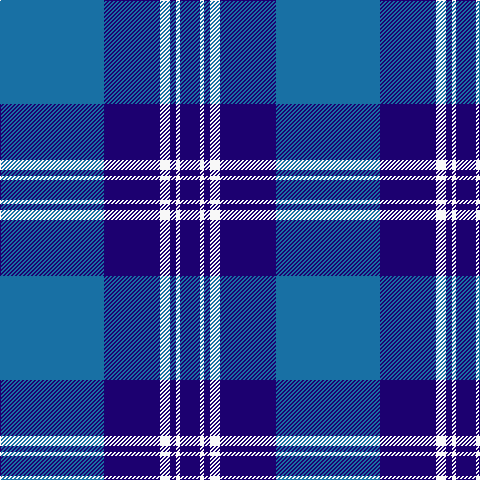

In pattern [BBWBWB](/patterns/bbwbwb/).

This was sourced from tartans-authority.  It is a [6 stripes tartan](/stripes/stripes6/).

Original link http://www.tartansauthority.com/tartan-ferret/display/85/

## Thread count
B/104 DB56 W10 DB6 W4 DB/20

## Palette
Each colour and its ΔE from the base-6 reference it is a variant of.

| Colour | Shade | Base | ΔE (OKLab) |
|---|---|---|---|
| B | <code style="background-color:#1870A4;">#1870A4</code> `#1870A4` | B <code style="background-color:#2C4084;">#2C4084</code> | 0.14 |
| DB | <code style="background-color:#1C0070;">#1C0070</code> `#1C0070` | B <code style="background-color:#2C4084;">#2C4084</code> | 0.14 |
| W | <code style="background-color:#F8F8F8;">#F8F8F8</code> `#F8F8F8` | W <code style="background-color:#F4F4F0;">#F4F4F0</code> | 0.01 |

# Sample pattern

ID: /setts/s6/b104ba56w10ba6w4ba20-b1870a4-ba1c0070-wf8f8f8/
