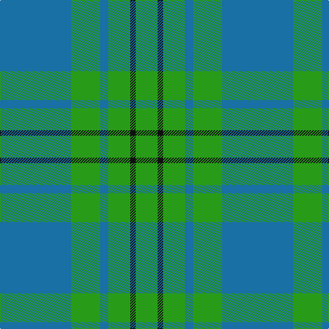

In pattern [BGBGKG](/patterns/bgbgkg/).

This was sourced from register-of-tartans.  It is a [6 stripes tartan](/stripes/stripes6/).

Original link https://www.tartanregister.gov.uk/tartanDetails.aspx?ref=2952

## Attestations

This cloth appears in 2 source records; the oldest owns this page.

- 01/01/2003 — Milligan (register-of-tartans, [record](https://www.tartanregister.gov.uk/tartanDetails.aspx?ref=2952))
- pre 2003 — Milligan (Fashion) (tartans-authority, [record](http://www.tartansauthority.com/tartan-ferret/display/6035/))

## Thread count
B/104 G42 B12 G32 K8 G/32

## Palette
Each colour and its ΔE from the base-6 reference it is a variant of.

| Colour | Shade | Base | ΔE (OKLab) |
|---|---|---|---|
| B | <code style="background-color:#1870A4;">#1870A4</code> `#1870A4` | B <code style="background-color:#2A418A;">#2A418A</code> | 0.13 |
| G | <code style="background-color:#289C18;">#289C18</code> `#289C18` | G <code style="background-color:#006100;">#006100</code> | 0.19 |
| K | <code style="background-color:#101010;">#101010</code> `#101010` | K <code style="background-color:#000000;">#000000</code> | 0.17 |

# Sample pattern

## Nearest tartans

The nearest existing variants by ΔTartan distance.

1. [Unidentified, Tweed](/setts/s6/b8w2b24g24b2g8-b304080-g008000-we0e0e0/) — ΔT 1.15
1. [Falconer of Labhdal (Personal)](/setts/s6/b28k28b28g80b8g8-b5c8ca8-g009468-k101010/) — ΔT 1.19
1. [Harmony, 12](/setts/s6/b12g4b58g58b4g12-b304080-g008000/) — ΔT 1.41
1. [Lennox Dress, Purple (Dance)](/setts/s7/b12ba4b50ba8g50ba4g12-b2888c4-ba44546c-g289c18/) — ΔT 1.51
1. [Gracie](/setts/s5/g94r6g12b70y6-b304080-g008000-rc00000-yf0c000/) — ΔT 1.59
1. [Falconer of Labhdal Personal Tartan Tartan Number: 6787. Earliest known date: 2005 August This is what James K.R. Falconer calls an update of the family tartan submitted in September 2005 and is the conventional Falconer tartan as seen at #387 with an extra blue line in the centre of the green and the colours rendered in lighter shades. Woven by Drove Weaving of Langholm (Lochcarron) and organised through Pride of Lammermuir, Lady Hilary Menzies. See products available Copyright © Blair Urquhart, Comrie, 2015](/setts/s10/b28k28b28g80b8g8b8g80b28k28-b5c8ca8-g009468-k101010/) — ΔT 1.60
1. [Hamilton, hunting](/setts/s5/b22g4b30g36w4-b304080-g008000-we0e0e0/) — ΔT 1.64
1. [Unnamed, No 17](/setts/s7/g20b4g4b12ba10b2ba4-b304080-ba5480b0-g008000/) — ΔT 1.67
1. [Holmes (Clan?)](/setts/s8/g60k6g6k6g12b64g6b6-b1474b4-g289c18-k101010/) — ΔT 1.68
1. [Unidentified 1](/setts/s7/b8g6b4g38ba48g2ba4-b304080-ba5480b0-g008000/) — ΔT 1.74

## Neighbour map

Every grey dot is one of 15726 variants placed by the first two principal components of the ΔTartan feature space (44% of its variance). Red is this tartan; blue dots are its nearest — click one to open its page.

<svg viewBox="0 0 640 380" role="img" style="max-width:100%;height:auto;border:1px solid #e0e0e0;border-radius:4px;display:block" xmlns="http://www.w3.org/2000/svg"><image href="/nn/cloud.v1.png" width="640" height="380"/><a href="/setts/s6/b8w2b24g24b2g8-b304080-g008000-we0e0e0/"><circle cx="337.5" cy="240.0" r="4" fill="#3465a4"><title>Unidentified, Tweed</title></circle></a><a href="/setts/s6/b28k28b28g80b8g8-b5c8ca8-g009468-k101010/"><circle cx="294.0" cy="244.7" r="4" fill="#3465a4"><title>Falconer of Labhdal (Personal)</title></circle></a><a href="/setts/s6/b12g4b58g58b4g12-b304080-g008000/"><circle cx="398.6" cy="245.7" r="4" fill="#3465a4"><title>Harmony, 12</title></circle></a><a href="/setts/s7/b12ba4b50ba8g50ba4g12-b2888c4-ba44546c-g289c18/"><circle cx="310.5" cy="215.7" r="4" fill="#3465a4"><title>Lennox Dress, Purple (Dance)</title></circle></a><a href="/setts/s5/g94r6g12b70y6-b304080-g008000-rc00000-yf0c000/"><circle cx="361.9" cy="208.8" r="4" fill="#3465a4"><title>Gracie</title></circle></a><a href="/setts/s10/b28k28b28g80b8g8b8g80b28k28-b5c8ca8-g009468-k101010/"><circle cx="286.8" cy="222.9" r="4" fill="#3465a4"><title>Falconer of Labhdal Personal Tartan Tartan Number: 6787. Earliest known date: 2005 August This is what James K.R. Falconer calls an update of the family tartan submitted in September 2005 and is the conventional Falconer tartan as seen at #387 with an extra blue line in the centre of the green and the colours rendered in lighter shades. Woven by Drove Weaving of Langholm (Lochcarron) and organised through Pride of Lammermuir, Lady Hilary Menzies. See products available Copyright © Blair Urquhart, Comrie, 2015</title></circle></a><a href="/setts/s5/b22g4b30g36w4-b304080-g008000-we0e0e0/"><circle cx="327.2" cy="267.3" r="4" fill="#3465a4"><title>Hamilton, hunting</title></circle></a><a href="/setts/s7/g20b4g4b12ba10b2ba4-b304080-ba5480b0-g008000/"><circle cx="273.4" cy="252.0" r="4" fill="#3465a4"><title>Unnamed, No 17</title></circle></a><a href="/setts/s8/g60k6g6k6g12b64g6b6-b1474b4-g289c18-k101010/"><circle cx="289.6" cy="189.1" r="4" fill="#3465a4"><title>Holmes (Clan?)</title></circle></a><a href="/setts/s7/b8g6b4g38ba48g2ba4-b304080-ba5480b0-g008000/"><circle cx="382.7" cy="199.5" r="4" fill="#3465a4"><title>Unidentified 1</title></circle></a><circle cx="351.0" cy="242.7" r="5" fill="#c00000"/></svg>

ID: /setts/s6/b104g42b12g32k8g32-b1870a4-g289c18-k101010/
