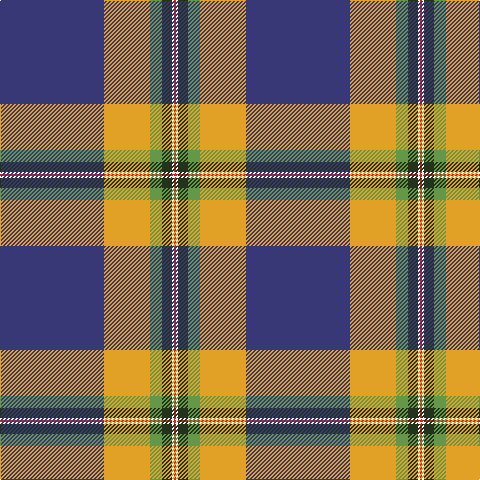

In pattern [BYGGWR](/patterns/byggwr/).

This was sourced from register-of-tartans.  It is a [6 stripes tartan](/stripes/stripes6/).

Original link https://www.tartanregister.gov.uk/tartanDetails.aspx?ref=10310

## Thread count
DB/104 Y46 LG12 K10 W2 R/2

## Palette
Each colour and its ΔE from the base-6 reference it is a variant of.

| Colour | Shade | Base | ΔE (OKLab) |
|---|---|---|---|
| DB | <code style="background-color:#373875;">#373875</code> `#373875` | B <code style="background-color:#2A418A;">#2A418A</code> | 0.04 |
| K | <code style="background-color:#23321B;">#23321B</code> `#23321B` | G <code style="background-color:#006100;">#006100</code> | 0.16 |
| LG | <code style="background-color:#649848;">#649848</code> `#649848` | G <code style="background-color:#006100;">#006100</code> | 0.20 |
| R | <code style="background-color:#CA2625;">#CA2625</code> `#CA2625` | R <code style="background-color:#CC0000;">#CC0000</code> | 0.02 |
| W | <code style="background-color:#F9F5EF;">#F9F5EF</code> `#F9F5EF` | W <code style="background-color:#F7F7F7;">#F7F7F7</code> | 0.01 |
| Y | <code style="background-color:#E0A126;">#E0A126</code> `#E0A126` | Y <code style="background-color:#F2BF00;">#F2BF00</code> | 0.08 |

# Sample pattern

## Nearest tartans

The nearest existing variants by ΔTartan distance.

1. [Ascension Island Heritage Society](/setts/s7/r16b90w2g8k22ga12r8-b5f749c-g808080-ga289c18-k101010-rdc0000-wf8f4d0/) — ΔT 0.91
1. [Ascension Island Heritage Trust](/setts/s7/r16b90w2ra8k22g12r8-b5c8ca8-g006818-k101010-rc80000-ra888888-wfcfcfc/) — ΔT 0.92
1. [Stone, Alan (Personal)](/setts/s6/r4w12k24b72ra24y2-b485074-k101010-rc80000-ra888888-we0e0e0-ye8c000/) — ΔT 1.30
1. [St. Andrew Quebec City (Corporate)](/setts/s8/r4w2r10g10y2g20b80ya4-b2c2c80-g006818-rc80000-we0e0e0-yd87c00-yae8c000/) — ΔT 1.39
1. [Wells (2014)](/setts/s7/b100g50y6w16r2wa2r2-b003c64-g288028-rc80000-wc0c0c0-wafcfcfc-yfccc00/) — ΔT 1.47
1. [Thomas Jean Marc Personal Tartan Tartan Number: 6990. Earliest known date: 2005 A personal tartan for Jean Marc Thomas, Paris. See products available Copyright © Blair Urquhart, Comrie, 2015](/setts/s8/b144r32k10y4ba32y4k10r32-b2888c4-ba003c64-k101010-rc80000-ye8c000/) — ΔT 1.50
1. [Nynashamn Whisky Society (Corporate)](/setts/s6/y21g26b62w2ga2w2-b2c2c80-g006818-ga003820-we0e0e0-ye8c000/) — ΔT 1.54
1. [Iberia Dress, Blue (Fashion)](/setts/s7/b120w4r20g12w8r30y20-b2c2c80-g003820-rc80000-we0e0e0-ye8c000/) — ΔT 1.59
1. [Caig (Corporate)](/setts/s7/w6r4b62g60y4b4y2-b780078-g006818-rc80000-we0e0e0-ye8c000/) — ΔT 1.62
1. [Hier (Personal)](/setts/s7/b116y4ba48g4r2ra10w2-b5c8ca8-ba202060-g006818-rc80000-ra880000-wfcfcfc-yfccc00/) — ΔT 1.62

## Neighbour map

Every grey dot is one of 15726 variants placed by the first two principal components of the ΔTartan feature space (44% of its variance). Red is this tartan; blue dots are its nearest — click one to open its page.

<svg viewBox="0 0 640 380" role="img" style="max-width:100%;height:auto;border:1px solid #e0e0e0;border-radius:4px;display:block" xmlns="http://www.w3.org/2000/svg"><image href="/nn/cloud.v1.png" width="640" height="380"/><a href="/setts/s7/r16b90w2g8k22ga12r8-b5f749c-g808080-ga289c18-k101010-rdc0000-wf8f4d0/"><circle cx="338.5" cy="90.6" r="4" fill="#3465a4"><title>Ascension Island Heritage Society</title></circle></a><a href="/setts/s7/r16b90w2ra8k22g12r8-b5c8ca8-g006818-k101010-rc80000-ra888888-wfcfcfc/"><circle cx="331.3" cy="89.5" r="4" fill="#3465a4"><title>Ascension Island Heritage Trust</title></circle></a><a href="/setts/s6/r4w12k24b72ra24y2-b485074-k101010-rc80000-ra888888-we0e0e0-ye8c000/"><circle cx="281.9" cy="116.8" r="4" fill="#3465a4"><title>Stone, Alan (Personal)</title></circle></a><a href="/setts/s8/r4w2r10g10y2g20b80ya4-b2c2c80-g006818-rc80000-we0e0e0-yd87c00-yae8c000/"><circle cx="376.2" cy="85.5" r="4" fill="#3465a4"><title>St. Andrew Quebec City (Corporate)</title></circle></a><a href="/setts/s7/b100g50y6w16r2wa2r2-b003c64-g288028-rc80000-wc0c0c0-wafcfcfc-yfccc00/"><circle cx="340.2" cy="88.1" r="4" fill="#3465a4"><title>Wells (2014)</title></circle></a><a href="/setts/s8/b144r32k10y4ba32y4k10r32-b2888c4-ba003c64-k101010-rc80000-ye8c000/"><circle cx="322.7" cy="101.9" r="4" fill="#3465a4"><title>Thomas Jean Marc Personal Tartan Tartan Number: 6990. Earliest known date: 2005 A personal tartan for Jean Marc Thomas, Paris. See products available Copyright © Blair Urquhart, Comrie, 2015</title></circle></a><a href="/setts/s6/y21g26b62w2ga2w2-b2c2c80-g006818-ga003820-we0e0e0-ye8c000/"><circle cx="297.1" cy="127.2" r="4" fill="#3465a4"><title>Nynashamn Whisky Society (Corporate)</title></circle></a><a href="/setts/s7/b120w4r20g12w8r30y20-b2c2c80-g003820-rc80000-we0e0e0-ye8c000/"><circle cx="321.0" cy="110.7" r="4" fill="#3465a4"><title>Iberia Dress, Blue (Fashion)</title></circle></a><a href="/setts/s7/w6r4b62g60y4b4y2-b780078-g006818-rc80000-we0e0e0-ye8c000/"><circle cx="310.2" cy="113.6" r="4" fill="#3465a4"><title>Caig (Corporate)</title></circle></a><a href="/setts/s7/b116y4ba48g4r2ra10w2-b5c8ca8-ba202060-g006818-rc80000-ra880000-wfcfcfc-yfccc00/"><circle cx="381.8" cy="66.2" r="4" fill="#3465a4"><title>Hier (Personal)</title></circle></a><circle cx="354.5" cy="88.9" r="5" fill="#c00000"/></svg>

ID: /setts/s6/b104y46g12ga10w2r2-b373875-g649848-ga23321b-rca2625-wf9f5ef-ye0a126/
