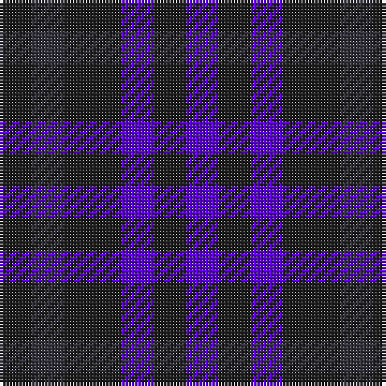

In pattern [BBBBBB](/patterns/bbbbbb/).

This was sourced from register-of-tartans.  It is a [6 stripes tartan](/stripes/stripes6/).

Original link https://www.tartanregister.gov.uk/tartanDetails.aspx?ref=10047

## Thread count
K/10 DN10 K18 P10 K10 P/10

## Palette
Each colour and its ΔE from the base-6 reference it is a variant of.

| Colour | Shade | Base | ΔE (OKLab) |
|---|---|---|---|
| DN | <code style="background-color:#32313A;">#32313A</code> `#32313A` | B <code style="background-color:#2C4084;">#2C4084</code> | 0.13 |
| K | <code style="background-color:#1E1E1E;">#1E1E1E</code> `#1E1E1E` | B <code style="background-color:#2C4084;">#2C4084</code> | 0.20 |
| P | <code style="background-color:#5900CE;">#5900CE</code> `#5900CE` | B <code style="background-color:#2C4084;">#2C4084</code> | 0.15 |

# Sample pattern

ID: /setts/s6/b10ba10b18bb10b10bb10-b1e1e1e-ba32313a-bb5900ce/
