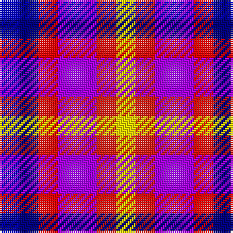

In pattern [BBRBRY](/patterns/bbrbry/).

This was sourced from register-of-tartans.  It is a [6 stripes tartan](/stripes/stripes6/).

Original link https://www.tartanregister.gov.uk/tartanDetails.aspx?ref=10476

## Thread count
B/10 DB10 R10 P20 Ra10 Y/10

## Palette
Each colour and its ΔE from the base-6 reference it is a variant of.

| Colour | Shade | Base | ΔE (OKLab) |
|---|---|---|---|
| B | <code style="background-color:#0000CD;">#0000CD</code> `#0000CD` | B <code style="background-color:#2C4084;">#2C4084</code> | 0.15 |
| DB | <code style="background-color:#000080;">#000080</code> `#000080` | B <code style="background-color:#2C4084;">#2C4084</code> | 0.14 |
| P | <code style="background-color:#AA00FF;">#AA00FF</code> `#AA00FF` | B <code style="background-color:#2C4084;">#2C4084</code> | 0.29 |
| R | <code style="background-color:#FF0000;">#FF0000</code> `#FF0000` | R <code style="background-color:#C80000;">#C80000</code> | 0.11 |
| Ra | <code style="background-color:#E3170D;">#E3170D</code> `#E3170D` | R <code style="background-color:#C80000;">#C80000</code> | 0.06 |
| Y | <code style="background-color:#FFE600;">#FFE600</code> `#FFE600` | Y <code style="background-color:#E8C000;">#E8C000</code> | 0.10 |

# Sample pattern

## Nearest tartans

The nearest existing variants by ΔTartan distance.

1. [Lytley Formal (Personal)](/setts/s6/b10ba10r10bb20ra10y10-b2c2c80-ba003c64-bb780078-rc80000-ra880000-yfccc00/) — ΔT 1.83
1. [Becker (Name)](/setts/s6/w24wa16b24r24k24y8-b2c2c80-k101010-rc80000-w98c8e8-waa8ace8-yfccc00/) — ΔT 2.02
1. [Anglicare (Corporate)](/setts/s12/b12w4b4k12ba12k4ba8b12bb12w11r4w8-b2c2c80-ba202060-bb2888c4-k101010-rc80000-wfcfcfc/) — ΔT 2.66
1. [Crinnion (Middlesbrough) (Personal)](/setts/s5/b12k4w12ba16y12-b275edc-ba761ca0-k101010-wd1d5cd-y0bb43f/) — ΔT 2.72
1. [Krifa-Jean (Personal)](/setts/s7/g40r50y40b40ga20k40ra40-b0000cd-g003c14-ga603800-k1c1714-re87878-rac8002c-yfccc00/) — ΔT 2.81
1. [Stewarton](/setts/s8/g4r10w12b14ba14b14ga10k4-b8080d0-ba4000ff-g008000-ga607030-k000030-r906030-wc0a0e0/) — ΔT 2.83
1. [Nicolson of Assynt & Coigach (Name)](/setts/s7/b16r22g10ba6y6w10k6-b2c2c80-ba1c1c50-g006818-k101010-rc80000-we0e0e0-ye8c000/) — ΔT 2.87
1. [Williams, Edmund (Personal)](/setts/s6/b30ba30g30ga30k16w10-b440044-ba780078-g289c18-ga003820-k101010-wfcfcfc/) — ΔT 2.89
1. [MacBlain (2016)](/setts/s6/b50ba30w20g30k10y10-b2c2c80-ba6c0070-g004c00-k000000-wf8f8f8-yf8e38c/) — ΔT 2.90
1. [Unidentified (2103)](/setts/s11/b16k16b16k16w8r8w8r8w8r8ra16-b5c5c5c-k101010-r888888-rac80000-we0e0e0/) — ΔT 2.90

## Neighbour map

Every grey dot is one of 15726 variants placed by the first two principal components of the ΔTartan feature space (44% of its variance). Red is this tartan; blue dots are its nearest — click one to open its page.

<svg viewBox="0 0 640 380" role="img" style="max-width:100%;height:auto;border:1px solid #e0e0e0;border-radius:4px;display:block" xmlns="http://www.w3.org/2000/svg"><image href="/nn/cloud.v1.png" width="640" height="380"/><a href="/setts/s6/b10ba10r10bb20ra10y10-b2c2c80-ba003c64-bb780078-rc80000-ra880000-yfccc00/"><circle cx="14.0" cy="277.1" r="4" fill="#3465a4"><title>Lytley Formal (Personal)</title></circle></a><a href="/setts/s6/w24wa16b24r24k24y8-b2c2c80-k101010-rc80000-w98c8e8-waa8ace8-yfccc00/"><circle cx="14.0" cy="256.2" r="4" fill="#3465a4"><title>Becker (Name)</title></circle></a><a href="/setts/s12/b12w4b4k12ba12k4ba8b12bb12w11r4w8-b2c2c80-ba202060-bb2888c4-k101010-rc80000-wfcfcfc/"><circle cx="14.0" cy="216.4" r="4" fill="#3465a4"><title>Anglicare (Corporate)</title></circle></a><a href="/setts/s5/b12k4w12ba16y12-b275edc-ba761ca0-k101010-wd1d5cd-y0bb43f/"><circle cx="14.0" cy="269.4" r="4" fill="#3465a4"><title>Crinnion (Middlesbrough) (Personal)</title></circle></a><a href="/setts/s7/g40r50y40b40ga20k40ra40-b0000cd-g003c14-ga603800-k1c1714-re87878-rac8002c-yfccc00/"><circle cx="14.0" cy="257.3" r="4" fill="#3465a4"><title>Krifa-Jean (Personal)</title></circle></a><a href="/setts/s8/g4r10w12b14ba14b14ga10k4-b8080d0-ba4000ff-g008000-ga607030-k000030-r906030-wc0a0e0/"><circle cx="14.0" cy="232.3" r="4" fill="#3465a4"><title>Stewarton</title></circle></a><a href="/setts/s7/b16r22g10ba6y6w10k6-b2c2c80-ba1c1c50-g006818-k101010-rc80000-we0e0e0-ye8c000/"><circle cx="14.0" cy="198.7" r="4" fill="#3465a4"><title>Nicolson of Assynt &amp; Coigach (Name)</title></circle></a><a href="/setts/s6/b30ba30g30ga30k16w10-b440044-ba780078-g289c18-ga003820-k101010-wfcfcfc/"><circle cx="14.0" cy="265.5" r="4" fill="#3465a4"><title>Williams, Edmund (Personal)</title></circle></a><a href="/setts/s6/b50ba30w20g30k10y10-b2c2c80-ba6c0070-g004c00-k000000-wf8f8f8-yf8e38c/"><circle cx="32.0" cy="211.1" r="4" fill="#3465a4"><title>MacBlain (2016)</title></circle></a><a href="/setts/s11/b16k16b16k16w8r8w8r8w8r8ra16-b5c5c5c-k101010-r888888-rac80000-we0e0e0/"><circle cx="14.0" cy="260.0" r="4" fill="#3465a4"><title>Unidentified (2103)</title></circle></a><circle cx="14.0" cy="259.8" r="5" fill="#c00000"/></svg>

ID: /setts/s6/b10ba10r10bb20ra10y10-b0000cd-ba000080-bbaa00ff-rff0000-rae3170d-yffe600/
