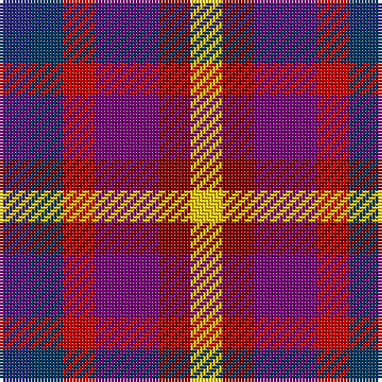

In pattern [BBRBRY](/patterns/bbrbry/).

This was sourced from tartans-authority.  It is a [6 stripes tartan](/stripes/stripes6/).

Original link http://www.tartansauthority.com/tartan-ferret/display/10476/

## Thread count
DB/10 DBa10 R10 P20 DR10 Y/10

## Palette
Each colour and its ΔE from the base-6 reference it is a variant of.

| Colour | Shade | Base | ΔE (OKLab) |
|---|---|---|---|
| DB | <code style="background-color:#2C2C80;">#2C2C80</code> `#2C2C80` | B <code style="background-color:#2C4084;">#2C4084</code> | 0.05 |
| DBa | <code style="background-color:#003C64;">#003C64</code> `#003C64` | B <code style="background-color:#2C4084;">#2C4084</code> | 0.07 |
| DR | <code style="background-color:#880000;">#880000</code> `#880000` | R <code style="background-color:#C80000;">#C80000</code> | 0.14 |
| P | <code style="background-color:#780078;">#780078</code> `#780078` | B <code style="background-color:#2C4084;">#2C4084</code> | 0.16 |
| R | <code style="background-color:#C80000;">#C80000</code> `#C80000` | R <code style="background-color:#C80000;">#C80000</code> | 0.00 |
| Y | <code style="background-color:#FCCC00;">#FCCC00</code> `#FCCC00` | Y <code style="background-color:#E8C000;">#E8C000</code> | 0.04 |

# Sample pattern

## Nearest tartans

The nearest existing variants by ΔTartan distance.

1. [Becker (Name)](/setts/s6/w24wa16b24r24k24y8-b2c2c80-k101010-rc80000-w98c8e8-waa8ace8-yfccc00/) — ΔT 1.78
1. [Lytley alias Parsons Formal (Personal)](/setts/s6/b10ba10r10bb20ra10y10-b0000cd-ba000080-bbaa00ff-rff0000-rae3170d-yffe600/) — ΔT 1.83
1. [Williams, Edmund (Personal)](/setts/s6/b30ba30g30ga30k16w10-b440044-ba780078-g289c18-ga003820-k101010-wfcfcfc/) — ΔT 2.02
1. [Krifa-Jean (Personal)](/setts/s7/g20r25b20y20ba10ra20r20-b2c2c80-ba441800-g003820-rc80000-ra888888-yfccc00/) — ΔT 2.02
1. [Krifa-Jean (Personal)](/setts/s7/g40r50y40b40ga20k40ra40-b0000cd-g003c14-ga603800-k1c1714-re87878-rac8002c-yfccc00/) — ΔT 2.05
1. [Blackdown Hills Corporate Tartan Tartan Number: 6711. Earliest known date: 1991 The Blackdown Hills on the Devon/Somerset border were designated as an Area of Outstanding Natural Beauty (AONB) in 1991 and this tartan was designed to celebrate that occasion. Designed at Coldharbour Mill at Cullompton in Devon. See products available Copyright © Blair Urquhart, Comrie, 2015](/setts/s7/k32b32y8b32r32ba32w8-b34506c-ba202060-k101010-rc85858-wf8f8f8-yd87c00/) — ΔT 2.13
1. [Nicolson of Taransay Hunting (Personal)](/setts/s7/r44b12ba32w12y12g20k20-b1c1c50-ba2c2c80-g006818-k101010-rc80000-we0e0e0-ye8c000/) — ΔT 2.13
1. [Nicolson of Assynt & Coigach (Name)](/setts/s7/b16r22g10ba6y6w10k6-b2c2c80-ba1c1c50-g006818-k101010-rc80000-we0e0e0-ye8c000/) — ΔT 2.18
1. [Rainbow (Fashion)](/setts/s6/g72y36ya36r36b36ba36-b780078-ba2c2c80-g289c18-rc80000-ye8c000-yad87c00/) — ΔT 2.22
1. [Unnamed C19th (Silk Sash)](/setts/s11/b14y4ba10ya4g14ya4r10y4r10ya4b14-b202060-ba440044-g285800-rc80000-yb0b0b0-yafccc00/) — ΔT 2.23

## Neighbour map

Every grey dot is one of 15726 variants placed by the first two principal components of the ΔTartan feature space (44% of its variance). Red is this tartan; blue dots are its nearest — click one to open its page.

<svg viewBox="0 0 640 380" role="img" style="max-width:100%;height:auto;border:1px solid #e0e0e0;border-radius:4px;display:block" xmlns="http://www.w3.org/2000/svg"><image href="/nn/cloud.v1.png" width="640" height="380"/><a href="/setts/s6/w24wa16b24r24k24y8-b2c2c80-k101010-rc80000-w98c8e8-waa8ace8-yfccc00/"><circle cx="14.0" cy="256.2" r="4" fill="#3465a4"><title>Becker (Name)</title></circle></a><a href="/setts/s6/b10ba10r10bb20ra10y10-b0000cd-ba000080-bbaa00ff-rff0000-rae3170d-yffe600/"><circle cx="14.0" cy="259.8" r="4" fill="#3465a4"><title>Lytley alias Parsons Formal (Personal)</title></circle></a><a href="/setts/s6/b30ba30g30ga30k16w10-b440044-ba780078-g289c18-ga003820-k101010-wfcfcfc/"><circle cx="14.0" cy="265.5" r="4" fill="#3465a4"><title>Williams, Edmund (Personal)</title></circle></a><a href="/setts/s7/g20r25b20y20ba10ra20r20-b2c2c80-ba441800-g003820-rc80000-ra888888-yfccc00/"><circle cx="14.0" cy="261.2" r="4" fill="#3465a4"><title>Krifa-Jean (Personal)</title></circle></a><a href="/setts/s7/g40r50y40b40ga20k40ra40-b0000cd-g003c14-ga603800-k1c1714-re87878-rac8002c-yfccc00/"><circle cx="14.0" cy="257.3" r="4" fill="#3465a4"><title>Krifa-Jean (Personal)</title></circle></a><a href="/setts/s7/k32b32y8b32r32ba32w8-b34506c-ba202060-k101010-rc85858-wf8f8f8-yd87c00/"><circle cx="56.6" cy="243.3" r="4" fill="#3465a4"><title>Blackdown Hills Corporate Tartan Tartan Number: 6711. Earliest known date: 1991 The Blackdown Hills on the Devon/Somerset border were designated as an Area of Outstanding Natural Beauty (AONB) in 1991 and this tartan was designed to celebrate that occasion. Designed at Coldharbour Mill at Cullompton in Devon. See products available Copyright © Blair Urquhart, Comrie, 2015</title></circle></a><a href="/setts/s7/r44b12ba32w12y12g20k20-b1c1c50-ba2c2c80-g006818-k101010-rc80000-we0e0e0-ye8c000/"><circle cx="14.0" cy="202.3" r="4" fill="#3465a4"><title>Nicolson of Taransay Hunting (Personal)</title></circle></a><a href="/setts/s7/b16r22g10ba6y6w10k6-b2c2c80-ba1c1c50-g006818-k101010-rc80000-we0e0e0-ye8c000/"><circle cx="14.0" cy="198.7" r="4" fill="#3465a4"><title>Nicolson of Assynt &amp; Coigach (Name)</title></circle></a><a href="/setts/s6/g72y36ya36r36b36ba36-b780078-ba2c2c80-g289c18-rc80000-ye8c000-yad87c00/"><circle cx="14.0" cy="274.6" r="4" fill="#3465a4"><title>Rainbow (Fashion)</title></circle></a><a href="/setts/s11/b14y4ba10ya4g14ya4r10y4r10ya4b14-b202060-ba440044-g285800-rc80000-yb0b0b0-yafccc00/"><circle cx="14.0" cy="202.5" r="4" fill="#3465a4"><title>Unnamed C19th (Silk Sash)</title></circle></a><circle cx="14.0" cy="277.1" r="5" fill="#c00000"/></svg>

ID: /setts/s6/b10ba10r10bb20ra10y10-b2c2c80-ba003c64-bb780078-rc80000-ra880000-yfccc00/
