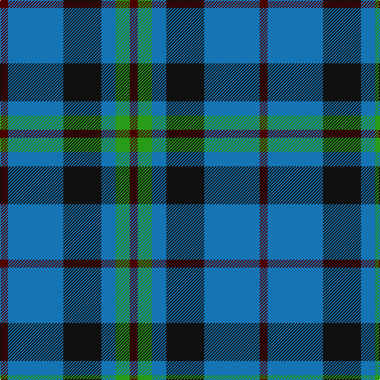

In pattern [BBKBGB](/patterns/bbkbgb/).

This was sourced from tartans-authority.  It is a [6 stripes tartan](/stripes/stripes6/).

Original link http://www.tartansauthority.com/tartan-ferret/display/5542/

## Thread count
DR/10 B70 K48 B18 G18 DR/10

## Palette
Each colour and its ΔE from the base-6 reference it is a variant of.

| Colour | Shade | Base | ΔE (OKLab) |
|---|---|---|---|
| B | <code style="background-color:#1474B4;">#1474B4</code> `#1474B4` | B <code style="background-color:#2C4084;">#2C4084</code> | 0.15 |
| DR | <code style="background-color:#4C0000;">#4C0000</code> `#4C0000` | B <code style="background-color:#2C4084;">#2C4084</code> | 0.24 |
| G | <code style="background-color:#289C18;">#289C18</code> `#289C18` | G <code style="background-color:#006400;">#006400</code> | 0.18 |
| K | <code style="background-color:#101010;">#101010</code> `#101010` | K <code style="background-color:#000000;">#000000</code> | 0.17 |

# Sample pattern

## Nearest tartans

The nearest existing variants by ΔTartan distance.

1. [Thayer USA (Name)](/setts/s6/r10b50w10b6g50b6-b2c2c80-g006818-rc80000-we0e0e0/) — ΔT 0.77
1. [All as One (Corporate)](/setts/s5/k22b76r22g22k10-b2888c4-g006818-k101010-rc80000/) — ΔT 0.79
1. [Irving of Bonshaw Tower (Personal)](/setts/s6/r4g6b4g28b28y4-b1c0070-g006818-r880000-yb8b8b8/) — ΔT 0.84
1. [Crombie House Check](/setts/s6/k6w20b4g12b36g4-b2c2c80-g006818-k101010-wc0c0c0/) — ΔT 0.88
1. [Thayer USA](/setts/s6/r10b50w10b6g50b6-b202060-g255210-ra51805-wffffff/) — ΔT 0.92
1. [Heritage Tartan, The](/setts/s6/b8r4b24g35w4g8-b1c0070-g006818-r880000-wc0c0c0/) — ΔT 0.99
1. [Granger (Personal)](/setts/s6/b80k8b24k42g54w8-b2c2c80-g006818-k101010-we0e0e0/) — ΔT 1.01
1. [Inglis Family Tartan Tartan Number: 1798. Earliest known date: 1930-50 Inglis, or Ingles, tartan is a variation of the MacIntyre tartan recognised by Lord Lyon. The green stripe of the MacIntyre is replaced by yellow in the Inglis tartan. The pattern comes from the collection of the late James MacKinlay which he called MacIntyre or Inglis. MacKinlay collected samples of tartan between 1930 and 1950 but did not provide details of the origins of the specimens. The original MacIntyre tartan can be seen on a doublet at the Kingussie museum dated 1800. It was registered in the Public Register of All Arms and Bearings in 1955. See products available Copyright © Blair Urquhart, Comrie, 2015](/setts/s6/w8g56b36r8b36y6-b2c2c80-g006818-rc80000-we0e0e0-ye8c000/) — ΔT 1.09
1. [MacIntyre, Inglis](/setts/s6/w8g56b36r8b36y6-b2c2c80-g006818-rc80000-wf8f8f8-ye8c000/) — ΔT 1.11
1. [Tilburg (District)](/setts/s5/b18y18b18ba46r6-b1c1c50-ba1c6894-rc80000-yc8c44c/) — ΔT 1.11

## Neighbour map

Every grey dot is one of 15726 variants placed by the first two principal components of the ΔTartan feature space (44% of its variance). Red is this tartan; blue dots are its nearest — click one to open its page.

<svg viewBox="0 0 640 380" role="img" style="max-width:100%;height:auto;border:1px solid #e0e0e0;border-radius:4px;display:block" xmlns="http://www.w3.org/2000/svg"><image href="/nn/cloud.v1.png" width="640" height="380"/><a href="/setts/s6/r10b50w10b6g50b6-b2c2c80-g006818-rc80000-we0e0e0/"><circle cx="248.9" cy="214.0" r="4" fill="#3465a4"><title>Thayer USA (Name)</title></circle></a><a href="/setts/s5/k22b76r22g22k10-b2888c4-g006818-k101010-rc80000/"><circle cx="226.4" cy="230.2" r="4" fill="#3465a4"><title>All as One (Corporate)</title></circle></a><a href="/setts/s6/r4g6b4g28b28y4-b1c0070-g006818-r880000-yb8b8b8/"><circle cx="253.1" cy="227.6" r="4" fill="#3465a4"><title>Irving of Bonshaw Tower (Personal)</title></circle></a><a href="/setts/s6/k6w20b4g12b36g4-b2c2c80-g006818-k101010-wc0c0c0/"><circle cx="224.3" cy="207.5" r="4" fill="#3465a4"><title>Crombie House Check</title></circle></a><a href="/setts/s6/r10b50w10b6g50b6-b202060-g255210-ra51805-wffffff/"><circle cx="247.6" cy="213.9" r="4" fill="#3465a4"><title>Thayer USA</title></circle></a><a href="/setts/s6/b8r4b24g35w4g8-b1c0070-g006818-r880000-wc0c0c0/"><circle cx="282.1" cy="225.7" r="4" fill="#3465a4"><title>Heritage Tartan, The</title></circle></a><a href="/setts/s6/b80k8b24k42g54w8-b2c2c80-g006818-k101010-we0e0e0/"><circle cx="250.7" cy="234.7" r="4" fill="#3465a4"><title>Granger (Personal)</title></circle></a><a href="/setts/s6/w8g56b36r8b36y6-b2c2c80-g006818-rc80000-we0e0e0-ye8c000/"><circle cx="226.0" cy="207.0" r="4" fill="#3465a4"><title>Inglis Family Tartan Tartan Number: 1798. Earliest known date: 1930-50 Inglis, or Ingles, tartan is a variation of the MacIntyre tartan recognised by Lord Lyon. The green stripe of the MacIntyre is replaced by yellow in the Inglis tartan. The pattern comes from the collection of the late James MacKinlay which he called MacIntyre or Inglis. MacKinlay collected samples of tartan between 1930 and 1950 but did not provide details of the origins of the specimens. The original MacIntyre tartan can be seen on a doublet at the Kingussie museum dated 1800. It was registered in the Public Register of All Arms and Bearings in 1955. See products available Copyright © Blair Urquhart, Comrie, 2015</title></circle></a><a href="/setts/s6/w8g56b36r8b36y6-b2c2c80-g006818-rc80000-wf8f8f8-ye8c000/"><circle cx="221.1" cy="204.7" r="4" fill="#3465a4"><title>MacIntyre, Inglis</title></circle></a><a href="/setts/s5/b18y18b18ba46r6-b1c1c50-ba1c6894-rc80000-yc8c44c/"><circle cx="192.5" cy="244.2" r="4" fill="#3465a4"><title>Tilburg (District)</title></circle></a><circle cx="232.7" cy="232.4" r="5" fill="#c00000"/></svg>

ID: /setts/s6/b10ba70k48ba18g18b10-b4c0000-ba1474b4-g289c18-k101010/
