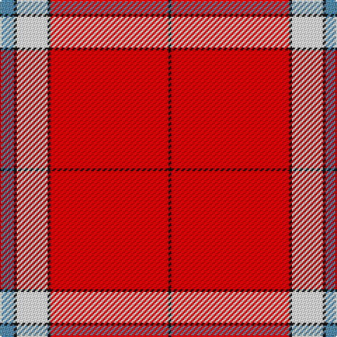

In pattern [BKWKRK](/patterns/bkwkrk/).

This was sourced from tartans-authority.  It is a [6 stripes tartan](/stripes/stripes6/).

Original link http://www.tartansauthority.com/tartan-ferret/display/10984/

## Thread count
B/10 K2 W22 K2 R84 K/2

## Palette
Each colour and its ΔE from the base-6 reference it is a variant of.

| Colour | Shade | Base | ΔE (OKLab) |
|---|---|---|---|
| B | <code style="background-color:#5C8CA8;">#5C8CA8</code> `#5C8CA8` | B <code style="background-color:#2C4084;">#2C4084</code> | 0.23 |
| K | <code style="background-color:#101010;">#101010</code> `#101010` | K <code style="background-color:#000000;">#000000</code> | 0.17 |
| R | <code style="background-color:#C80000;">#C80000</code> `#C80000` | R <code style="background-color:#C80000;">#C80000</code> | 0.00 |
| W | <code style="background-color:#FCFCFC;">#FCFCFC</code> `#FCFCFC` | W <code style="background-color:#F4F4F0;">#F4F4F0</code> | 0.03 |

# Sample pattern

ID: /setts/s6/b10k2w22k2r84k2-b5c8ca8-k101010-rc80000-wfcfcfc/
