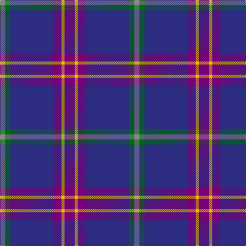

In pattern [BYBBGR](/patterns/bybbgr/).

This was sourced from tartans-authority.  It is a [6 stripes tartan](/stripes/stripes6/).

Original link http://www.tartansauthority.com/tartan-ferret/display/8045/

## Thread count
N/10 G10 DB84 P16 Y6 P/20

## Palette
Each colour and its ΔE from the base-6 reference it is a variant of.

| Colour | Shade | Base | ΔE (OKLab) |
|---|---|---|---|
| DB | <code style="background-color:#2C2C80;">#2C2C80</code> `#2C2C80` | B <code style="background-color:#2A418A;">#2A418A</code> | 0.06 |
| G | <code style="background-color:#006818;">#006818</code> `#006818` | G <code style="background-color:#006100;">#006100</code> | 0.02 |
| N | <code style="background-color:#888888;">#888888</code> `#888888` | R <code style="background-color:#CC0000;">#CC0000</code> | 0.24 |
| P | <code style="background-color:#780078;">#780078</code> `#780078` | B <code style="background-color:#2A418A;">#2A418A</code> | 0.17 |
| Y | <code style="background-color:#E8C000;">#E8C000</code> `#E8C000` | Y <code style="background-color:#F2BF00;">#F2BF00</code> | 0.02 |

# Sample pattern

## Nearest tartans

The nearest existing variants by ΔTartan distance.

1. [Royal Scottish Corporation](/setts/s9/w2r3b12ba3b3ba28r3ba3y2x2~b1c1c50-ba2c2c80-rc80000-we0e0e0-ye8c000/) — ΔT 1.11
1. [Wcwm 9275-1395](/setts/s7/b6ba3b56k24g6r6g6~b1c0070-ba440044-g006818-k101010-re87878/) — ΔT 1.40
1. [St. Leonards (Corporate)](/setts/s8/r16b2ra6r3k4ba2b40ba6x2~b2c2c80-ba2888c4-k101010-rc80000-ra888888/) — ΔT 1.49
1. [Moray Council](/setts/s8/b8r2b33ba15g12y2g2r2x2~b1c0070-ba14283c-g006818-r880000-yd09800/) — ΔT 1.51
1. [Pagus Wasia District Tartan Tartan Number: 10962. Earliest known date: 2012 Pagus (shire) Wasia (wetland) is a rural district in Belgium. The tartan was created by the founding members of the new Pagus Wasia Pipes & Drums, based on the colours of the District Coat of Arms. The district is associated with the Belgian surname, Waas. Registration was authorised by Marc Van de Vijver, Mayor of the city of Beveren. See products available Copyright © Blair Urquhart, Comrie, 2015](/setts/s9/r1b2ba1bb3ba19b3y1b2y1x4~b040470-ba444878-bb1c2448-r9c2430-ycccc08/) — ΔT 1.52
1. [St. Margaret Youth Group (Corporate)](/setts/s8/r30b5r3b33g8k3b8w2x2~b202060-g006818-k101010-r901c38-we0e0e0/) — ΔT 1.53
1. [Riley's Theme (Fashion)](/setts/s6/b20k4g5ba14w1b2x2~b2c2c80-ba440044-g006818-k101010-wfcfcfc/) — ΔT 1.53
1. [Margach, William (Dumbarton)](/setts/s6/r4k3b18ra3ba34w3x2~b5f749c-ba433a5a-k1c1714-r86264d-raca2625-wf9f5ef/) — ΔT 1.58
1. [Lennox Primary School](/setts/s7/b2w1b10ba1g10k1g2x4~b64008c-ba00008c-g808080-k101010-wc49cd8/) — ΔT 1.58
1. [Van Loo (Personal)](/setts/s7/b5ba30k25b5ba30bb2b5x2~b2888c4-ba2c2c80-bb780078-k101010/) — ΔT 1.61

## Neighbour map

Every grey dot is one of 15726 variants placed by the first two principal components of the ΔTartan feature space (44% of its variance). Red is this tartan; blue dots are its nearest — click one to open its page.

<svg viewBox="0 0 640 380" role="img" style="max-width:100%;height:auto;border:1px solid #e0e0e0;border-radius:4px;display:block" xmlns="http://www.w3.org/2000/svg"><image href="/nn/cloud.v1.png" width="640" height="380"/><a href="/setts/s9/w2r3b12ba3b3ba28r3ba3y2x2~b1c1c50-ba2c2c80-rc80000-we0e0e0-ye8c000/"><circle cx="339.2" cy="152.9" r="4" fill="#3465a4"><title>Royal Scottish Corporation</title></circle></a><a href="/setts/s7/b6ba3b56k24g6r6g6~b1c0070-ba440044-g006818-k101010-re87878/"><circle cx="355.6" cy="166.7" r="4" fill="#3465a4"><title>Wcwm 9275-1395</title></circle></a><a href="/setts/s8/r16b2ra6r3k4ba2b40ba6x2~b2c2c80-ba2888c4-k101010-rc80000-ra888888/"><circle cx="316.8" cy="134.7" r="4" fill="#3465a4"><title>St. Leonards (Corporate)</title></circle></a><a href="/setts/s8/b8r2b33ba15g12y2g2r2x2~b1c0070-ba14283c-g006818-r880000-yd09800/"><circle cx="324.0" cy="174.3" r="4" fill="#3465a4"><title>Moray Council</title></circle></a><a href="/setts/s9/r1b2ba1bb3ba19b3y1b2y1x4~b040470-ba444878-bb1c2448-r9c2430-ycccc08/"><circle cx="395.6" cy="140.0" r="4" fill="#3465a4"><title>Pagus Wasia District Tartan Tartan Number: 10962. Earliest known date: 2012 Pagus (shire) Wasia (wetland) is a rural district in Belgium. The tartan was created by the founding members of the new Pagus Wasia Pipes &amp; Drums, based on the colours of the District Coat of Arms. The district is associated with the Belgian surname, Waas. Registration was authorised by Marc Van de Vijver, Mayor of the city of Beveren. See products available Copyright © Blair Urquhart, Comrie, 2015</title></circle></a><a href="/setts/s8/r30b5r3b33g8k3b8w2x2~b202060-g006818-k101010-r901c38-we0e0e0/"><circle cx="320.1" cy="166.4" r="4" fill="#3465a4"><title>St. Margaret Youth Group (Corporate)</title></circle></a><a href="/setts/s6/b20k4g5ba14w1b2x2~b2c2c80-ba440044-g006818-k101010-wfcfcfc/"><circle cx="309.0" cy="189.8" r="4" fill="#3465a4"><title>Riley's Theme (Fashion)</title></circle></a><a href="/setts/s6/r4k3b18ra3ba34w3x2~b5f749c-ba433a5a-k1c1714-r86264d-raca2625-wf9f5ef/"><circle cx="292.5" cy="170.5" r="4" fill="#3465a4"><title>Margach, William (Dumbarton)</title></circle></a><a href="/setts/s7/b2w1b10ba1g10k1g2x4~b64008c-ba00008c-g808080-k101010-wc49cd8/"><circle cx="276.6" cy="179.7" r="4" fill="#3465a4"><title>Lennox Primary School</title></circle></a><a href="/setts/s7/b5ba30k25b5ba30bb2b5x2~b2888c4-ba2c2c80-bb780078-k101010/"><circle cx="367.4" cy="219.9" r="4" fill="#3465a4"><title>Van Loo (Personal)</title></circle></a><circle cx="354.6" cy="181.7" r="5" fill="#c00000"/></svg>

ID: /setts/s6/b10y3b8ba42g5r5x2~b780078-ba2c2c80-g006818-r888888-ye8c000/
