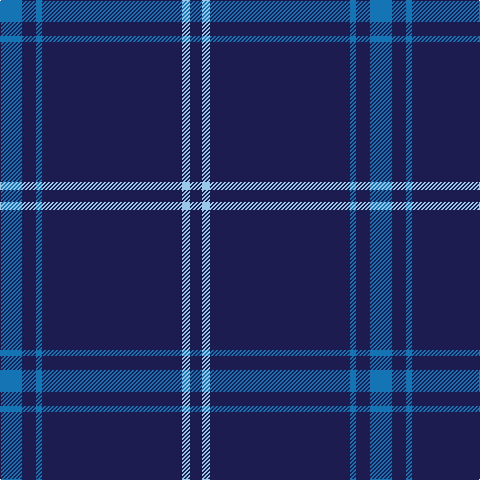

This page is one **sett** — a single exact thread-count. It belongs to the [tartan](/tartans/b11db7b3db70lb4db6/)
(the same proportion at any scale), whose colour order is pattern [BBBBWB](/stripes/bbbbwb/).

Sourced from tartans-authority.  It is a [6 stripe tartan](/stripes/stripes6/).

Original link http://www.tartansauthority.com/tartan-ferret/display/2214/

2 attestations — the source records this cloth was collapsed from (oldest owns this page)

<ul>
<li>1982 — Auchairne (Corporate) (tartans-authority, <a href="http://www.tartansauthority.com/tartan-ferret/display/2214/">record</a>)</li>
<li>01/01/1994 — Auchairne (register-of-tartans, <a href="https://www.tartanregister.gov.uk/tartanDetails.aspx?ref=129">record</a>)</li>
</ul>

## Register references

External register numbers recorded for this tartan.

- Scottish Register of Tartans: [129](https://www.tartanregister.gov.uk/tartanDetails.aspx?ref=129)
- Scottish Tartans Authority (ITI): 2214
- Scottish Tartans World Register: 2214

## Thread count
B/22 DB14 B6 DB140 LB8 DB/12

## Palette

Palette: <strong>Tartan Register</strong>
<table><thead><tr><th>Colour</th><th>Threads</th><th>Shade</th><th>Base</th><th>OKLCh</th></tr></thead><tbody><tr><td>B/</td><td style="text-align:right;font-variant-numeric:tabular-nums">22</td><td><code style="background-color:#1474B4;">#1474B4</code> <small style="color:#888">#1474B4</small></td><td>B <code style="background-color:#2A418A;">#2A418A</code></td><td><small style="color:#888">oklch(54.0% 0.129 245.1)</small></td></tr><tr><td>DB</td><td style="text-align:right;font-variant-numeric:tabular-nums">14</td><td><code style="background-color:#1C1C50;">#1C1C50</code> <small style="color:#888">#1C1C50</small></td><td>B <code style="background-color:#2A418A;">#2A418A</code></td><td><small style="color:#888">oklch(26.2% 0.093 277.9)</small></td></tr><tr><td>B</td><td style="text-align:right;font-variant-numeric:tabular-nums">6</td><td><code style="background-color:#1474B4;">#1474B4</code> <small style="color:#888">#1474B4</small></td><td>B <code style="background-color:#2A418A;">#2A418A</code></td><td><small style="color:#888">oklch(54.0% 0.129 245.1)</small></td></tr><tr><td>DB</td><td style="text-align:right;font-variant-numeric:tabular-nums">140</td><td><code style="background-color:#1C1C50;">#1C1C50</code> <small style="color:#888">#1C1C50</small></td><td>B <code style="background-color:#2A418A;">#2A418A</code></td><td><small style="color:#888">oklch(26.2% 0.093 277.9)</small></td></tr><tr><td>LB</td><td style="text-align:right;font-variant-numeric:tabular-nums">8</td><td><code style="background-color:#98C8E8;">#98C8E8</code> <small style="color:#888">#98C8E8</small></td><td>W <code style="background-color:#F7F7F7;">#F7F7F7</code></td><td><small style="color:#888">oklch(81.0% 0.068 237.9)</small></td></tr><tr><td>DB/</td><td style="text-align:right;font-variant-numeric:tabular-nums">12</td><td><code style="background-color:#1C1C50;">#1C1C50</code> <small style="color:#888">#1C1C50</small></td><td>B <code style="background-color:#2A418A;">#2A418A</code></td><td><small style="color:#888">oklch(26.2% 0.093 277.9)</small></td></tr></tbody></table>

# Sample pattern

## Nearest tartans

The nearest existing variants by ΔTartan distance, with this tartan at the top so the swatches line up against it.

ΔTartan

Tartan

Sett

—

<a href="/ttd/edit/#slug=b11db7b3db70lb4db6~x2">Auchairne (Corporate)</a> <a class="nn-out" href="/setts/s6/b11db7b3db70lb4db6~x2/" title="open its dictionary page">↗</a>

1.01

<a href="/ttd/edit/#slug=r3db2r1db18g1db2~x4">Lynch</a> <a class="nn-out" href="/setts/s6/r3db2r1db18g1db2~x4/" title="open its dictionary page">↗</a>

1.52

<a href="/ttd/edit/#slug=db144r9t44db4t4db4">United French Freemasons (Corporate</a> <a class="nn-out" href="/setts/s6/db144r9t44db4t4db4/" title="open its dictionary page">↗</a>

1.61

<a href="/ttd/edit/#slug=db32r3db4k1ly3~x2">MacLaine of Lochbuie, hunting</a> <a class="nn-out" href="/setts/s5/db32r3db4k1ly3~x2/" title="open its dictionary page">↗</a>

1.61

<a href="/setts/s10/t4dt2t1dt23lb2t2~x2/">Covenant College (Corporate)</a>

1.66

<a href="/ttd/edit/#slug=db48w2db7w2db7w2db20t11r2~x2">RAAF #4</a> <a class="nn-out" href="/setts/s9/db48w2db7w2db7w2db20t11r2~x2/" title="open its dictionary page">↗</a>

1.67

<a href="/ttd/edit/#slug=db16r4db3r1~x2">Elliott</a> <a class="nn-out" href="/setts/s4/db16r4db3r1~x2/" title="open its dictionary page">↗</a>

1.67

<a href="/ttd/edit/#slug=r19db6r7db101dg6db7~x2">Lynch</a> <a class="nn-out" href="/setts/s6/r19db6r7db101dg6db7~x2/" title="open its dictionary page">↗</a>

1.74

<a href="/ttd/edit/#slug=db122r11w4r15ly4db6ly4db30">Inverness, Duke of York</a> <a class="nn-out" href="/setts/s8/db122r11w4r15ly4db6ly4db30/" title="open its dictionary page">↗</a>

1.74

<a href="/ttd/edit/#slug=b10db6b3db62w4db5~x2">Auchairne</a> <a class="nn-out" href="/setts/s6/b10db6b3db62w4db5~x2/" title="open its dictionary page">↗</a>

1.75

<a href="/ttd/edit/#slug=r19db6r14db101g7db7">Lynch Family Tartan Tartan Number: 2163. Earliest known date: 1994 Information from Dr. Phil Smith, Narvon, USA. See products available Copyright © Blair Urquhart, Comrie, 2015</a> <a class="nn-out" href="/setts/s6/r19db6r14db101g7db7/" title="open its dictionary page">↗</a>

## Neighbour map

Every grey dot is one of 14299 variants placed by the first two principal components of the ΔTartan feature space (44% of its variance). Red is this tartan; blue dots are its nearest — click one to open its page.

<svg viewBox="0 0 640 380" role="img" style="max-width:100%;height:auto;border:1px solid #e0e0e0;border-radius:4px;display:block" xmlns="http://www.w3.org/2000/svg"><image href="/nn/cloud.v1.png" width="640" height="380"/><a href="/setts/s6/r3db2r1db18g1db2~x4/"><circle cx="602.2" cy="204.9" r="4" fill="#3465a4"><title>Lynch</title></circle></a><a href="/setts/s6/db144r9t44db4t4db4/"><circle cx="558.0" cy="176.5" r="4" fill="#3465a4"><title>United French Freemasons (Corporate</title></circle></a><a href="/setts/s5/db32r3db4k1ly3~x2/"><circle cx="597.3" cy="164.2" r="4" fill="#3465a4"><title>MacLaine of Lochbuie, hunting</title></circle></a><a href="/setts/s10/t4dt2t1dt23lb2t2~x2/"><circle cx="591.3" cy="186.2" r="4" fill="#3465a4"><title>Covenant College (Corporate)</title></circle></a><a href="/setts/s9/db48w2db7w2db7w2db20t11r2~x2/"><circle cx="549.6" cy="157.8" r="4" fill="#3465a4"><title>RAAF #4</title></circle></a><a href="/setts/s4/db16r4db3r1~x2/"><circle cx="554.6" cy="251.1" r="4" fill="#3465a4"><title>Elliott</title></circle></a><a href="/setts/s6/r19db6r7db101dg6db7~x2/"><circle cx="594.7" cy="211.2" r="4" fill="#3465a4"><title>Lynch</title></circle></a><a href="/setts/s8/db122r11w4r15ly4db6ly4db30/"><circle cx="576.2" cy="137.7" r="4" fill="#3465a4"><title>Inverness, Duke of York</title></circle></a><a href="/setts/s6/b10db6b3db62w4db5~x2/"><circle cx="553.1" cy="185.2" r="4" fill="#3465a4"><title>Auchairne</title></circle></a><a href="/setts/s6/r19db6r14db101g7db7/"><circle cx="531.0" cy="198.2" r="4" fill="#3465a4"><title>Lynch Family Tartan Tartan Number: 2163. Earliest known date: 1994 Information from Dr. Phil Smith, Narvon, USA. See products available Copyright © Blair Urquhart, Comrie, 2015</title></circle></a><circle cx="613.4" cy="198.4" r="5" fill="#c00000"/></svg>

ID: /setts/s6/b11db7b3db70lb4db6~x2/
