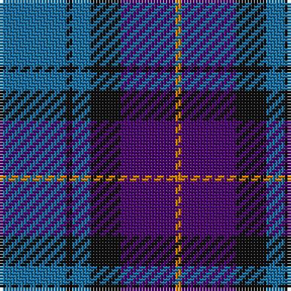

In pattern [BKBKBY](/stripes/bkbkby/).

This was sourced from house-of-tartan.  It is a [6 stripe tartan](/stripes/stripes6/).

Original link http://www.house-of-tartan.scotland.net/house/TartanViewjs.asp?colr=Def&tnam=6769

## Thread count
B/22 K2 B6 K10 P18 O/2

## Palette
Each colour and the base-6 reference it is a variant of.

| Colour | Shade | Base |
|---|---|---|
| B | <code style="background-color:#1870A4;">#1870A4</code> `oklch(52.2% 0.113 241.2)` <small>#1870A4</small> | B <code style="background-color:#2A418A;">#2A418A</code> |
| K | <code style="background-color:#101010;">#101010</code> `oklch(17.3% 0.000 89.9)` <small>#101010</small> | K <code style="background-color:#000000;">#000000</code> |
| O | <code style="background-color:#D87C00;">#D87C00</code> `oklch(67.3% 0.155 61.8)` <small>#D87C00</small> | Y <code style="background-color:#F2BF00;">#F2BF00</code> |
| P | <code style="background-color:#4C0470;">#4C0470</code> `oklch(32.5% 0.161 309.1)` <small>#4C0470</small> | B <code style="background-color:#2A418A;">#2A418A</code> |

# Sample pattern

## Nearest tartans

The nearest existing variants by ΔTartan distance.

1. [MacCorquodale #2](/setts/s6/r8b32k24db24k3b3~x2/) — ΔT 0.99
1. [Joker, The](/setts/s6/b18k2b4k6dp12lo1~x2/) — ΔT 1.00
1. [Bareback (Corporate)](/setts/s6/n6k6n21k16db36ly4/) — ΔT 1.02
1. [Granger (Personal)](/setts/s6/db40k4db12k21g27w4~x2/) — ΔT 1.05
1. [Scottish Open Squash (Corporate)](/setts/s5/db23dp2g11dp24lb3~x2/) — ΔT 1.08
1. [Fong (Personal)](/setts/s4/r21db43dt86lb10/) — ΔT 1.16
1. [Gifford (Personal)](/setts/s7/k15r8ly2db25k5db13k5~x2/) — ΔT 1.22
1. [Heritage of Scotland](/setts/s7/db6w3db21k16dp6k3dp6~x2/) — ΔT 1.23
1. [Donnolly](/setts/s6/db3g21db3o21db35w3~x2/) — ΔT 1.24
1. [MacNeil - 1994 (Personal)](/setts/s5/b30k12dt12k2w3~x2/) — ΔT 1.26

## Neighbour map

Every grey dot is one of 14299 variants placed by the first two principal components of the ΔTartan feature space (44% of its variance). Red is this tartan; blue dots are its nearest — click one to open its page.

<svg viewBox="0 0 640 380" role="img" style="max-width:100%;height:auto;border:1px solid #e0e0e0;border-radius:4px;display:block" xmlns="http://www.w3.org/2000/svg"><image href="/nn/cloud.v1.png" width="640" height="380"/><a href="/setts/s6/r8b32k24db24k3b3~x2/"><circle cx="200.8" cy="228.6" r="4" fill="#3465a4"><title>MacCorquodale #2</title></circle></a><a href="/setts/s6/b18k2b4k6dp12lo1~x2/"><circle cx="306.7" cy="199.2" r="4" fill="#3465a4"><title>Joker, The</title></circle></a><a href="/setts/s6/n6k6n21k16db36ly4/"><circle cx="233.0" cy="240.3" r="4" fill="#3465a4"><title>Bareback (Corporate)</title></circle></a><a href="/setts/s6/db40k4db12k21g27w4~x2/"><circle cx="253.9" cy="238.5" r="4" fill="#3465a4"><title>Granger (Personal)</title></circle></a><a href="/setts/s5/db23dp2g11dp24lb3~x2/"><circle cx="258.7" cy="239.4" r="4" fill="#3465a4"><title>Scottish Open Squash (Corporate)</title></circle></a><a href="/setts/s4/r21db43dt86lb10/"><circle cx="292.0" cy="257.5" r="4" fill="#3465a4"><title>Fong (Personal)</title></circle></a><a href="/setts/s7/k15r8ly2db25k5db13k5~x2/"><circle cx="299.8" cy="225.0" r="4" fill="#3465a4"><title>Gifford (Personal)</title></circle></a><a href="/setts/s7/db6w3db21k16dp6k3dp6~x2/"><circle cx="226.2" cy="236.4" r="4" fill="#3465a4"><title>Heritage of Scotland</title></circle></a><a href="/setts/s6/db3g21db3o21db35w3~x2/"><circle cx="265.1" cy="207.2" r="4" fill="#3465a4"><title>Donnolly</title></circle></a><a href="/setts/s5/b30k12dt12k2w3~x2/"><circle cx="280.4" cy="211.0" r="4" fill="#3465a4"><title>MacNeil - 1994 (Personal)</title></circle></a><circle cx="263.8" cy="228.3" r="5" fill="#c00000"/></svg>

ID: /setts/s6/b11k1b3k5dp9lo1~x2/
