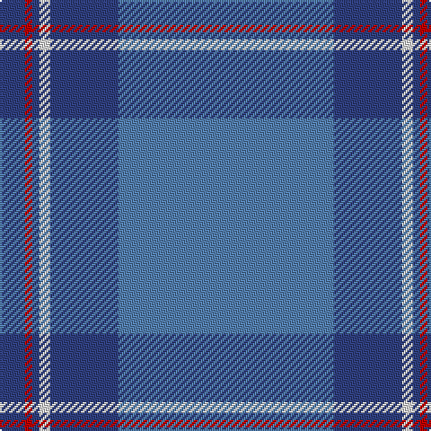

In pattern [BBWBRB](/patterns/bbwbrb/).

This was sourced from weddslist.  It is a [6 stripes tartan](/stripes/stripes6/).

Original link http://www.weddslist.com/cgi-bin/tartans/pg.pl?source=sts

## Thread count
B/14 R4 B4 LN6 B38 Ba/120

## Palette
Each colour and its ΔE from the base-6 reference it is a variant of.

| Colour | Shade | Base | ΔE (OKLab) |
|---|---|---|---|
| B | <code style="background-color:#304080;">#304080</code> `#304080` | B <code style="background-color:#2A418A;">#2A418A</code> | 0.02 |
| Ba | <code style="background-color:#5480B0;">#5480B0</code> `#5480B0` | B <code style="background-color:#2A418A;">#2A418A</code> | 0.19 |
| LN | <code style="background-color:#E0E0E0;">#E0E0E0</code> `#E0E0E0` | W <code style="background-color:#F7F7F7;">#F7F7F7</code> | 0.07 |
| R | <code style="background-color:#C00000;">#C00000</code> `#C00000` | R <code style="background-color:#CC0000;">#CC0000</code> | 0.03 |

# Sample pattern

## Nearest tartans

The nearest existing variants by ΔTartan distance.

1. [Norris Hunting](/setts/s6/k4w2r16ra2b56ra4-b2888c4-k101010-r888888-ra880000-we0e0e0/) — ΔT 1.35
1. [Federal Bureaux (FBI) Corporate Tartan Tartan Number: 83. Earliest known date: 1989 Discovered (in 1991) to be the same as a previously accredited tartan, "S.C.O.T.S." designed by Kinloch Anderson in 1988. Twenty kilts have been produced for the F.B.I. pipe band. See products available Copyright © Blair Urquhart, Comrie, 2015](/setts/s6/b120ba38w6ba4r4ba14-b5c8ca8-ba2c2c80-rc80000-we0e0e0/) — ΔT 1.46
1. [Leonard (Name)](/setts/s8/b72ba12b10r6k4r6b10ba36-b1870a4-ba2c2c80-k101010-rc80000/) — ΔT 1.49
1. [Scottish Tourist Board (1990) (Corp)](/setts/s5/b100ba30w6ba8w4-b1474b4-ba2c2c80-we0e0e0/) — ΔT 1.58
1. [Wilson #2](/setts/s6/b96g28r6g4r6g4-b2c4084-g005020-rdc0000/) — ΔT 1.61
1. [Munster Ancestry](/setts/s8/b8ba96b42ba28y6ba12b2ya6-b332c2c-ba146a99-yc4950c-yae7b205/) — ΔT 1.65
1. [Wilson](/setts/s6/b64g20r4g3r4g3-b2c4084-g005020-rdc0000/) — ΔT 1.66
1. [Munster Ancestry (Fashion)](/setts/s8/b8ba96b42ba28g6ba12b2y6-b5c5c5c-ba2c2c80-g604000-ye8c000/) — ΔT 1.66
1. [Peacock](/setts/s4/b80ba12bb28y4-b3090c0-ba800080-bb304080-yf0c000/) — ΔT 1.73
1. [Strathdee (Personal)](/setts/s10/g50b20w2b10w2b20g50r2g6r4-b3850c8-g007460-rc80000-wf8f8f8/) — ΔT 1.85

## Neighbour map

Every grey dot is one of 15726 variants placed by the first two principal components of the ΔTartan feature space (44% of its variance). Red is this tartan; blue dots are its nearest — click one to open its page.

<svg viewBox="0 0 640 380" role="img" style="max-width:100%;height:auto;border:1px solid #e0e0e0;border-radius:4px;display:block" xmlns="http://www.w3.org/2000/svg"><image href="/nn/cloud.v1.png" width="640" height="380"/><a href="/setts/s6/k4w2r16ra2b56ra4-b2888c4-k101010-r888888-ra880000-we0e0e0/"><circle cx="450.2" cy="146.1" r="4" fill="#3465a4"><title>Norris Hunting</title></circle></a><a href="/setts/s6/b120ba38w6ba4r4ba14-b5c8ca8-ba2c2c80-rc80000-we0e0e0/"><circle cx="456.7" cy="154.7" r="4" fill="#3465a4"><title>Federal Bureaux (FBI) Corporate Tartan Tartan Number: 83. Earliest known date: 1989 Discovered (in 1991) to be the same as a previously accredited tartan, &quot;S.C.O.T.S.&quot; designed by Kinloch Anderson in 1988. Twenty kilts have been produced for the F.B.I. pipe band. See products available Copyright © Blair Urquhart, Comrie, 2015</title></circle></a><a href="/setts/s8/b72ba12b10r6k4r6b10ba36-b1870a4-ba2c2c80-k101010-rc80000/"><circle cx="413.6" cy="190.0" r="4" fill="#3465a4"><title>Leonard (Name)</title></circle></a><a href="/setts/s5/b100ba30w6ba8w4-b1474b4-ba2c2c80-we0e0e0/"><circle cx="493.2" cy="201.8" r="4" fill="#3465a4"><title>Scottish Tourist Board (1990) (Corp)</title></circle></a><a href="/setts/s6/b96g28r6g4r6g4-b2c4084-g005020-rdc0000/"><circle cx="517.9" cy="197.9" r="4" fill="#3465a4"><title>Wilson #2</title></circle></a><a href="/setts/s8/b8ba96b42ba28y6ba12b2ya6-b332c2c-ba146a99-yc4950c-yae7b205/"><circle cx="500.6" cy="150.2" r="4" fill="#3465a4"><title>Munster Ancestry</title></circle></a><a href="/setts/s6/b64g20r4g3r4g3-b2c4084-g005020-rdc0000/"><circle cx="503.9" cy="203.5" r="4" fill="#3465a4"><title>Wilson</title></circle></a><a href="/setts/s8/b8ba96b42ba28g6ba12b2y6-b5c5c5c-ba2c2c80-g604000-ye8c000/"><circle cx="528.7" cy="160.3" r="4" fill="#3465a4"><title>Munster Ancestry (Fashion)</title></circle></a><a href="/setts/s4/b80ba12bb28y4-b3090c0-ba800080-bb304080-yf0c000/"><circle cx="427.6" cy="216.1" r="4" fill="#3465a4"><title>Peacock</title></circle></a><a href="/setts/s10/g50b20w2b10w2b20g50r2g6r4-b3850c8-g007460-rc80000-wf8f8f8/"><circle cx="436.1" cy="169.2" r="4" fill="#3465a4"><title>Strathdee (Personal)</title></circle></a><circle cx="496.5" cy="173.8" r="5" fill="#c00000"/></svg>

ID: /setts/s6/b120ba38w6ba4r4ba14-b5480b0-ba304080-rc00000-we0e0e0/
