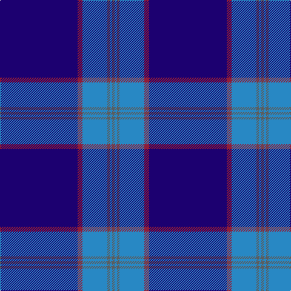

In pattern [BBBBRB](/patterns/bbbbrb/).

This was sourced from tartans-authority.  It is a [6 stripes tartan](/stripes/stripes6/).

Original link http://www.tartansauthority.com/tartan-ferret/display/10557/

## Thread count
DB/128 DR8 B41 N4 B4 N/4

## Palette
Each colour and its ΔE from the base-6 reference it is a variant of.

| Colour | Shade | Base | ΔE (OKLab) |
|---|---|---|---|
| B | <code style="background-color:#2888C4;">#2888C4</code> `#2888C4` | B <code style="background-color:#2A418A;">#2A418A</code> | 0.21 |
| DB | <code style="background-color:#1C0070;">#1C0070</code> `#1C0070` | B <code style="background-color:#2A418A;">#2A418A</code> | 0.14 |
| DR | <code style="background-color:#901C38;">#901C38</code> `#901C38` | R <code style="background-color:#CC0000;">#CC0000</code> | 0.13 |
| N | <code style="background-color:#5C5C5C;">#5C5C5C</code> `#5C5C5C` | B <code style="background-color:#2A418A;">#2A418A</code> | 0.15 |

# Sample pattern

## Nearest tartans

The nearest existing variants by ΔTartan distance.

1. [Marist School, The](/setts/s8/b116ba8b4ba4b4ba4bb32y4-b1c0070-ba2c2c80-bb5c8ca8-yd09800/) — ΔT 0.83
1. [French Freemasons' Pride](/setts/s6/b128r8g41ba4g4ba4-b000080-ba2f4f4f-g5f9ea0-r8b0000/) — ΔT 0.96
1. [S.C.O.T.S.](/setts/s6/b110ba36w6ba4r4ba12-b304080-ba000050-rc00020-we0e0e0/) — ΔT 1.02
1. [Tyneside Blue, North Tyneside Pipe Band](/setts/s7/b124k44w6k4w4k6r2-b304080-k000030-rc00000-we0e0e0/) — ΔT 1.18
1. [S.C.O.T.S](/setts/s6/b136ba45w7ba4r4ba16-b1474b4-ba1c0070-rc80000-we0e0e0/) — ΔT 1.21
1. [Waugh (Name)](/setts/s5/b100ba10k5ba10r8-b1c0070-ba7098b0-k101010-r980000/) — ΔT 1.33
1. [United French Freemasons (Corporate](/setts/s6/b144r9ba44b4ba4b4-b202060-ba2888c4-r880000/) — ΔT 1.39
1. [Waugh](/setts/s5/b100g10k5g10r8-b000080-g65909a-k000000-rb22222/) — ΔT 1.40
1. [Royal Agricultural Winter Fair](/setts/s8/b128w4b4y8b4r4b16g64-b00008c-g003014-r8c0000-wc8c8c8-yc88c00/) — ΔT 1.41
1. [Affara (Personal)](/setts/s7/b160k10g24k4y4g4k20-b2c2c80-g006818-k101010-ye8c000/) — ΔT 1.48

## Neighbour map

Every grey dot is one of 15726 variants placed by the first two principal components of the ΔTartan feature space (44% of its variance). Red is this tartan; blue dots are its nearest — click one to open its page.

<svg viewBox="0 0 640 380" role="img" style="max-width:100%;height:auto;border:1px solid #e0e0e0;border-radius:4px;display:block" xmlns="http://www.w3.org/2000/svg"><image href="/nn/cloud.v1.png" width="640" height="380"/><a href="/setts/s8/b116ba8b4ba4b4ba4bb32y4-b1c0070-ba2c2c80-bb5c8ca8-yd09800/"><circle cx="497.9" cy="138.6" r="4" fill="#3465a4"><title>Marist School, The</title></circle></a><a href="/setts/s6/b128r8g41ba4g4ba4-b000080-ba2f4f4f-g5f9ea0-r8b0000/"><circle cx="451.1" cy="147.0" r="4" fill="#3465a4"><title>French Freemasons' Pride</title></circle></a><a href="/setts/s6/b110ba36w6ba4r4ba12-b304080-ba000050-rc00020-we0e0e0/"><circle cx="464.6" cy="172.8" r="4" fill="#3465a4"><title>S.C.O.T.S.</title></circle></a><a href="/setts/s7/b124k44w6k4w4k6r2-b304080-k000030-rc00000-we0e0e0/"><circle cx="472.2" cy="122.3" r="4" fill="#3465a4"><title>Tyneside Blue, North Tyneside Pipe Band</title></circle></a><a href="/setts/s6/b136ba45w7ba4r4ba16-b1474b4-ba1c0070-rc80000-we0e0e0/"><circle cx="448.1" cy="152.4" r="4" fill="#3465a4"><title>S.C.O.T.S</title></circle></a><a href="/setts/s5/b100ba10k5ba10r8-b1c0070-ba7098b0-k101010-r980000/"><circle cx="509.8" cy="180.0" r="4" fill="#3465a4"><title>Waugh (Name)</title></circle></a><a href="/setts/s6/b144r9ba44b4ba4b4-b202060-ba2888c4-r880000/"><circle cx="555.0" cy="171.3" r="4" fill="#3465a4"><title>United French Freemasons (Corporate</title></circle></a><a href="/setts/s5/b100g10k5g10r8-b000080-g65909a-k000000-rb22222/"><circle cx="497.9" cy="180.8" r="4" fill="#3465a4"><title>Waugh</title></circle></a><a href="/setts/s8/b128w4b4y8b4r4b16g64-b00008c-g003014-r8c0000-wc8c8c8-yc88c00/"><circle cx="444.2" cy="133.6" r="4" fill="#3465a4"><title>Royal Agricultural Winter Fair</title></circle></a><a href="/setts/s7/b160k10g24k4y4g4k20-b2c2c80-g006818-k101010-ye8c000/"><circle cx="531.5" cy="142.5" r="4" fill="#3465a4"><title>Affara (Personal)</title></circle></a><circle cx="476.8" cy="154.0" r="5" fill="#c00000"/></svg>

ID: /setts/s6/b128r8ba41bb4ba4bb4-b1c0070-ba2888c4-bb5c5c5c-r901c38/
