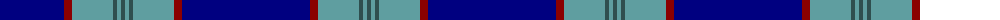

In pattern [BRYBYB](/patterns/brybyb/).

This was sourced from register-of-tartans.  It is a [6 stripes tartan](/stripes/stripes6/).

Original link https://www.tartanregister.gov.uk/tartanDetails.aspx?ref=10557

## Thread count
DB/128 DR8 B41 N4 B4 N/4

## Palette
Each colour and its ΔE from the base-6 reference it is a variant of.

| Colour | Shade | Base | ΔE (OKLab) |
|---|---|---|---|
| B | <code style="background-color:#5F9EA0;">#5F9EA0</code> `#5F9EA0` | Y <code style="background-color:#E8C000;">#E8C000</code> | 0.25 |
| DB | <code style="background-color:#000080;">#000080</code> `#000080` | B <code style="background-color:#2C4084;">#2C4084</code> | 0.14 |
| DR | <code style="background-color:#8B0000;">#8B0000</code> `#8B0000` | R <code style="background-color:#C80000;">#C80000</code> | 0.13 |
| N | <code style="background-color:#2F4F4F;">#2F4F4F</code> `#2F4F4F` | B <code style="background-color:#2C4084;">#2C4084</code> | 0.11 |

# Sample pattern

ID: /setts/s6/b128r8y41ba4y4ba4-b000080-ba2f4f4f-r8b0000-y5f9ea0/
