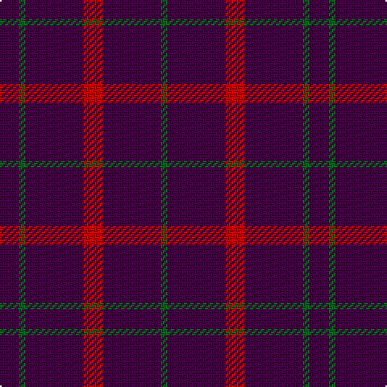

In pattern [BGBRBG](/patterns/bgbrbg/).

This was sourced from register-of-tartans.  It is a [6 stripes tartan](/stripes/stripes6/).

Original link https://www.tartanregister.gov.uk/tartanDetails.aspx?ref=1720

## Thread count
DP/12 G4 DP36 R12 DP36 G/4

## Palette
Each colour and its ΔE from the base-6 reference it is a variant of.

| Colour | Shade | Base | ΔE (OKLab) |
|---|---|---|---|
| DG | <code style="background-color:#003820;">#003820</code> `#003820` | G <code style="background-color:#006400;">#006400</code> | 0.16 |
| DP | <code style="background-color:#440044;">#440044</code> `#440044` | B <code style="background-color:#2C4084;">#2C4084</code> | 0.17 |
| G | <code style="background-color:#006818;">#006818</code> `#006818` | G <code style="background-color:#006400;">#006400</code> | 0.02 |
| R | <code style="background-color:#C80000;">#C80000</code> `#C80000` | R <code style="background-color:#C80000;">#C80000</code> | 0.00 |

# Sample pattern

## Nearest tartans

The nearest existing variants by ΔTartan distance.

1. [Highland Spring (1988) (Corporate)](/setts/s4/b12g4b36r12-b440044-g006818-rc80000/) — ΔT 1.26
1. [Highland Spring Corporate Tartan Tartan Number: 130. Earliest known date: 1987 Highland Spring manufacture bottled drinking water at Blackford in Perthshire, Scotland. See products available Copyright © Blair Urquhart, Comrie, 2015](/setts/s4/b10g4b38r10-b780078-g006818-rc80000/) — ΔT 1.87
1. [Highland Spring](/setts/s4/b10g6b38r10-b800080-g008000-rc00000/) — ΔT 1.96
1. [Brooks Brothers Tattersall Blue](/setts/s5/r4b36y8b36y4-b202060-r880000-ya08858/) — ΔT 2.07
1. [Hebridean (Old..) District Tartan Tartan Number: 414. Earliest known date: pre 2003 The design 'Heather Tartan' has been produced at the request of the Royal Society for Prevention of Cruelty to Children, as the Society's corporate tartan. The colours of the design are taken from the Society's badge and lettrhead. Dark Pink Mix, Light Pink Mix, Kingfisher and Emerald. See products available Copyright © Blair Urquhart, Comrie, 2015](/setts/s7/b20r2b20r4b20r2g4-b2c2c80-g006818-rc80000/) — ΔT 2.16
1. [Leonard Hunting](/setts/s6/k40b20k120b20k40b36-b6c006c-k101010/) — ΔT 2.16
1. [Unidentified Plaid 7](/setts/s7/b54r10b54r6b6r60b46-b304080-rc00000/) — ΔT 2.21
1. [Lynch Variant](/setts/s6/r24b6r14b104g8b8-b500050-g005020-rdc0000/) — ΔT 2.27
1. [Leonard Hunting (Name)](/setts/s4/k120b20k40b36-b6c006c-k101010/) — ΔT 2.31
1. [Brooks Brothers Tattersall Red](/setts/s5/b4r36b8r36y4-b202060-r880000-ya08858/) — ΔT 2.31

## Neighbour map

Every grey dot is one of 15726 variants placed by the first two principal components of the ΔTartan feature space (44% of its variance). Red is this tartan; blue dots are its nearest — click one to open its page.

<svg viewBox="0 0 640 380" role="img" style="max-width:100%;height:auto;border:1px solid #e0e0e0;border-radius:4px;display:block" xmlns="http://www.w3.org/2000/svg"><image href="/nn/cloud.v1.png" width="640" height="380"/><a href="/setts/s4/b12g4b36r12-b440044-g006818-rc80000/"><circle cx="504.7" cy="273.8" r="4" fill="#3465a4"><title>Highland Spring (1988) (Corporate)</title></circle></a><a href="/setts/s4/b10g4b38r10-b780078-g006818-rc80000/"><circle cx="564.7" cy="268.7" r="4" fill="#3465a4"><title>Highland Spring Corporate Tartan Tartan Number: 130. Earliest known date: 1987 Highland Spring manufacture bottled drinking water at Blackford in Perthshire, Scotland. See products available Copyright © Blair Urquhart, Comrie, 2015</title></circle></a><a href="/setts/s4/b10g6b38r10-b800080-g008000-rc00000/"><circle cx="504.6" cy="277.6" r="4" fill="#3465a4"><title>Highland Spring</title></circle></a><a href="/setts/s5/r4b36y8b36y4-b202060-r880000-ya08858/"><circle cx="544.6" cy="266.1" r="4" fill="#3465a4"><title>Brooks Brothers Tattersall Blue</title></circle></a><a href="/setts/s7/b20r2b20r4b20r2g4-b2c2c80-g006818-rc80000/"><circle cx="570.1" cy="258.1" r="4" fill="#3465a4"><title>Hebridean (Old..) District Tartan Tartan Number: 414. Earliest known date: pre 2003 The design 'Heather Tartan' has been produced at the request of the Royal Society for Prevention of Cruelty to Children, as the Society's corporate tartan. The colours of the design are taken from the Society's badge and lettrhead. Dark Pink Mix, Light Pink Mix, Kingfisher and Emerald. See products available Copyright © Blair Urquhart, Comrie, 2015</title></circle></a><a href="/setts/s6/k40b20k120b20k40b36-b6c006c-k101010/"><circle cx="512.7" cy="313.1" r="4" fill="#3465a4"><title>Leonard Hunting</title></circle></a><a href="/setts/s7/b54r10b54r6b6r60b46-b304080-rc00000/"><circle cx="460.8" cy="267.4" r="4" fill="#3465a4"><title>Unidentified Plaid 7</title></circle></a><a href="/setts/s6/r24b6r14b104g8b8-b500050-g005020-rdc0000/"><circle cx="530.8" cy="188.9" r="4" fill="#3465a4"><title>Lynch Variant</title></circle></a><a href="/setts/s4/k120b20k40b36-b6c006c-k101010/"><circle cx="532.3" cy="334.3" r="4" fill="#3465a4"><title>Leonard Hunting (Name)</title></circle></a><a href="/setts/s5/b4r36b8r36y4-b202060-r880000-ya08858/"><circle cx="610.7" cy="270.5" r="4" fill="#3465a4"><title>Brooks Brothers Tattersall Red</title></circle></a><circle cx="554.0" cy="262.5" r="5" fill="#c00000"/></svg>

ID: /setts/s6/b12g4b36r12b36g4-b440044-g006818-rc80000/
