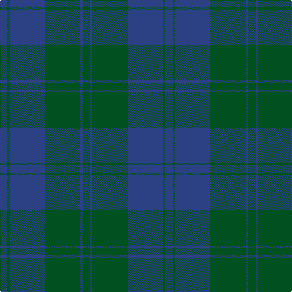

In pattern [BGBGBG](/patterns/bgbgbg/).

This was sourced from register-of-tartans.  It is a [6 stripes tartan](/stripes/stripes6/).

Original link https://www.tartanregister.gov.uk/tartanDetails.aspx?ref=1605

## Thread count
B/12 G4 B58 G58 B4 G/12

## Palette
Each colour and its ΔE from the base-6 reference it is a variant of.

| Colour | Shade | Base | ΔE (OKLab) |
|---|---|---|---|
| B | <code style="background-color:#2C4084;">#2C4084</code> `#2C4084` | B <code style="background-color:#2A418A;">#2A418A</code> | 0.01 |
| G | <code style="background-color:#005020;">#005020</code> `#005020` | G <code style="background-color:#006100;">#006100</code> | 0.07 |

# Sample pattern

## Nearest tartans

The nearest existing variants by ΔTartan distance.

1. [Williams (New York) (Personal)](/setts/s5/k60b12k12b82ba4-b003c64-ba5c8ca8-k101010/) — ΔT 1.76
1. [Unidentified Tweed](/setts/s6/b8w2b24g24b2g8-b2c4084-g005020-we0e0e0/) — ΔT 1.97
1. [Land's End Blue](/setts/s8/b4g18r4g18b4g4b52ga4-b003c64-g006818-ga003820-r901c38/) — ΔT 2.15
1. [MacCallum, High School](/setts/s5/g54b18g6b66g6-b304080-g808080/) — ΔT 2.18
1. [Donachie of Brockloch Htg (Clan)](/setts/s10/g48r4g4ga80g50ga4g4r4g4ga40-g487048-ga003820-r880000/) — ΔT 2.19
1. [Breckon Hunting (Name)](/setts/s9/b12r4b56g56r4g4r4g4r8-b1c1c50-g003820-r880000/) — ΔT 2.19
1. [Keeper of the Quaich](/setts/s6/g3b3g3b27g40ga3-b304080-g402000-ga908000/) — ΔT 2.24
1. [Carnet (Fashion)](/setts/s6/k24g12k12g44k4g8-g004c00-k28140c/) — ΔT 2.27
1. [Sugiyama Jogakuen University (Corp)](/setts/s6/b14ba4b50ba20g42ba4-b2c2c80-ba202060-g006818/) — ΔT 2.31
1. [Land's End, Blue (Fashion)](/setts/s8/b4g18r4g18b4g4b52g4-b003054-g004c2c-r901c38/) — ΔT 2.31

## Neighbour map

Every grey dot is one of 15726 variants placed by the first two principal components of the ΔTartan feature space (44% of its variance). Red is this tartan; blue dots are its nearest — click one to open its page.

<svg viewBox="0 0 640 380" role="img" style="max-width:100%;height:auto;border:1px solid #e0e0e0;border-radius:4px;display:block" xmlns="http://www.w3.org/2000/svg"><image href="/nn/cloud.v1.png" width="640" height="380"/><a href="/setts/s5/k60b12k12b82ba4-b003c64-ba5c8ca8-k101010/"><circle cx="470.9" cy="260.3" r="4" fill="#3465a4"><title>Williams (New York) (Personal)</title></circle></a><a href="/setts/s6/b8w2b24g24b2g8-b2c4084-g005020-we0e0e0/"><circle cx="383.0" cy="261.9" r="4" fill="#3465a4"><title>Unidentified Tweed</title></circle></a><a href="/setts/s8/b4g18r4g18b4g4b52ga4-b003c64-g006818-ga003820-r901c38/"><circle cx="421.3" cy="220.2" r="4" fill="#3465a4"><title>Land's End Blue</title></circle></a><a href="/setts/s5/g54b18g6b66g6-b304080-g808080/"><circle cx="448.9" cy="282.6" r="4" fill="#3465a4"><title>MacCallum, High School</title></circle></a><a href="/setts/s10/g48r4g4ga80g50ga4g4r4g4ga40-g487048-ga003820-r880000/"><circle cx="442.4" cy="213.6" r="4" fill="#3465a4"><title>Donachie of Brockloch Htg (Clan)</title></circle></a><a href="/setts/s9/b12r4b56g56r4g4r4g4r8-b1c1c50-g003820-r880000/"><circle cx="415.2" cy="228.6" r="4" fill="#3465a4"><title>Breckon Hunting (Name)</title></circle></a><a href="/setts/s6/g3b3g3b27g40ga3-b304080-g402000-ga908000/"><circle cx="470.3" cy="239.7" r="4" fill="#3465a4"><title>Keeper of the Quaich</title></circle></a><a href="/setts/s6/k24g12k12g44k4g8-g004c00-k28140c/"><circle cx="504.3" cy="310.6" r="4" fill="#3465a4"><title>Carnet (Fashion)</title></circle></a><a href="/setts/s6/b14ba4b50ba20g42ba4-b2c2c80-ba202060-g006818/"><circle cx="344.2" cy="262.5" r="4" fill="#3465a4"><title>Sugiyama Jogakuen University (Corp)</title></circle></a><a href="/setts/s8/b4g18r4g18b4g4b52g4-b003054-g004c2c-r901c38/"><circle cx="518.9" cy="270.4" r="4" fill="#3465a4"><title>Land's End, Blue (Fashion)</title></circle></a><circle cx="477.6" cy="282.9" r="5" fill="#c00000"/></svg>

ID: /setts/s6/b12g4b58g58b4g12-b2c4084-g005020/
