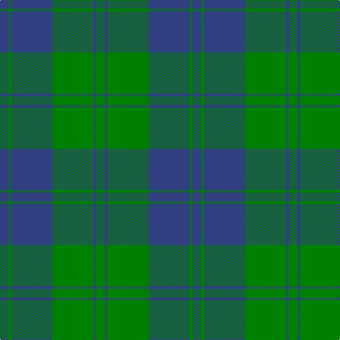

In pattern [BGBGBG](/patterns/bgbgbg/).

This was sourced from weddslist.  It is a [6 stripes tartan](/stripes/stripes6/).

Original link http://www.weddslist.com/cgi-bin/tartans/pg.pl?source=sts

## Thread count
B/12 G4 B58 G58 B4 G/12

## Palette
Each colour and its ΔE from the base-6 reference it is a variant of.

| Colour | Shade | Base | ΔE (OKLab) |
|---|---|---|---|
| B | <code style="background-color:#304080;">#304080</code> `#304080` | B <code style="background-color:#2A418A;">#2A418A</code> | 0.02 |
| G | <code style="background-color:#008000;">#008000</code> `#008000` | G <code style="background-color:#006100;">#006100</code> | 0.10 |

# Sample pattern

## Nearest tartans

The nearest existing variants by ΔTartan distance.

1. [Unidentified, Tweed](/setts/s6/b8w2b24g24b2g8-b304080-g008000-we0e0e0/) — ΔT 1.16
1. [Milligan](/setts/s6/b104g42b12g32k8g32-b1870a4-g289c18-k101010/) — ΔT 1.41
1. [Barclay](/setts/s4/g2b32g32r2-b2c2c80-g006818-rc80000/) — ΔT 1.48
1. [Barclay Htg (Clan)](/setts/s4/g4b64g64r4-b2c2c80-g006818-rc80000/) — ΔT 1.48
1. [Barclay Hunting Clan Tartan Tartan Number: 705. Earliest known date: 1842 The 'Vestiarium' attempted to persuade its readers that the illustrated tartans were of great antiquity. Despite this fault the work contains the earliest record of many tartans some of which have been verified by other means. Innes, Stewart, and W & A K Johnston, also record this sett. See products available Copyright © Blair Urquhart, Comrie, 2015](/setts/s4/g2b32g32r2-b202060-g006818-rc80000/) — ΔT 1.51
1. [St. Dennis & Cranley School](/setts/s7/b4g48b16w4b16g16b4-b1c0070-g006818-wc0c0c0/) — ΔT 1.70
1. [Hamilton, hunting](/setts/s5/b22g4b30g36w4-b304080-g008000-we0e0e0/) — ΔT 1.75
1. [North Sea Commission](/setts/s5/b36ba12b4ba48y4-b5c8ca8-ba344054-ye8c000/) — ΔT 1.80
1. [Unidentified Tweed](/setts/s6/b8w2b24g24b2g8-b2c4084-g005020-we0e0e0/) — ΔT 1.80
1. [Falconer of Labhdal (Personal)](/setts/s6/b28k28b28g80b8g8-b5c8ca8-g009468-k101010/) — ΔT 1.82

## Neighbour map

Every grey dot is one of 15726 variants placed by the first two principal components of the ΔTartan feature space (44% of its variance). Red is this tartan; blue dots are its nearest — click one to open its page.

<svg viewBox="0 0 640 380" role="img" style="max-width:100%;height:auto;border:1px solid #e0e0e0;border-radius:4px;display:block" xmlns="http://www.w3.org/2000/svg"><image href="/nn/cloud.v1.png" width="640" height="380"/><a href="/setts/s6/b8w2b24g24b2g8-b304080-g008000-we0e0e0/"><circle cx="337.5" cy="240.0" r="4" fill="#3465a4"><title>Unidentified, Tweed</title></circle></a><a href="/setts/s6/b104g42b12g32k8g32-b1870a4-g289c18-k101010/"><circle cx="351.0" cy="242.7" r="4" fill="#3465a4"><title>Milligan</title></circle></a><a href="/setts/s4/g2b32g32r2-b2c2c80-g006818-rc80000/"><circle cx="383.3" cy="251.0" r="4" fill="#3465a4"><title>Barclay</title></circle></a><a href="/setts/s4/g4b64g64r4-b2c2c80-g006818-rc80000/"><circle cx="383.3" cy="251.0" r="4" fill="#3465a4"><title>Barclay Htg (Clan)</title></circle></a><a href="/setts/s4/g2b32g32r2-b202060-g006818-rc80000/"><circle cx="380.3" cy="250.4" r="4" fill="#3465a4"><title>Barclay Hunting Clan Tartan Tartan Number: 705. Earliest known date: 1842 The 'Vestiarium' attempted to persuade its readers that the illustrated tartans were of great antiquity. Despite this fault the work contains the earliest record of many tartans some of which have been verified by other means. Innes, Stewart, and W &amp; A K Johnston, also record this sett. See products available Copyright © Blair Urquhart, Comrie, 2015</title></circle></a><a href="/setts/s7/b4g48b16w4b16g16b4-b1c0070-g006818-wc0c0c0/"><circle cx="367.2" cy="221.9" r="4" fill="#3465a4"><title>St. Dennis &amp; Cranley School</title></circle></a><a href="/setts/s5/b22g4b30g36w4-b304080-g008000-we0e0e0/"><circle cx="327.2" cy="267.3" r="4" fill="#3465a4"><title>Hamilton, hunting</title></circle></a><a href="/setts/s5/b36ba12b4ba48y4-b5c8ca8-ba344054-ye8c000/"><circle cx="396.6" cy="247.5" r="4" fill="#3465a4"><title>North Sea Commission</title></circle></a><a href="/setts/s6/b8w2b24g24b2g8-b2c4084-g005020-we0e0e0/"><circle cx="383.0" cy="261.9" r="4" fill="#3465a4"><title>Unidentified Tweed</title></circle></a><a href="/setts/s6/b28k28b28g80b8g8-b5c8ca8-g009468-k101010/"><circle cx="294.0" cy="244.7" r="4" fill="#3465a4"><title>Falconer of Labhdal (Personal)</title></circle></a><circle cx="398.6" cy="245.7" r="5" fill="#c00000"/></svg>

ID: /setts/s6/b12g4b58g58b4g12-b304080-g008000/
