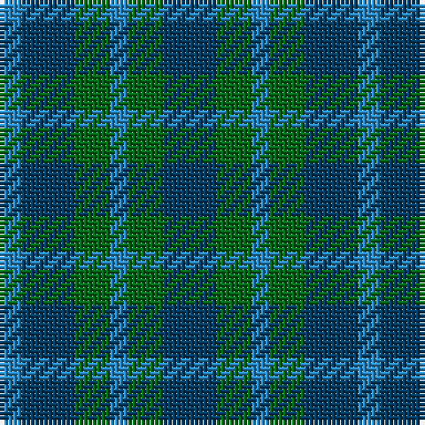

In pattern [BBGBGB](/patterns/bbgbgb/).

This was sourced from register-of-tartans.  It is a [6 stripes tartan](/stripes/stripes6/).

Original link https://www.tartanregister.gov.uk/tartanDetails.aspx?ref=5063

## Thread count
B/5 DB12 G8 B4 G8 DB/12

## Palette
Each colour and its ΔE from the base-6 reference it is a variant of.

| Colour | Shade | Base | ΔE (OKLab) |
|---|---|---|---|
| B | <code style="background-color:#2888C4;">#2888C4</code> `#2888C4` | B <code style="background-color:#2A418A;">#2A418A</code> | 0.21 |
| DB | <code style="background-color:#003C64;">#003C64</code> `#003C64` | B <code style="background-color:#2A418A;">#2A418A</code> | 0.08 |
| G | <code style="background-color:#006818;">#006818</code> `#006818` | G <code style="background-color:#006100;">#006100</code> | 0.02 |

# Sample pattern

## Nearest tartans

The nearest existing variants by ΔTartan distance.

1. [Sheffield High (School)](/setts/s4/b5ba12g8b4-b2888c4-ba003c64-g006818/) — ΔT 1.20
1. [MacCurdie (Clan?)](/setts/s4/k20g56b48g16-b2c2c80-g006818-k101010/) — ΔT 1.68
1. [Unidentified No 63](/setts/s7/k6g8k2g8k6b8k2-b2c4084-g005020-k101010/) — ΔT 1.71
1. [Sutherland 42nd](/setts/s6/b4k4b12k12g12k4-b2c4084-g005020-k101010/) — ΔT 1.71
1. [Highland Grey](/setts/s6/b16g16b4g16b16g4-b2c2c80-g006818/) — ΔT 1.80
1. [Austin Clan](/setts/s5/b8k8b8g18k4-b2c2c80-g006818-k101010/) — ΔT 1.97
1. [Wandering Shepherd (Personal)](/setts/s5/b40k40g40b20k20-b2c2c80-g006818-k101010/) — ΔT 2.07
1. [MacKay - 1800 (Reay Coat) (Artefact)](/setts/s7/g18ga18y4ga18g18b18g6-b1474b4-g604000-ga408060-ye8c000/) — ΔT 2.10
1. [Dewar, Robert Alexander (Personal)](/setts/s9/g30b16k10b16g30y6g30b16k10-b003c64-g007440-k101010-ye8c000/) — ΔT 2.11
1. [Unidentified No 29](/setts/s6/b6g22ba4b22bb12g6-b2c4084-ba3c82af-bb0596fa-g005020/) — ΔT 2.15

## Neighbour map

Every grey dot is one of 15726 variants placed by the first two principal components of the ΔTartan feature space (44% of its variance). Red is this tartan; blue dots are its nearest — click one to open its page.

<svg viewBox="0 0 640 380" role="img" style="max-width:100%;height:auto;border:1px solid #e0e0e0;border-radius:4px;display:block" xmlns="http://www.w3.org/2000/svg"><image href="/nn/cloud.v1.png" width="640" height="380"/><a href="/setts/s4/b5ba12g8b4-b2888c4-ba003c64-g006818/"><circle cx="207.9" cy="359.8" r="4" fill="#3465a4"><title>Sheffield High (School)</title></circle></a><a href="/setts/s4/k20g56b48g16-b2c2c80-g006818-k101010/"><circle cx="264.7" cy="341.5" r="4" fill="#3465a4"><title>MacCurdie (Clan?)</title></circle></a><a href="/setts/s7/k6g8k2g8k6b8k2-b2c4084-g005020-k101010/"><circle cx="233.6" cy="336.4" r="4" fill="#3465a4"><title>Unidentified No 63</title></circle></a><a href="/setts/s6/b4k4b12k12g12k4-b2c4084-g005020-k101010/"><circle cx="231.9" cy="341.5" r="4" fill="#3465a4"><title>Sutherland 42nd</title></circle></a><a href="/setts/s6/b16g16b4g16b16g4-b2c2c80-g006818/"><circle cx="318.6" cy="345.1" r="4" fill="#3465a4"><title>Highland Grey</title></circle></a><a href="/setts/s5/b8k8b8g18k4-b2c2c80-g006818-k101010/"><circle cx="207.3" cy="318.6" r="4" fill="#3465a4"><title>Austin Clan</title></circle></a><a href="/setts/s5/b40k40g40b20k20-b2c2c80-g006818-k101010/"><circle cx="154.3" cy="366.0" r="4" fill="#3465a4"><title>Wandering Shepherd (Personal)</title></circle></a><a href="/setts/s7/g18ga18y4ga18g18b18g6-b1474b4-g604000-ga408060-ye8c000/"><circle cx="210.0" cy="306.9" r="4" fill="#3465a4"><title>MacKay - 1800 (Reay Coat) (Artefact)</title></circle></a><a href="/setts/s9/g30b16k10b16g30y6g30b16k10-b003c64-g007440-k101010-ye8c000/"><circle cx="248.9" cy="279.0" r="4" fill="#3465a4"><title>Dewar, Robert Alexander (Personal)</title></circle></a><a href="/setts/s6/b6g22ba4b22bb12g6-b2c4084-ba3c82af-bb0596fa-g005020/"><circle cx="209.1" cy="278.2" r="4" fill="#3465a4"><title>Unidentified No 29</title></circle></a><circle cx="241.1" cy="357.1" r="5" fill="#c00000"/></svg>

ID: /setts/s6/b12g8ba4g8b12ba5-b003c64-ba2888c4-g006818/
