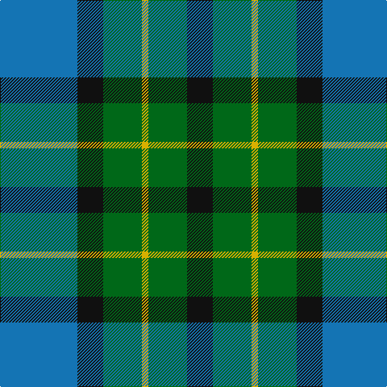

In pattern [BKGYGK](/stripes/bkgygk/).

This was sourced from register-of-tartans.  It is a [6 stripe tartan](/stripes/stripes6/).

Original link https://www.tartanregister.gov.uk/tartanDetails.aspx?ref=3798

## Register references

External register numbers recorded for this tartan.

- Scottish Register of Tartans: [3798](https://www.tartanregister.gov.uk/tartanDetails.aspx?ref=3798)
- Scottish Tartans Authority (ITI): 339
- Scottish Tartans World Register: 339

## Thread count
B/96 K32 G48 Y8 G48 K/32

## Palette
Each colour and the base-6 reference it is a variant of.

| Colour | Shade | Base |
|---|---|---|
| B | <code style="background-color:#1474B4;">#1474B4</code> `oklch(54.0% 0.129 245.1)` <small>#1474B4</small> | B <code style="background-color:#2A418A;">#2A418A</code> |
| DB | <code style="background-color:#202060;">#202060</code> `oklch(28.9% 0.111 276.9)` <small>#202060</small> | B <code style="background-color:#2A418A;">#2A418A</code> |
| DBa | <code style="background-color:#2C2C80;">#2C2C80</code> `oklch(35.0% 0.138 276.6)` <small>#2C2C80</small> | B <code style="background-color:#2A418A;">#2A418A</code> |
| DG | <code style="background-color:#003820;">#003820</code> `oklch(30.0% 0.070 158.3)` <small>#003820</small> | G <code style="background-color:#006100;">#006100</code> |
| G | <code style="background-color:#006818;">#006818</code> `oklch(45.0% 0.142 145.0)` <small>#006818</small> | G <code style="background-color:#006100;">#006100</code> |
| K | <code style="background-color:#101010;">#101010</code> `oklch(17.3% 0.000 89.9)` <small>#101010</small> | K <code style="background-color:#000000;">#000000</code> |
| Y | <code style="background-color:#D8B000;">#D8B000</code> `oklch(77.1% 0.158 92.3)` <small>#D8B000</small> | Y <code style="background-color:#F2BF00;">#F2BF00</code> |

# Sample pattern

## Nearest tartans

The nearest existing variants by ΔTartan distance.

1. [Skibo](/setts/s5/r2g23db11db22r2~x2/) — ΔT 0.87
1. [MacKirdy](/setts/s5/k2g12k11b12w1~x2/) — ΔT 0.89
1. [Blaylock Annandale](/setts/s7/g24b6lb3k6b12k15g4~x2/) — ΔT 0.91
1. [Morrison Society](/setts/s6/k3g14k14g2b14r3~x2/) — ΔT 1.10
1. [Unidentified #28](/setts/s6/k2dg9t1k6b4dg2~x2/) — ΔT 1.11
1. [Redland](/setts/s6/g52lb7g9k35db35k7/) — ΔT 1.16
1. [Campbell of Argyll (Smiths)](/setts/s6/db2k2db12k11g16w2~x2/) — ΔT 1.20
1. [Flower of Scotland](/setts/s6/r3b25k16b3g25b3~x2/) — ΔT 1.21
1. [Wallace Blue (Fashion)](/setts/s5/t2db29t12g29w2~x2/) — ΔT 1.24
1. [Blaylock Annandale (Name)](/setts/s7/g24db6t3k6db12k15g4~x2/) — ΔT 1.24

## Neighbour map

Every grey dot is one of 14299 variants placed by the first two principal components of the ΔTartan feature space (44% of its variance). Red is this tartan; blue dots are its nearest — click one to open its page.

<svg viewBox="0 0 640 380" role="img" style="max-width:100%;height:auto;border:1px solid #e0e0e0;border-radius:4px;display:block" xmlns="http://www.w3.org/2000/svg"><image href="/nn/cloud.v1.png" width="640" height="380"/><a href="/setts/s5/r2g23db11db22r2~x2/"><circle cx="216.4" cy="231.8" r="4" fill="#3465a4"><title>Skibo</title></circle></a><a href="/setts/s5/k2g12k11b12w1~x2/"><circle cx="179.3" cy="232.8" r="4" fill="#3465a4"><title>MacKirdy</title></circle></a><a href="/setts/s7/g24b6lb3k6b12k15g4~x2/"><circle cx="189.5" cy="235.8" r="4" fill="#3465a4"><title>Blaylock Annandale</title></circle></a><a href="/setts/s6/k3g14k14g2b14r3~x2/"><circle cx="163.1" cy="247.3" r="4" fill="#3465a4"><title>Morrison Society</title></circle></a><a href="/setts/s6/k2dg9t1k6b4dg2~x2/"><circle cx="229.3" cy="242.6" r="4" fill="#3465a4"><title>Unidentified #28</title></circle></a><a href="/setts/s6/g52lb7g9k35db35k7/"><circle cx="207.6" cy="246.5" r="4" fill="#3465a4"><title>Redland</title></circle></a><a href="/setts/s6/db2k2db12k11g16w2~x2/"><circle cx="184.6" cy="237.1" r="4" fill="#3465a4"><title>Campbell of Argyll (Smiths)</title></circle></a><a href="/setts/s6/r3b25k16b3g25b3~x2/"><circle cx="210.4" cy="230.2" r="4" fill="#3465a4"><title>Flower of Scotland</title></circle></a><a href="/setts/s5/t2db29t12g29w2~x2/"><circle cx="249.0" cy="223.1" r="4" fill="#3465a4"><title>Wallace Blue (Fashion)</title></circle></a><a href="/setts/s7/g24db6t3k6db12k15g4~x2/"><circle cx="212.8" cy="248.1" r="4" fill="#3465a4"><title>Blaylock Annandale (Name)</title></circle></a><circle cx="192.0" cy="239.5" r="5" fill="#c00000"/></svg>

ID: /setts/s6/b12k4g6ly1~x8/
