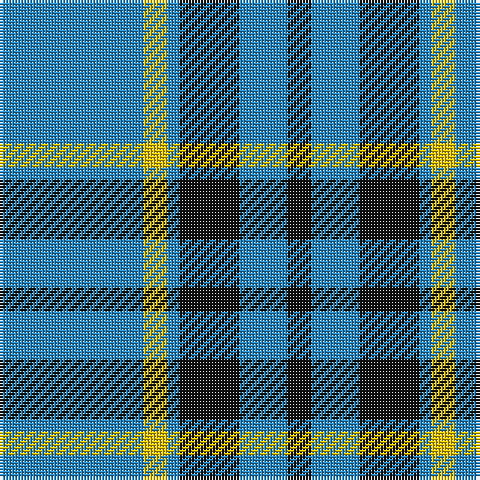

In pattern [BYBKBK](/patterns/bybkbk/).

This was sourced from register-of-tartans.  It is a [6 stripes tartan](/stripes/stripes6/).

Original link https://www.tartanregister.gov.uk/tartanDetails.aspx?ref=3470

## Attestations

This cloth appears in 2 source records; the oldest owns this page.

- 01/01/1973 — Rea (register-of-tartans, [record](https://www.tartanregister.gov.uk/tartanDetails.aspx?ref=3470))
- 1973 — Rea (Name) (tartans-authority, [record](http://www.tartansauthority.com/tartan-ferret/display/6613/))

## Thread count
B/48 Y8 B4 K20 B16 K/8

## Palette
Each colour and its ΔE from the base-6 reference it is a variant of.

| Colour | Shade | Base | ΔE (OKLab) |
|---|---|---|---|
| B | <code style="background-color:#2888C4;">#2888C4</code> `#2888C4` | B <code style="background-color:#2A418A;">#2A418A</code> | 0.21 |
| K | <code style="background-color:#101010;">#101010</code> `#101010` | K <code style="background-color:#000000;">#000000</code> | 0.17 |
| Y | <code style="background-color:#E8C000;">#E8C000</code> `#E8C000` | Y <code style="background-color:#F2BF00;">#F2BF00</code> | 0.02 |

# Sample pattern

## Nearest tartans

The nearest existing variants by ΔTartan distance.

1. [Angle, Blue (Fashion)](/setts/s7/w1y11k6y3w1y1w1~k101010-we8ccb8-y48a4c0~x4/) — ΔT 1.12
1. [Loch Lomond](/setts/s5/b37w9b3ba9w3~b5480b0-ba000050-we0e0e0~x2/) — ΔT 1.19
1. [Salem Scottish Dancers (Corporate)](/setts/s8/b5ba5b30w4b4ba18w3b3~b14283c-ba1474b4-wf8f8f8~x2/) — ΔT 1.34
1. [Sligo](/setts/s6/b50ba4b12ba23y4ba4~b5480b0-ba401000-yf0c000~x2/) — ΔT 1.35
1. [Gallaecia (Unofficial) (District)](/setts/s5/b24ba13b4ba4w2~b1c1c50-ba2888c4-we0e0e0~x2/) — ΔT 1.44
1. [Micron](/setts/s6/k30b40y3b5w2b6~b1474b4-k101010-wfcfcfc-ye8c000~x2/) — ΔT 1.53
1. [Sligo Irish County Tartan Tartan Number: 2256. Earliest known date: 1995 One of a series of Irish District tartans designed by Polly Wittering of the House of Edgar, with colours reminiscent of the Country with soft warm colours dominating. See products available Copyright © Blair Urquhart, Comrie, 2015](/setts/s6/b50k4b12k23y4k4~b687c94-k000000-yd49c1c~x2/) — ΔT 1.58
1. [Ochterlonie](/setts/s6/b30w7b18w11b6y3~b102040-we0e0e0-yf0c000~x2/) — ΔT 1.59
1. [Carlisle Ancient](/setts/s5/b11y2r1y2r1~b2474e8-r880000-yd09800~x4/) — ΔT 1.63
1. [Carlisle Family (Name)](/setts/s7/b33y6r3y6k3y15b32~b3474fc-k000000-r8c0000-yc88c00~x4/) — ΔT 1.69

## Neighbour map

Every grey dot is one of 15726 variants placed by the first two principal components of the ΔTartan feature space (44% of its variance). Red is this tartan; blue dots are its nearest — click one to open its page.

<svg viewBox="0 0 640 380" role="img" style="max-width:100%;height:auto;border:1px solid #e0e0e0;border-radius:4px;display:block" xmlns="http://www.w3.org/2000/svg"><image href="/nn/cloud.v1.png" width="640" height="380"/><a href="/setts/s7/w1y11k6y3w1y1w1~k101010-we8ccb8-y48a4c0~x4/"><circle cx="335.9" cy="196.3" r="4" fill="#3465a4"><title>Angle, Blue (Fashion)</title></circle></a><a href="/setts/s5/b37w9b3ba9w3~b5480b0-ba000050-we0e0e0~x2/"><circle cx="380.0" cy="210.1" r="4" fill="#3465a4"><title>Loch Lomond</title></circle></a><a href="/setts/s8/b5ba5b30w4b4ba18w3b3~b14283c-ba1474b4-wf8f8f8~x2/"><circle cx="325.8" cy="205.3" r="4" fill="#3465a4"><title>Salem Scottish Dancers (Corporate)</title></circle></a><a href="/setts/s6/b50ba4b12ba23y4ba4~b5480b0-ba401000-yf0c000~x2/"><circle cx="398.5" cy="210.2" r="4" fill="#3465a4"><title>Sligo</title></circle></a><a href="/setts/s5/b24ba13b4ba4w2~b1c1c50-ba2888c4-we0e0e0~x2/"><circle cx="362.7" cy="236.4" r="4" fill="#3465a4"><title>Gallaecia (Unofficial) (District)</title></circle></a><a href="/setts/s6/k30b40y3b5w2b6~b1474b4-k101010-wfcfcfc-ye8c000~x2/"><circle cx="352.3" cy="177.1" r="4" fill="#3465a4"><title>Micron</title></circle></a><a href="/setts/s6/b50k4b12k23y4k4~b687c94-k000000-yd49c1c~x2/"><circle cx="367.4" cy="203.6" r="4" fill="#3465a4"><title>Sligo Irish County Tartan Tartan Number: 2256. Earliest known date: 1995 One of a series of Irish District tartans designed by Polly Wittering of the House of Edgar, with colours reminiscent of the Country with soft warm colours dominating. See products available Copyright © Blair Urquhart, Comrie, 2015</title></circle></a><a href="/setts/s6/b30w7b18w11b6y3~b102040-we0e0e0-yf0c000~x2/"><circle cx="381.6" cy="236.0" r="4" fill="#3465a4"><title>Ochterlonie</title></circle></a><a href="/setts/s5/b11y2r1y2r1~b2474e8-r880000-yd09800~x4/"><circle cx="394.3" cy="212.3" r="4" fill="#3465a4"><title>Carlisle Ancient</title></circle></a><a href="/setts/s7/b33y6r3y6k3y15b32~b3474fc-k000000-r8c0000-yc88c00~x4/"><circle cx="358.4" cy="197.4" r="4" fill="#3465a4"><title>Carlisle Family (Name)</title></circle></a><circle cx="361.1" cy="222.3" r="5" fill="#c00000"/></svg>

ID: /setts/s6/b12y2b1k5b4k2~b2888c4-k101010-ye8c000~x4/
