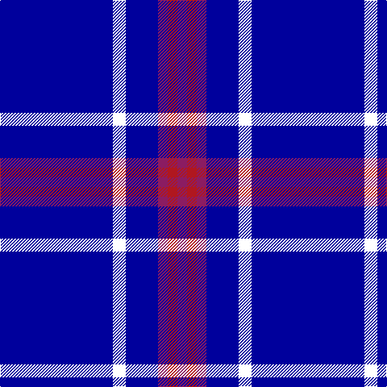

In pattern [BWBRRR](/patterns/bwbrrr/).

This was sourced from register-of-tartans.  It is a [6 stripes tartan](/stripes/stripes6/).

Original link https://www.tartanregister.gov.uk/tartanDetails.aspx?ref=10448

## Thread count
DB/140 W16 DB40 P12 R12 P/12

## Palette
Each colour and its ΔE from the base-6 reference it is a variant of.

| Colour | Shade | Base | ΔE (OKLab) |
|---|---|---|---|
| DB | <code style="background-color:#00009C;">#00009C</code> `#00009C` | B <code style="background-color:#2C4084;">#2C4084</code> | 0.13 |
| P | <code style="background-color:#8B1C62;">#8B1C62</code> `#8B1C62` | R <code style="background-color:#C80000;">#C80000</code> | 0.17 |
| R | <code style="background-color:#B0171F;">#B0171F</code> `#B0171F` | R <code style="background-color:#C80000;">#C80000</code> | 0.05 |
| W | <code style="background-color:#FFFFFF;">#FFFFFF</code> `#FFFFFF` | W <code style="background-color:#F4F4F0;">#F4F4F0</code> | 0.03 |

# Sample pattern

ID: /setts/s6/b140w16b40r12ra12r12-b00009c-r8b1c62-rab0171f-wffffff/
