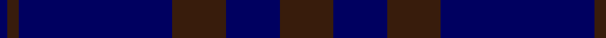

In pattern [BBBBBB](/patterns/bbbbbb/).

This was sourced from register-of-tartans.  It is a [6 stripes tartan](/stripes/stripes6/).

Original link https://www.tartanregister.gov.uk/tartanDetails.aspx?ref=4962

## Register references

External register numbers recorded for this tartan.

- Scottish Register of Tartans: [4962](https://www.tartanregister.gov.uk/tartanDetails.aspx?ref=4962)
- Scottish Tartans Authority (ITI): 3624

## Thread count
DB/4 K6 DB80 K28 DB28 K/28

## Palette
Each colour and its ΔE from the base-6 reference it is a variant of.

| Colour | Shade | Base | ΔE (OKLab) |
|---|---|---|---|
| DB | <code style="background-color:#000060;">#000060</code> `#000060` | B <code style="background-color:#2A418A;">#2A418A</code> | 0.18 |
| K | <code style="background-color:#381C0C;">#381C0C</code> `#381C0C` | B <code style="background-color:#2A418A;">#2A418A</code> | 0.22 |

# Sample pattern

## Nearest tartans

The nearest existing variants by ΔTartan distance.

1. [Williams (New York) (Personal)](/setts/s5/k30b6k6b41ba2~b003c64-ba5c8ca8-k101010~x2/) — ΔT 1.72
1. [Elliot](/setts/s6/b9g12b44g12b9r3~b2c2c80-g604000-r901c38~x2/) — ΔT 1.72
1. [Casterton (Corporate)](/setts/s6/b7k2b33k33r2k7~b1c0070-k101010-rc80000~x2/) — ΔT 1.73
1. [Blue Spirit Fashion Tartan Tartan Number: 7001. Earliest known date: 01/08/2006 Designed by Kirsty Anderson of The House of Edgar for ACS Clothing of Glasgow. See products available Copyright © Blair Urquhart, Comrie, 2015](/setts/s8/b3k12b3k17b40k2b2w1~b1b056a-k1e1a10-we0e0e0~x2/) — ΔT 2.01
1. [Largan (?)](/setts/s6/b8k39b8k39b87r6~b2c2c80-k101010-rc80000/) — ΔT 2.16
1. [Atlin (Fashion)](/setts/s6/k14b14k14b40k3b2~b000060-k000000~x2/) — ΔT 2.17
1. [Blue Spirit](/setts/s8/b3k13b3k22b49k2b2w1~b1c0070-k101010-wa8ace8~x2/) — ΔT 2.18
1. [Elliot (Clan)](/setts/s4/b44g12b9r3~b2c2c80-g604000-r901c38~x2/) — ΔT 2.30
1. [Asahi (Corporate)](/setts/s5/b45ba2b4ba15b7~b2c2c80-ba1474b4~x2/) — ΔT 2.34
1. [Williams (New York) (Personal)](/setts/s5/k30b6k6b41w2~b000080-k101010-w87ceeb~x2/) — ΔT 2.37

## Neighbour map

Every grey dot is one of 15726 variants placed by the first two principal components of the ΔTartan feature space (44% of its variance). Red is this tartan; blue dots are its nearest — click one to open its page.

<svg viewBox="0 0 640 380" role="img" style="max-width:100%;height:auto;border:1px solid #e0e0e0;border-radius:4px;display:block" xmlns="http://www.w3.org/2000/svg"><image href="/nn/cloud.v1.png" width="640" height="380"/><a href="/setts/s5/k30b6k6b41ba2~b003c64-ba5c8ca8-k101010~x2/"><circle cx="472.0" cy="260.7" r="4" fill="#3465a4"><title>Williams (New York) (Personal)</title></circle></a><a href="/setts/s6/b9g12b44g12b9r3~b2c2c80-g604000-r901c38~x2/"><circle cx="531.4" cy="260.3" r="4" fill="#3465a4"><title>Elliot</title></circle></a><a href="/setts/s6/b7k2b33k33r2k7~b1c0070-k101010-rc80000~x2/"><circle cx="450.0" cy="256.1" r="4" fill="#3465a4"><title>Casterton (Corporate)</title></circle></a><a href="/setts/s8/b3k12b3k17b40k2b2w1~b1b056a-k1e1a10-we0e0e0~x2/"><circle cx="535.5" cy="195.6" r="4" fill="#3465a4"><title>Blue Spirit Fashion Tartan Tartan Number: 7001. Earliest known date: 01/08/2006 Designed by Kirsty Anderson of The House of Edgar for ACS Clothing of Glasgow. See products available Copyright © Blair Urquhart, Comrie, 2015</title></circle></a><a href="/setts/s6/b8k39b8k39b87r6~b2c2c80-k101010-rc80000/"><circle cx="427.8" cy="248.7" r="4" fill="#3465a4"><title>Largan (?)</title></circle></a><a href="/setts/s6/k14b14k14b40k3b2~b000060-k000000~x2/"><circle cx="498.1" cy="268.6" r="4" fill="#3465a4"><title>Atlin (Fashion)</title></circle></a><a href="/setts/s8/b3k13b3k22b49k2b2w1~b1c0070-k101010-wa8ace8~x2/"><circle cx="555.6" cy="189.6" r="4" fill="#3465a4"><title>Blue Spirit</title></circle></a><a href="/setts/s4/b44g12b9r3~b2c2c80-g604000-r901c38~x2/"><circle cx="611.3" cy="284.0" r="4" fill="#3465a4"><title>Elliot (Clan)</title></circle></a><a href="/setts/s5/b45ba2b4ba15b7~b2c2c80-ba1474b4~x2/"><circle cx="626.0" cy="273.7" r="4" fill="#3465a4"><title>Asahi (Corporate)</title></circle></a><a href="/setts/s5/k30b6k6b41w2~b000080-k101010-w87ceeb~x2/"><circle cx="433.3" cy="247.4" r="4" fill="#3465a4"><title>Williams (New York) (Personal)</title></circle></a><circle cx="550.7" cy="284.2" r="5" fill="#c00000"/></svg>

ID: /setts/s6/b14ba14b14ba40b3ba2~b381c0c-ba000060~x2/
