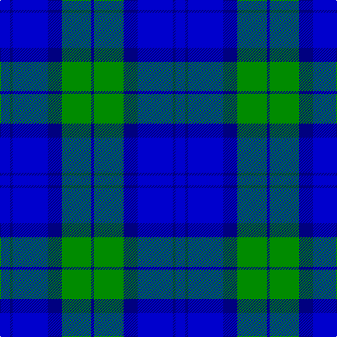

In pattern [BBBBGB](/patterns/bbbbgb/).

This was sourced from house-of-tartan.  It is a [6 stripes tartan](/stripes/stripes6/).

Original link http://www.house-of-tartan.scotland.net/house/TartanViewjs.asp?colr=Def&tnam=10639

## Thread count
B/14 DB4 B50 DB20 G42 DB/4

## Palette
Each colour and its ΔE from the base-6 reference it is a variant of.

| Colour | Shade | Base | ΔE (OKLab) |
|---|---|---|---|
| B | <code style="background-color:#0000CD;">#0000CD</code> `#0000CD` | B <code style="background-color:#2A418A;">#2A418A</code> | 0.14 |
| DB | <code style="background-color:#000080;">#000080</code> `#000080` | B <code style="background-color:#2A418A;">#2A418A</code> | 0.14 |
| G | <code style="background-color:#008B00;">#008B00</code> `#008B00` | G <code style="background-color:#006100;">#006100</code> | 0.13 |

# Sample pattern

## Nearest tartans

The nearest existing variants by ΔTartan distance.

1. [Douglas Variation](/setts/s6/w8b50ba50b4ba10w4-b080848-ba0596fa-we0e0e0/) — ΔT 1.50
1. [MacNeil - 1994 (Personal)](/setts/s5/b60k24ba24k4w6-b3850c8-ba003c64-k101010-wfcfcfc/) — ΔT 1.61
1. [Brazell (Personal)](/setts/s5/b42y6b42ba66r12-b000064-ba0596fa-rdc0000-ye8c000/) — ΔT 1.69
1. [Federal Bureau of Investigation](/setts/s7/b12w4b4w6b32ba52r4-b1c0070-ba1870a4-r880000-wc0c0c0/) — ΔT 1.78
1. [Swan 2015, Brian E (Personal)](/setts/s7/k8b36k8b36k52w4k8-b0000cd-k101010-wffffff/) — ΔT 1.83
1. [St. Andrews, Earl of (District)](/setts/s6/b104ba56w10ba6w4ba20-b1870a4-ba1c0070-wf8f8f8/) — ΔT 1.90
1. [Immanuel Presbyterian Church (Milwaukee)](/setts/s8/k6r4k28w4b12w4b32w6-b0000cd-k101010-rff0000-w82cffd/) — ΔT 1.90
1. [Swan, Brian E](/setts/s6/k12b34k12b34k54w6-b0000cd-k101010-wffffff/) — ΔT 1.92
1. [Gilt Edge (Corporate)](/setts/s5/b6ba4bb62b68w4-b202060-ba2c2c80-bb2888c4-we0e0e0/) — ΔT 1.94
1. [International Police Association (IPA 2010)](/setts/s7/b14r6b52w4b4w51y8-b0000cd-rcd0000-w00b2ee-yffe600/) — ΔT 1.96

## Neighbour map

Every grey dot is one of 15726 variants placed by the first two principal components of the ΔTartan feature space (44% of its variance). Red is this tartan; blue dots are its nearest — click one to open its page.

<svg viewBox="0 0 640 380" role="img" style="max-width:100%;height:auto;border:1px solid #e0e0e0;border-radius:4px;display:block" xmlns="http://www.w3.org/2000/svg"><image href="/nn/cloud.v1.png" width="640" height="380"/><a href="/setts/s6/w8b50ba50b4ba10w4-b080848-ba0596fa-we0e0e0/"><circle cx="270.8" cy="199.9" r="4" fill="#3465a4"><title>Douglas Variation</title></circle></a><a href="/setts/s5/b60k24ba24k4w6-b3850c8-ba003c64-k101010-wfcfcfc/"><circle cx="276.5" cy="207.9" r="4" fill="#3465a4"><title>MacNeil - 1994 (Personal)</title></circle></a><a href="/setts/s5/b42y6b42ba66r12-b000064-ba0596fa-rdc0000-ye8c000/"><circle cx="238.9" cy="228.3" r="4" fill="#3465a4"><title>Brazell (Personal)</title></circle></a><a href="/setts/s7/b12w4b4w6b32ba52r4-b1c0070-ba1870a4-r880000-wc0c0c0/"><circle cx="283.9" cy="186.9" r="4" fill="#3465a4"><title>Federal Bureau of Investigation</title></circle></a><a href="/setts/s7/k8b36k8b36k52w4k8-b0000cd-k101010-wffffff/"><circle cx="318.9" cy="226.1" r="4" fill="#3465a4"><title>Swan 2015, Brian E (Personal)</title></circle></a><a href="/setts/s6/b104ba56w10ba6w4ba20-b1870a4-ba1c0070-wf8f8f8/"><circle cx="357.7" cy="180.6" r="4" fill="#3465a4"><title>St. Andrews, Earl of (District)</title></circle></a><a href="/setts/s8/k6r4k28w4b12w4b32w6-b0000cd-k101010-rff0000-w82cffd/"><circle cx="205.0" cy="197.4" r="4" fill="#3465a4"><title>Immanuel Presbyterian Church (Milwaukee)</title></circle></a><a href="/setts/s6/k12b34k12b34k54w6-b0000cd-k101010-wffffff/"><circle cx="289.0" cy="256.0" r="4" fill="#3465a4"><title>Swan, Brian E</title></circle></a><a href="/setts/s5/b6ba4bb62b68w4-b202060-ba2c2c80-bb2888c4-we0e0e0/"><circle cx="342.0" cy="198.0" r="4" fill="#3465a4"><title>Gilt Edge (Corporate)</title></circle></a><a href="/setts/s7/b14r6b52w4b4w51y8-b0000cd-rcd0000-w00b2ee-yffe600/"><circle cx="267.1" cy="177.1" r="4" fill="#3465a4"><title>International Police Association (IPA 2010)</title></circle></a><circle cx="261.7" cy="231.8" r="5" fill="#c00000"/></svg>

ID: /setts/s6/b14ba4b50ba20g42ba4-b0000cd-ba000080-g008b00/
