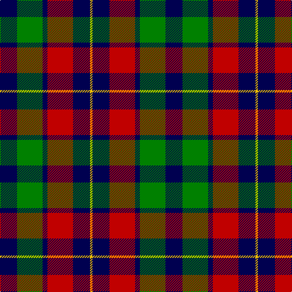

In pattern [BGBRBY](/patterns/bgbrby/).

This was sourced from weddslist.  It is a [6 stripes tartan](/stripes/stripes6/).

Original link http://www.weddslist.com/cgi-bin/tartans/pg.pl?source=sts

## Thread count
DB/28 G42 DB8 R42 DB28 Y/4

## Palette
Each colour and its ΔE from the base-6 reference it is a variant of.

| Colour | Shade | Base | ΔE (OKLab) |
|---|---|---|---|
| DB | <code style="background-color:#000050;">#000050</code> `#000050` | B <code style="background-color:#2A418A;">#2A418A</code> | 0.21 |
| G | <code style="background-color:#008000;">#008000</code> `#008000` | G <code style="background-color:#006100;">#006100</code> | 0.10 |
| R | <code style="background-color:#C00000;">#C00000</code> `#C00000` | R <code style="background-color:#CC0000;">#CC0000</code> | 0.03 |
| Y | <code style="background-color:#F0C000;">#F0C000</code> `#F0C000` | Y <code style="background-color:#F2BF00;">#F2BF00</code> | 0.00 |

# Sample pattern

## Nearest tartans

The nearest existing variants by ΔTartan distance.

1. [Kilgour](/setts/s6/b14g21b4r21b14y2~b080848-g005020-rdc0000-ye8c000~x2/) — ΔT 0.64
1. [Brough](/setts/s7/r20k14w2k14g9r3g11~g008000-k000030-rc00000-we0e0e0~x2/) — ΔT 0.65
1. [Scottish Ballet](/setts/s6/y5g22b15ba11b5g2~b440044-ba780078-g288028-ye8c000~x2/) — ΔT 0.85
1. [Oban, Grey](/setts/s5/k4w3k4g9r1~g808080-k000000-rc00000-we0e0e0~x4/) — ΔT 0.94
1. [Oban Grey](/setts/s5/k4w3k4g9r1~g808080-k101010-rdc0000-we0e0e0~x4/) — ΔT 0.97
1. [Wilson's, No 150 "Coburg"](/setts/s6/g18b2g4k14ba12k3~b5480b0-ba800080-g008000-k000000~x2/) — ΔT 1.00
1. [Oban Grey District Tartan Tartan Number: 1237. Earliest known date: pre 2003 Not an official district but a name chosen by the weavers. See products available Copyright © Blair Urquhart, Comrie, 2015](/setts/s5/k4w3k4r9ra1~k101010-r888888-rac80000-we0e0e0~x4/) — ΔT 1.04
1. [MacKean (Personal)](/setts/s7/r8k18r6k18b27k2w3~b1474b4-k101010-rc80000-wfcfcfc~x2/) — ΔT 1.07
1. [Wilson's No 158](/setts/s6/g21w2g4k17b14k3~b800080-g008000-k000000-we0e0e0~x2/) — ΔT 1.07
1. [Fletcher of Dunans](/setts/s7/b6k1b6k8r1g8r2~b304080-g008000-k000000-rc00000~x2/) — ΔT 1.08

## Neighbour map

Every grey dot is one of 15726 variants placed by the first two principal components of the ΔTartan feature space (44% of its variance). Red is this tartan; blue dots are its nearest — click one to open its page.

<svg viewBox="0 0 640 380" role="img" style="max-width:100%;height:auto;border:1px solid #e0e0e0;border-radius:4px;display:block" xmlns="http://www.w3.org/2000/svg"><image href="/nn/cloud.v1.png" width="640" height="380"/><a href="/setts/s6/b14g21b4r21b14y2~b080848-g005020-rdc0000-ye8c000~x2/"><circle cx="195.5" cy="228.2" r="4" fill="#3465a4"><title>Kilgour</title></circle></a><a href="/setts/s7/r20k14w2k14g9r3g11~g008000-k000030-rc00000-we0e0e0~x2/"><circle cx="158.6" cy="220.0" r="4" fill="#3465a4"><title>Brough</title></circle></a><a href="/setts/s6/y5g22b15ba11b5g2~b440044-ba780078-g288028-ye8c000~x2/"><circle cx="192.6" cy="213.4" r="4" fill="#3465a4"><title>Scottish Ballet</title></circle></a><a href="/setts/s5/k4w3k4g9r1~g808080-k000000-rc00000-we0e0e0~x4/"><circle cx="173.1" cy="225.9" r="4" fill="#3465a4"><title>Oban, Grey</title></circle></a><a href="/setts/s5/k4w3k4g9r1~g808080-k101010-rdc0000-we0e0e0~x4/"><circle cx="185.1" cy="227.2" r="4" fill="#3465a4"><title>Oban Grey</title></circle></a><a href="/setts/s6/g18b2g4k14ba12k3~b5480b0-ba800080-g008000-k000000~x2/"><circle cx="173.6" cy="222.1" r="4" fill="#3465a4"><title>Wilson's, No 150 &quot;Coburg&quot;</title></circle></a><a href="/setts/s5/k4w3k4r9ra1~k101010-r888888-rac80000-we0e0e0~x4/"><circle cx="183.3" cy="226.2" r="4" fill="#3465a4"><title>Oban Grey District Tartan Tartan Number: 1237. Earliest known date: pre 2003 Not an official district but a name chosen by the weavers. See products available Copyright © Blair Urquhart, Comrie, 2015</title></circle></a><a href="/setts/s7/r8k18r6k18b27k2w3~b1474b4-k101010-rc80000-wfcfcfc~x2/"><circle cx="227.6" cy="196.3" r="4" fill="#3465a4"><title>MacKean (Personal)</title></circle></a><a href="/setts/s6/g21w2g4k17b14k3~b800080-g008000-k000000-we0e0e0~x2/"><circle cx="178.7" cy="210.7" r="4" fill="#3465a4"><title>Wilson's No 158</title></circle></a><a href="/setts/s7/b6k1b6k8r1g8r2~b304080-g008000-k000000-rc00000~x2/"><circle cx="143.6" cy="227.6" r="4" fill="#3465a4"><title>Fletcher of Dunans</title></circle></a><circle cx="182.9" cy="226.1" r="5" fill="#c00000"/></svg>

ID: /setts/s6/b14g21b4r21b14y2~b000050-g008000-rc00000-yf0c000~x2/
