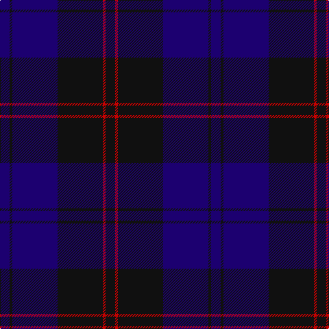

In pattern [BKBKRK](/patterns/bkbkrk/).

This was sourced from tartans-authority.  It is a [6 stripes tartan](/stripes/stripes6/).

Original link http://www.tartansauthority.com/tartan-ferret/display/8060/

## Thread count
DB/14 K4 DB66 K66 R4 K/14

## Palette
Each colour and its ΔE from the base-6 reference it is a variant of.

| Colour | Shade | Base | ΔE (OKLab) |
|---|---|---|---|
| DB | <code style="background-color:#1C0070;">#1C0070</code> `#1C0070` | B <code style="background-color:#2A418A;">#2A418A</code> | 0.14 |
| K | <code style="background-color:#101010;">#101010</code> `#101010` | K <code style="background-color:#000000;">#000000</code> | 0.17 |
| R | <code style="background-color:#C80000;">#C80000</code> `#C80000` | R <code style="background-color:#CC0000;">#CC0000</code> | 0.01 |

# Sample pattern

## Nearest tartans

The nearest existing variants by ΔTartan distance.

1. [Williams (New York) (Personal)](/setts/s5/k60b12k12b82ba4-b003c64-ba5c8ca8-k101010/) — ΔT 1.25
1. [Largan (?)](/setts/s6/b8k39b8k39b87r6-b2c2c80-k101010-rc80000/) — ΔT 1.26
1. [Atlin](/setts/s6/b28ba28b28ba80b6ba4-b381c0c-ba000060/) — ΔT 1.73
1. [Williams (New York) (Personal)](/setts/s5/k60b12k12b82w4-b000080-k101010-w87ceeb/) — ΔT 1.74
1. [Monarchs](/setts/s6/b76k16ba4k16g36ba4-b2c2c80-ba680028-g005448-k101010/) — ΔT 1.74
1. [Perthshire, New /Tourist Board](/setts/s6/b74r20g44b22g6r6-b000050-g003000-r800000/) — ΔT 1.75
1. [Wellington Variation](/setts/s4/k6b46k34r4-b2c2c80-k101010-rc80000/) — ΔT 1.78
1. [Marchmont (Personal)](/setts/s7/g4b48k48g4k48b48k4-b2c2c80-g289c18-k101010/) — ΔT 1.84
1. [Earl Blue Marl](/setts/s6/b160k56ba18k6r10k24-b2c2c80-ba780078-k101010-r9c68a4/) — ΔT 1.85
1. [Blue Spirit Fashion Tartan Tartan Number: 7001. Earliest known date: 01/08/2006 Designed by Kirsty Anderson of The House of Edgar for ACS Clothing of Glasgow. See products available Copyright © Blair Urquhart, Comrie, 2015](/setts/s8/b6k24b6k34b80k4b4w2-b1b056a-k1e1a10-we0e0e0/) — ΔT 1.86

## Neighbour map

Every grey dot is one of 15726 variants placed by the first two principal components of the ΔTartan feature space (44% of its variance). Red is this tartan; blue dots are its nearest — click one to open its page.

<svg viewBox="0 0 640 380" role="img" style="max-width:100%;height:auto;border:1px solid #e0e0e0;border-radius:4px;display:block" xmlns="http://www.w3.org/2000/svg"><image href="/nn/cloud.v1.png" width="640" height="380"/><a href="/setts/s5/k60b12k12b82ba4-b003c64-ba5c8ca8-k101010/"><circle cx="470.9" cy="260.3" r="4" fill="#3465a4"><title>Williams (New York) (Personal)</title></circle></a><a href="/setts/s6/b8k39b8k39b87r6-b2c2c80-k101010-rc80000/"><circle cx="427.2" cy="247.4" r="4" fill="#3465a4"><title>Largan (?)</title></circle></a><a href="/setts/s6/b28ba28b28ba80b6ba4-b381c0c-ba000060/"><circle cx="550.0" cy="283.0" r="4" fill="#3465a4"><title>Atlin</title></circle></a><a href="/setts/s5/k60b12k12b82w4-b000080-k101010-w87ceeb/"><circle cx="432.6" cy="245.5" r="4" fill="#3465a4"><title>Williams (New York) (Personal)</title></circle></a><a href="/setts/s6/b76k16ba4k16g36ba4-b2c2c80-ba680028-g005448-k101010/"><circle cx="376.4" cy="222.4" r="4" fill="#3465a4"><title>Monarchs</title></circle></a><a href="/setts/s6/b74r20g44b22g6r6-b000050-g003000-r800000/"><circle cx="385.0" cy="258.3" r="4" fill="#3465a4"><title>Perthshire, New /Tourist Board</title></circle></a><a href="/setts/s4/k6b46k34r4-b2c2c80-k101010-rc80000/"><circle cx="392.5" cy="278.6" r="4" fill="#3465a4"><title>Wellington Variation</title></circle></a><a href="/setts/s7/g4b48k48g4k48b48k4-b2c2c80-g289c18-k101010/"><circle cx="364.2" cy="257.8" r="4" fill="#3465a4"><title>Marchmont (Personal)</title></circle></a><a href="/setts/s6/b160k56ba18k6r10k24-b2c2c80-ba780078-k101010-r9c68a4/"><circle cx="449.1" cy="192.2" r="4" fill="#3465a4"><title>Earl Blue Marl</title></circle></a><a href="/setts/s8/b6k24b6k34b80k4b4w2-b1b056a-k1e1a10-we0e0e0/"><circle cx="532.9" cy="194.7" r="4" fill="#3465a4"><title>Blue Spirit Fashion Tartan Tartan Number: 7001. Earliest known date: 01/08/2006 Designed by Kirsty Anderson of The House of Edgar for ACS Clothing of Glasgow. See products available Copyright © Blair Urquhart, Comrie, 2015</title></circle></a><circle cx="448.5" cy="256.0" r="5" fill="#c00000"/></svg>

ID: /setts/s6/b14k4b66k66r4k14-b1c0070-k101010-rc80000/
