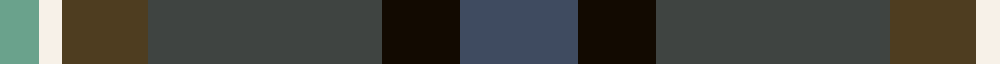

In pattern [BKBGWY](/patterns/bkbgwy/).

This was sourced from house-of-tartan.  It is a [6 stripes tartan](/stripes/stripes6/).

Original link http://www.house-of-tartan.scotland.net/house/TartanViewjs.asp?colr=Def&tnam=10708

## Thread count
LG/10 W6 T22 N60 K20 Na/30

## Palette
Each colour and its ΔE from the base-6 reference it is a variant of.

| Colour | Shade | Base | ΔE (OKLab) |
|---|---|---|---|
| K | <code style="background-color:#120A01;">#120A01</code> `#120A01` | K <code style="background-color:#000000;">#000000</code> | 0.15 |
| LG | <code style="background-color:#6AA28C;">#6AA28C</code> `#6AA28C` | Y <code style="background-color:#F2BF00;">#F2BF00</code> | 0.23 |
| N | <code style="background-color:#3F4441;">#3F4441</code> `#3F4441` | B <code style="background-color:#2A418A;">#2A418A</code> | 0.13 |
| Na | <code style="background-color:#3F4B60;">#3F4B60</code> `#3F4B60` | B <code style="background-color:#2A418A;">#2A418A</code> | 0.09 |
| T | <code style="background-color:#4E3D20;">#4E3D20</code> `#4E3D20` | G <code style="background-color:#006100;">#006100</code> | 0.14 |
| W | <code style="background-color:#F7F1E8;">#F7F1E8</code> `#F7F1E8` | W <code style="background-color:#F7F7F7;">#F7F7F7</code> | 0.02 |

# Sample pattern

## Nearest tartans

The nearest existing variants by ΔTartan distance.

1. [Staley (2014)](/setts/s6/b9w2g25ba10k15bb4~b2c2c80-ba441800-bb780078-g003820-k101010-wfcfcfc~x2/) — ΔT 0.99
1. [Meeson Hunting](/setts/s6/k26b10ba19r6y2bb9~b646464-ba184458-bb105088-k101010-r880000-yc89800~x2/) — ΔT 1.16
1. [Waterford, County (District)](/setts/s6/g24y2ga16b7ba16r5~b202060-ba441800-g003820-ga5c6428-rc80000-yd09800~x2/) — ΔT 1.17
1. [Haughfoot (Commemorative)](/setts/s6/g4ga24b15ba4k15r4~b14283c-ba5c8ca8-g789484-ga003820-k101010-rc80000~x2/) — ΔT 1.20
1. [Staley (2014)](/setts/s6/b9w2g25ba10k15bb4~b2c4084-ba441800-bb3d1130-g002814-k101010-wf8f4d0~x2/) — ΔT 1.21
1. [Cowie](/setts/s6/r3b24k7ba11g11y2~b003c64-ba2c2c80-g006818-k101010-rc80000-ye8c000~x2/) — ΔT 1.27
1. [Meeson Hunting Name Tartan Tartan Number: 6027. Earliest known date: 2007 Hunting version. The black and gray were originally woven with a melange or marled yarn. See products available Copyright © Blair Urquhart, Comrie, 2015](/setts/s6/k26b10ba19r6y2bb9~b787478-ba184458-bb105088-k101010-r880000-yc4a820~x2/) — ΔT 1.37
1. [Blairmore House (Corporate)](/setts/s8/b17w2b2r2b2ba12g16y3~b003478-ba3c2010-g0c5454-r8c0000-wc8c8c8-yc88c00~x4/) — ΔT 1.41
1. [Haut Family (by Dundee)](/setts/s6/b46ba15k12bb8g8bc8~b3f4441-ba3d2e60-bb805a90-bc3d1130-g509721-k120a01~x2/) — ΔT 1.45
1. [Lyle and Scott](/setts/s6/g5b2g9ba19r9y2~b1474b4-ba003c64-g003820-ra00000-yfccc00~x2/) — ΔT 1.46

## Neighbour map

Every grey dot is one of 15726 variants placed by the first two principal components of the ΔTartan feature space (44% of its variance). Red is this tartan; blue dots are its nearest — click one to open its page.

<svg viewBox="0 0 640 380" role="img" style="max-width:100%;height:auto;border:1px solid #e0e0e0;border-radius:4px;display:block" xmlns="http://www.w3.org/2000/svg"><image href="/nn/cloud.v1.png" width="640" height="380"/><a href="/setts/s6/b9w2g25ba10k15bb4~b2c2c80-ba441800-bb780078-g003820-k101010-wfcfcfc~x2/"><circle cx="188.9" cy="206.7" r="4" fill="#3465a4"><title>Staley (2014)</title></circle></a><a href="/setts/s6/k26b10ba19r6y2bb9~b646464-ba184458-bb105088-k101010-r880000-yc89800~x2/"><circle cx="178.5" cy="205.0" r="4" fill="#3465a4"><title>Meeson Hunting</title></circle></a><a href="/setts/s6/g24y2ga16b7ba16r5~b202060-ba441800-g003820-ga5c6428-rc80000-yd09800~x2/"><circle cx="179.7" cy="212.3" r="4" fill="#3465a4"><title>Waterford, County (District)</title></circle></a><a href="/setts/s6/g4ga24b15ba4k15r4~b14283c-ba5c8ca8-g789484-ga003820-k101010-rc80000~x2/"><circle cx="154.8" cy="234.6" r="4" fill="#3465a4"><title>Haughfoot (Commemorative)</title></circle></a><a href="/setts/s6/b9w2g25ba10k15bb4~b2c4084-ba441800-bb3d1130-g002814-k101010-wf8f4d0~x2/"><circle cx="206.8" cy="216.6" r="4" fill="#3465a4"><title>Staley (2014)</title></circle></a><a href="/setts/s6/r3b24k7ba11g11y2~b003c64-ba2c2c80-g006818-k101010-rc80000-ye8c000~x2/"><circle cx="194.1" cy="199.1" r="4" fill="#3465a4"><title>Cowie</title></circle></a><a href="/setts/s6/k26b10ba19r6y2bb9~b787478-ba184458-bb105088-k101010-r880000-yc4a820~x2/"><circle cx="165.3" cy="199.1" r="4" fill="#3465a4"><title>Meeson Hunting Name Tartan Tartan Number: 6027. Earliest known date: 2007 Hunting version. The black and gray were originally woven with a melange or marled yarn. See products available Copyright © Blair Urquhart, Comrie, 2015</title></circle></a><a href="/setts/s8/b17w2b2r2b2ba12g16y3~b003478-ba3c2010-g0c5454-r8c0000-wc8c8c8-yc88c00~x4/"><circle cx="190.7" cy="188.6" r="4" fill="#3465a4"><title>Blairmore House (Corporate)</title></circle></a><a href="/setts/s6/b46ba15k12bb8g8bc8~b3f4441-ba3d2e60-bb805a90-bc3d1130-g509721-k120a01~x2/"><circle cx="238.7" cy="228.0" r="4" fill="#3465a4"><title>Haut Family (by Dundee)</title></circle></a><a href="/setts/s6/g5b2g9ba19r9y2~b1474b4-ba003c64-g003820-ra00000-yfccc00~x2/"><circle cx="217.9" cy="219.4" r="4" fill="#3465a4"><title>Lyle and Scott</title></circle></a><circle cx="190.4" cy="210.1" r="5" fill="#c00000"/></svg>

ID: /setts/s6/b15k10ba30g11w3y5~b3f4b60-ba3f4441-g4e3d20-k120a01-wf7f1e8-y6aa28c~x2/
